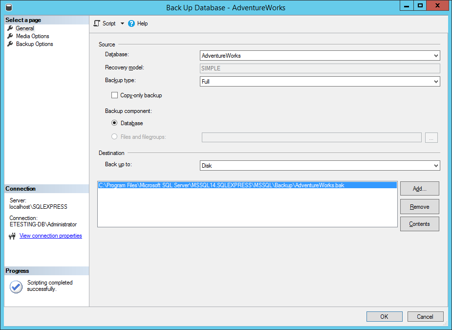
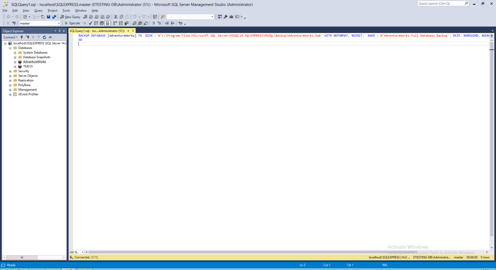
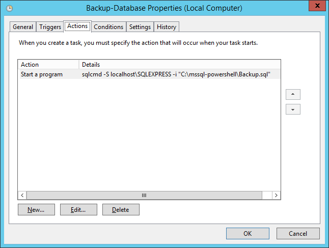
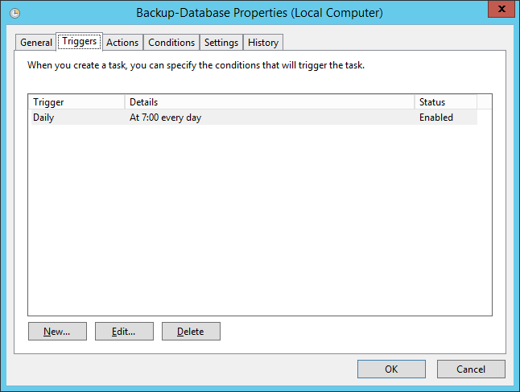

# 💉 Backup Full SQL Server with SQL Script


หลายคนคงเคยใช้งาน SQL Server เป็น Database เพื่อใช้ในการเก็บข้อมูล ซึ่งถ้าหากใช้ในงาน Production แล้ว ก็ควรจะต้องมีการทำ Backup ซึ่งเราสามารถเขียน SQL แล้วใช้ Task Schedule เพื่อตั้งเวลาในการ Backup ได้ แต่เราจะสามารถเลือก Backup ได้แค่ 2 แบบ คือ Full กับ Differential ส่วน T-Log เดี๋ยวจะพูดถึงในบทความต่อไป


## **📩 Download**

* [SQL Server Sample Database](https://github.com/microsoft/sql-server-samples/tree/master/samples/databases)

## **🏆 Get Started**

* คลิกขวา Database ที่จะ Backup แล้วเลือก Task -> Backup



* คลิก Script



* เขียน Script เพิ่มเติม โดยทำการ Declare Path และ File Name ตามวันที่


```
DECLARE @path VARCHAR(256)
SELECT @path = N'C:\Backup\' + CONVERT(VARCHAR(256), GETDATE(), 23) + '.bak'

BACKUP DATABASE [AdventureWorks] TO  DISK = @path WITH NOFORMAT, NOINIT,  NAME = N'AdventureWorks-Full Database Backup', SKIP, NOREWIND, NOUNLOAD,  STATS = 10
GO
```


* ทำการกำหนด Task Schedule



* ทำการกำหนด Trigger



**อ่านเพิ่มเติม** : [https://bit.ly/37WOVur](https://bit.ly/37WOVur)
