# 💊 Backup SQL Server Database with SQL Backup and FTP


โดยปกติการ Backup Database บน SQL Server จะทำผ่าน Script แล้วเก็บไว้ที่ Local แล้วทำการ Copy ไปไว้อีกที ตามกฎของ 3-2-1 Backup Rule จะได้ไฟล์นามสกุลเป็น .bak หรือถ้าจะใช้วิธี Remote Connection จะได้ไฟล์เป็น .sql แต่ไม่แนะนำเนื่องจากไฟล์มีขนาดใหญ่ ซึ่งเราจะใช้โปรแกรม SQL Backup and FTP ในการ Backup เป็น .bak


## **✅ Requirement**

* Create User Backup on SQL Server
* Assign Role ( sysadmin ) and Permission ( db\_owner )
* Enable Transaction Log in Recovery Model ( Bulk-logged )
* [Enable Remote Connection](https://codeinsane.wordpress.com/2019/04/18/how-to-enable-sql-server-remote-connection/) for Remote Connection Backup ( ไม่แนะนำ )

## **📩 Download**

* [SQL Backup and FTP](https://sqlbackupandftp.com/)

## **🏆 Get Started**

* ทำการดาวน์โหลดและติดตั้ง SQL Backup and FTP

<figure>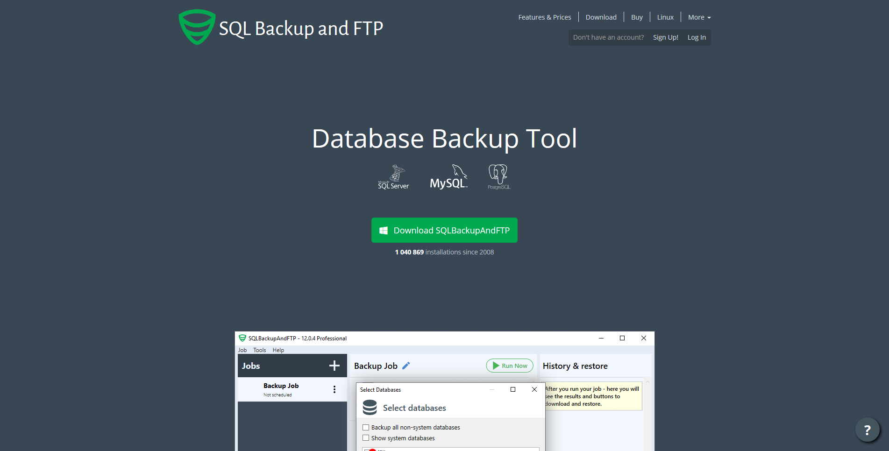<figcaption></figcaption></figure>

* คลิก Connect to Database Server

<figure>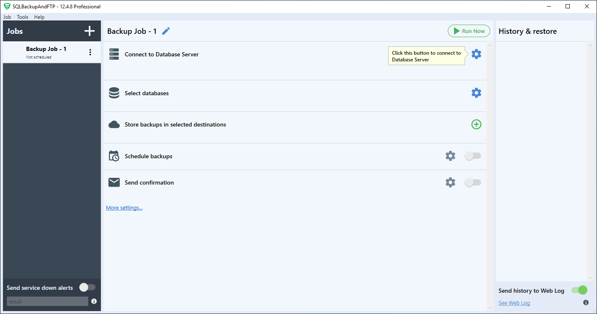<figcaption></figcaption></figure>

* เลือก Microsoft SQL Server ( local )

<figure>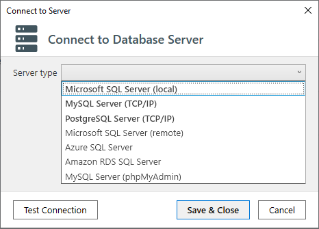<figcaption></figcaption></figure>

* เลือก SQL Server Authentication ทำการกรอก Username และ Password พร้อมทำการ Test Connection แล้วคลิก Save & Close

<figure>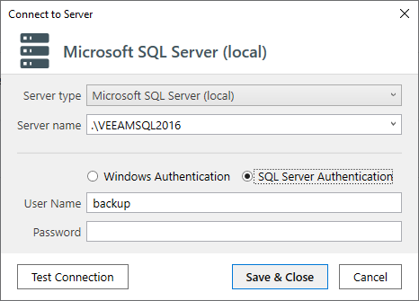<figcaption></figcaption></figure>

* คลิก Select databases

<figure>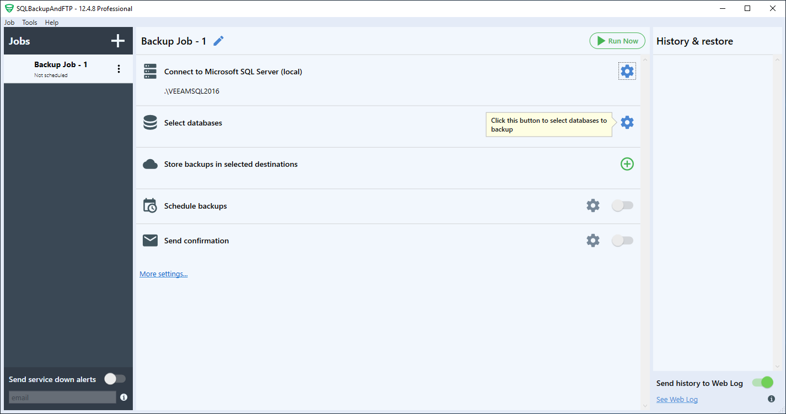<figcaption></figcaption></figure>

* เลือก Database แล้วคลิก Save & Close

<figure>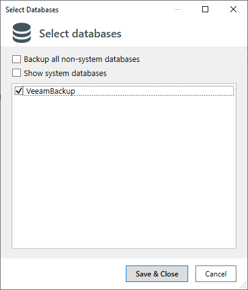<figcaption></figcaption></figure>

* คลิก Store backups in selected destinations แล้วเลือก Local/Network Folder/NAS

<figure>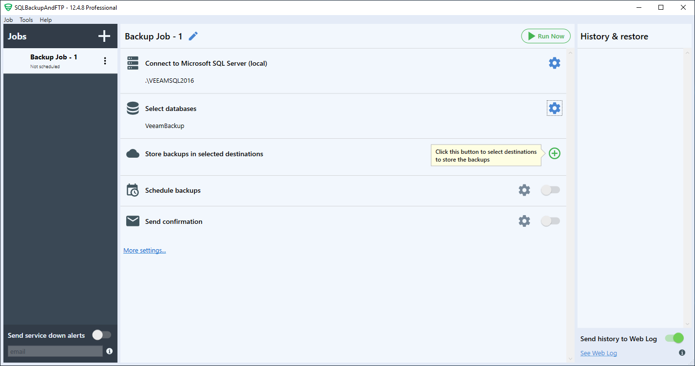<figcaption></figcaption></figure>

* ทำการระบุ Path แบบ Local เลือก Auto Delete ตาม Policy Backup ที่กำหนด พร้อมทำการกรอก Username และ Password แล้วคลิก Save & Close

<figure>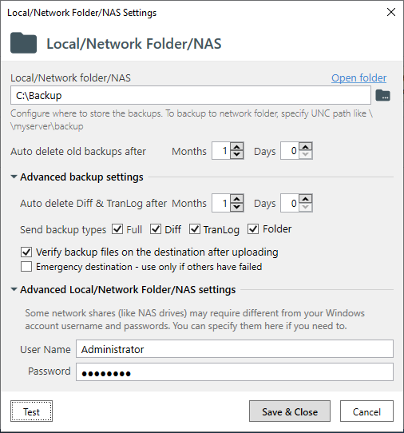<figcaption></figcaption></figure>

* ทำการระบุ Path แบบ Network Folder คำเตือนต้องเลือก Path แบบ Local ก่อน แล้วค่อยเลือก Path แบบ Network จะได้ไฟล์ Backup เป็นแบบ .bak ถ้าเลือก Network ก่อนจะได้ไฟล์เป็น .sql แทน

<figure>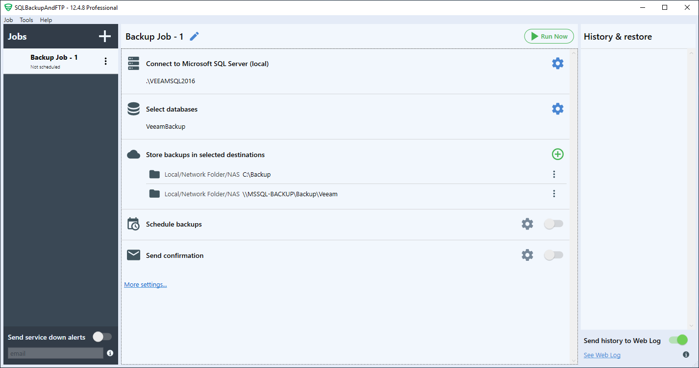<figcaption></figcaption></figure>

* ทำการกำหนด Schedule backups แล้วคลิก Save & Close

<figure>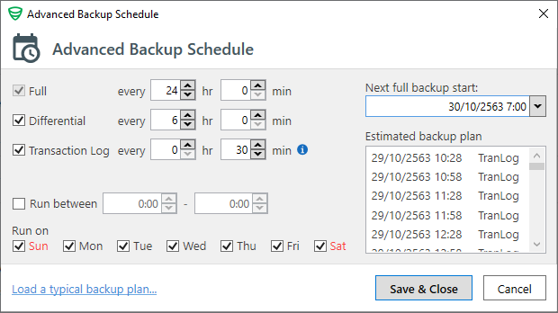<figcaption></figcaption></figure>

* หากเกิด Job หมุนค้างเกิดจากการ Compress ให้ทำการ Disable Compress backups จะสามารถทำการ Backup ได้ปกติ

<figure>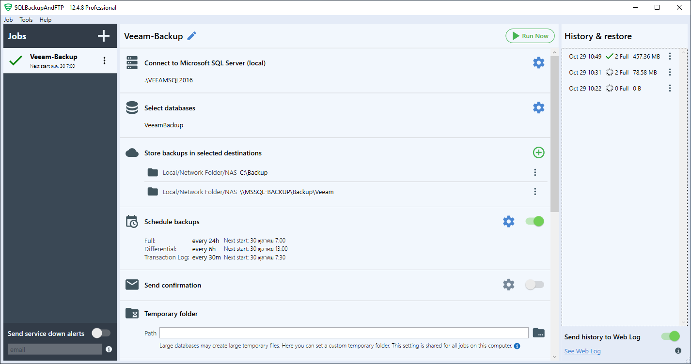<figcaption></figcaption></figure>

* กรณีที่ต้องการ Restore ให้ทำการสร้างเป็นอีก Job เพื่อที่จะได้เก็บ History

<figure>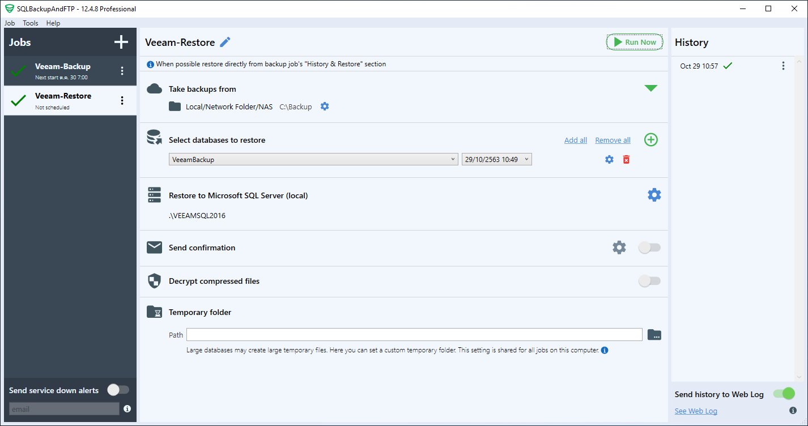<figcaption></figcaption></figure>

* ลองเข้าไปดู Path ที่เก็บไฟล์ Backup ขนาดของ Compress จะแตกต่างกันมาก หาก Compress ผ่านก็ให้เลือก Compress ซึ่งจะใช้เวลานานกว่าปกตินิดหน่อย

<figure>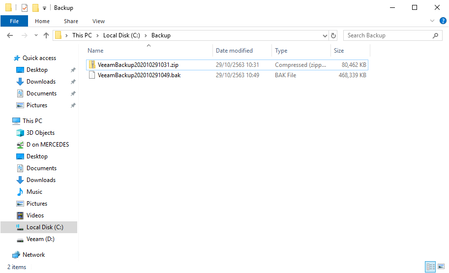<figcaption></figcaption></figure>

**อ่านเพิ่มเติม** : [https://bit.ly/2TyoTVF](https://bit.ly/2TyoTVF)
