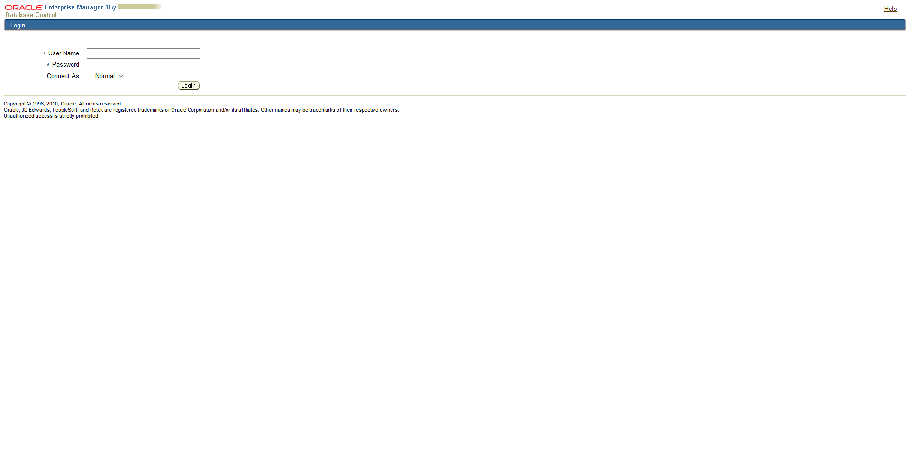

# 🧅 Fix Enterprise Manager Error OC4J Configuration issue


Enterprise Manager เป็นเครื่องมือที่ใช้ในการ Monitor Oracle Database ผ่านทางเว็บไซต์ ซึ่งในกรณีที่มีการ Change Hostname จะต้องมีการแก้ไขไฟล์ต่าง ๆ ไม่ว่าจะเป็น .bash\_profile, listener.ora, tnsnames.ora รวมถึงไฟล์ /etc/hosts และทำการ Rebuild Enterprise Manager ใหม่ แต่ต้องทำการ Drop ตัวเก่าทิ้งก่อนทำการ Create ใหม่



**Cause** : สาเหตุเนื่องมาจาก Database Control ไม่ได้ทำการ Configured หรือ Misconfigured ทำให้ไม่สามารถทำการ Start Enterprise Manager ได้ จะต้องทำการ Rebuild Enterprise Manager


## **Configuration**

* ทำการ Drop Database Control


```
emca -deconfig dbcontrol db -repos drop
```


* &#x20;ทำการ Create Databse Control


```
emca -config dbcontrol db -repos create
```


```
STARTED EMCA at Jul 23, 2019 4:22:50 PM
EM Configuration Assistant, Version 11.2.0.0.2 Production
Copyright (c) 2003, 2005, Oracle.  All rights reserved.

Enter the following information:
Database SID: ORCL
Listener port number: 1521
Listener ORACLE_HOME [ /u01/app/oracle/product/11.2.0/db_1 ]:
Password for SYS user: password
Password for DBSNMP user: password
Password for SYSMAN user: password
Email address for notifications (optional): email
Outgoing Mail (SMTP) server for notifications (optional): smtp
-----------------------------------------------------------------
Do you wish to continue? [yes(Y)/no(N)]: y
```

* ทำการ Start Enterprise Manager


```
emctl start dbconsole
```


* ทำการตรวจสอบ Status Enterprise Manager


```
emctl status dbconsole
```


```
Oracle Enterprise Manager 11g Database Control Release 11.2.0.2.0
Copyright (c) 1996, 2010 Oracle Corporation.  All rights reserved.
https://lab-ora.lab.local:1158/em/console/aboutApplication
Oracle Enterprise Manager 11g is running.
------------------------------------------------------------------
Logs are generated in directory /u01/app/oracle/product/11.2.0/db_1/lab-ora.lab.local_ORCL/sysman/log
```

* ลองทำการเข้าผ่านหน้าเว็บ [https://localhost:1158/em/console/aboutApplication](https://localhost:1158/em/console/aboutApplication)


