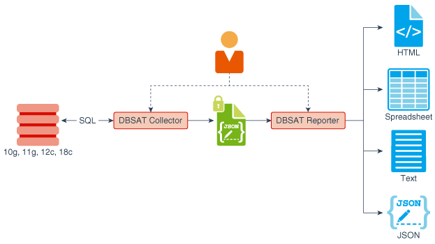
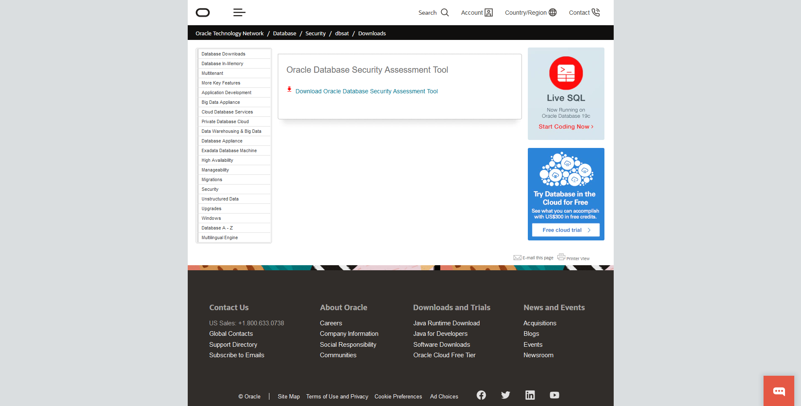
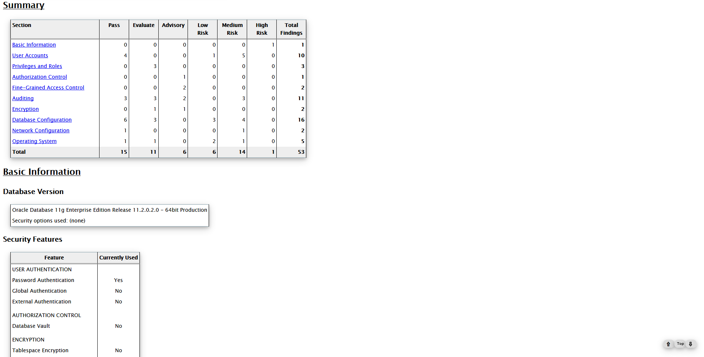

# 🫒 Install DBSAT for Oracle Database 11gR2


Database Security Assessment Tool ( DBSAT ) เป็น Utility ของ Oracle Database ที่ใช้ในการตรวจสอบความปลอดภัยของฐานข้อมูล Database Security และช่วยในการระบุข้อมูลที่สำคัญ Sensitive Data ในฐานข้อมูล ไม่ว่าจะเป็น Database Version, Security Feature, Patch รวมถึงการทำ Oracle Account Assessment




## **Requirement**

* Oracle SID : orcl
* Install Java Development Kit ( JDK ) 8+
* Install Python 2+

## **Download**

* [Database Security Assessment Tool ( DBSAT )](https://www.oracle.com/technetwork/database/security/dbsat/downloads/index.html)

## **Install**

* ทำการ Update และ Upgrade


```
yum update && yum upgrade -y
```


* ทำการติดตั้ง Package


```
yum install zip unzip python -y
```


* ทำการระบุ Java Path


```
export JAVA_HOME=/usr/java/latest
```



```
export PATH=$JAVA_HOME/bin:$PATH
```


* ทำการ Connect Database ด้วย SQL\*Plus


```
sqlplus / as sysdba
```


* Create User DBSAT


```
create user dbsat_user identified by dbsat_user ;
```


* Grant Permission


```
grant create session to dbsat_user ;
```



```
grant select_catalog_role to dbsat_user ;
```



```
grant select on sys.registry$history to dbsat_user ;
```



```
grant select on sys.dba_users_with_defpwd to dbsat_user ;
```


* ทำการดาวน์โหลดและติดตั้ง DBSAT



* ทำการ SCP จากเครื่อง Client ไปไว้ในโฟลเดอร์ dbsat


```
cd /home/oracle
```



```
mkdir dbsat && cd dbsat
```



```
unzip dbsat.zip
```


* ทำการรัน DBSAT Collector


```
./dbsat collect dbsat_user@orcl orcl_output
```


```
Database Security Assessment Tool version 2.2 (September 2019)

This tool is intended to assist you in securing your Oracle database
system. You are solely responsible for your system and the effect and
results of the execution of this tool (including, without limitation,
any damage or data loss). Further, the output generated by this tool may
include potentially sensitive system configuration data and information
that could be used by a skilled attacker to penetrate your system. You
are solely responsible for ensuring that the output of this tool,
including any generated reports, is handled in accordance with your
company's policies.

Connecting to the target Oracle database...


SQL*Plus: Release 11.2.0.2.0 Production on Mon Sep 30 11:12:19 2019

Copyright (c) 1982, 2010, Oracle.  All rights reserved.

Enter password: dbsat_user
Connected to:
Oracle Database 11g Enterprise Edition Release 11.2.0.2.0 - 64bit Production
With the Partitioning, OLAP, Data Mining and Real Application Testing options

Setup complete.

SQL queries complete.
/bin/cat: /u01/app/oracle/product/11.2.0/db_1/network/admin/sqlnet.ora: No such file or directory
Warning: Exit status 256 from OS rule: sqlnet.ora
/bin/ls: cannot access /u01/app/oracle/product/11.2.0/db_1/network/admin/sqlnet.ora: No such file or directory
Warning: Exit status 512 from OS rule: ls_sqlnet.ora
OS commands complete.
Disconnected from Oracle Database 11g Enterprise Edition Release 11.2.0.2.0 - 64bit Production
With the Partitioning, OLAP, Data Mining and Real Application Testing options
DBSAT Collector completed successfully.

Calling /u01/app/oracle/product/11.2.0/db_1/bin/zip to encrypt orcl_output.json...

Enter password: zip_password
Verify password: zip_password
  adding: orcl_output.json (deflated 87%)
zip completed successfully.
```

* ทำการรัน DBSAT Reporter


```
./dbsat report orcl_output
```


```
Database Security Assessment Tool version 2.2 (September 2019)

This tool is intended to assist you in securing your Oracle database
system. You are solely responsible for your system and the effect and
results of the execution of this tool (including, without limitation,
any damage or data loss). Further, the output generated by this tool may
include potentially sensitive system configuration data and information
that could be used by a skilled attacker to penetrate your system. You
are solely responsible for ensuring that the output of this tool,
including any generated reports, is handled in accordance with your
company's policies.

Archive:  orcl_output.zip
[orcl_output.zip] orcl_output.json password: zip_password
  inflating: orcl_output.json
DBSAT Reporter ran successfully.

Calling /usr/bin/zip to encrypt the generated reports...

Enter password: report_password
Verify password: report_password
        zip warning: orcl_output_report.zip not found or empty
  adding: orcl_output_report.txt (deflated 81%)
  adding: orcl_output_report.html (deflated 85%)
  adding: orcl_output_report.xlsx (deflated 3%)
  adding: orcl_output_report.json (deflated 85%)
zip completed successfully.
```

* จะแสดงผลลัพธ์ในรูปแบบ HTML



**อ่านเพิ่มเติม** : [https://bit.ly/2n89KgU](https://bit.ly/2n89KgU)
