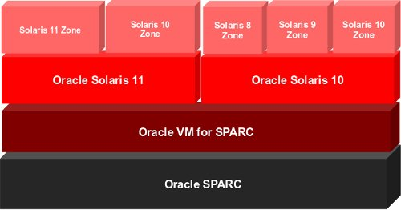
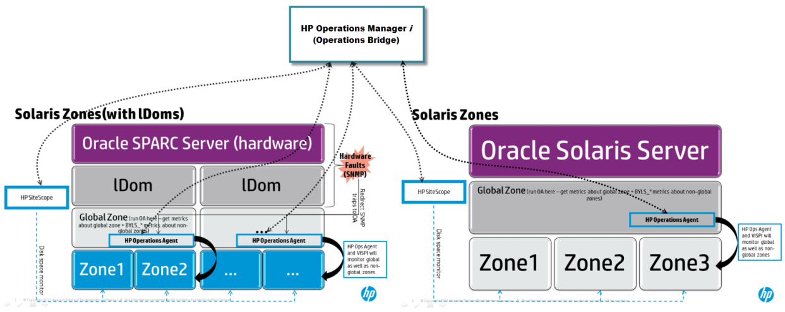

# 🍋 LDOM Oracle VM for SPARC


ในการใช้งาน Oracle Sun SPARC จะมีเทคโนโลยีที่ใช้ในการจำลอง Virtualization ที่เรียกว่า Logical Domains ( LDOM ) โดยแต่ละ Domain จะช่วยให้สามารถทำการ Migrate หรือ Scale ได้ง่ายขึ้น ในระหว่างที่ Application ยังทำงานอยู่ โดยไม่ตัดการเชื่อมต่อจาก Client & Application รวมถึงในเรื่องของ Security and Isolation


## 🚀 SPARC Hypervisor

Concept ของ LDOM จะใช้ SPARC Hypervisor ในการจำลองระหว่าง Physical Hardware และ Virtual Hardware โดยฝังอยู่ใน Firmware ของระบบ ซึ่งจะไม่เหมือนกับ Hypervisor อื่นที่รันอยู่บน x86 ภายใน Virtual Hardware จะใช้สร้าง Guest System ที่มีการทำงานคล้ายกับบน Bare Metal โดยจะมี Open Boot Prompt ( OBP ) ของตัวเอง ซึ่งแต่ละ Guest จะมีการทำสำเนาของ Solaris OS และจะเห็น CPU, Memory, I/O ที่พร้อมใช้งาน

<figure><figcaption></figcaption></figure>

## **🧩 CMT Architecture**

สถาปัตยกรรมแบบ Chip Multithreading ( CMT ) จะต้องใช้ CPU ที่รองรับอย่าง T1 – T4 ที่มีจำนวน Core และ Thread จำนวนมาก เช่น T4 มี 8 Core แต่ละ Core มี 8 Thread รวม 64 Thread per Socket หรือ 64 CPU โดยมี SPARC Hypervisor ในการ Assign CPU, Memory, I/O ให้ Guest และควบคุม Isolation Guest เหมือนกับ Hypervisor อื่นที่รันอยู่บน x86

<figure><figcaption></figcaption></figure>

## **🥏 LDOM**

เป็นเทคโนโลยีที่ใช้ในการจำลอง HW Virtualization การทำงานของ LDOM จะอยู่ภายใต้ Control Domain ซึ่งเป็นเจ้าของ Hardware ที่พร้อมใช้งานทั้งหมด หากไม่มีการแบ่ง Domain การใช้งานจะถูกรันอยู่บน Primary Domain เหตุผลในการใช้งาน LDOM

* เหมาะกับกรณีที่ต้องการแบ่งในระดับ Kernel Level
* เหมาะกับกรณีที่ต้องการ Update Patch ของ Solaris ที่ต่างกัน หรือลง Solaris คนละ Version กัน
* เหมาะกับการทำ Live Migration ไม่สามารถ Live Migrate Zone ได้ แต่สามารถ Live Migrate LDOM ได้
* เหมาะกับการลดค่า License โดยลดจำนวน vCPU ที่อยู่ใน LDOM
* เหมาะกับการทำ Multipath Group of Device เพื่อไม่ให้ I/O ต้องขึ้นอยู่กับ Single Service Domain

หลังจากที่มีการกำหนดค่า LDOM เสร็จเรียบร้อยจะต้องมีการบันทึกลงใน [Integrated Lights Out Management ( ILOM )](https://docs.oracle.com/cd/E79179\_01/html/E82092/z40001381388892.html) ก่อนที่จะมีการ Reboot เพื่อให้พร้อมใช้งาน และจะต้องมีการ Check Version Compatible ของ Logical Domain กับ Hypervisor

## **🧱 ZONE**

เป็นเทคโนโลยีที่ใช้ในการจำลอง OS Virtualization การทำงานของ Zone จะใช้ Concept เดียวกันกับ Zone ของ Network โดยแบ่งเป็น Global Zone ( GZ ) จะรันอยู่บน Share Kernel Space และ Non-Global Zone ( NGZ ) รันอยู่บน User Space

* สามารถ Detach Zone ออกจาก Global Zone ไป Attach Zone ใน Global Zone อื่นได้
* สามารถทำ Security กรณีที่ถูกโจมตีจะไม่กระทบกับ Zone อื่น
* สามารถใช้งาน CPU ได้เกินที่กำหนด ตราบใดที่ CPU ของ Pool ไม่ได้ถูกใช้งาน 100%

**อ่านเพิ่มเติม** : [https://bit.ly/3h20qXQ](https://bit.ly/3h20qXQ), [https://bit.ly/3UtFsjf](https://bit.ly/3UtFsjf), [https://bit.ly/3Uq8IqV](https://bit.ly/3Uq8IqV)
