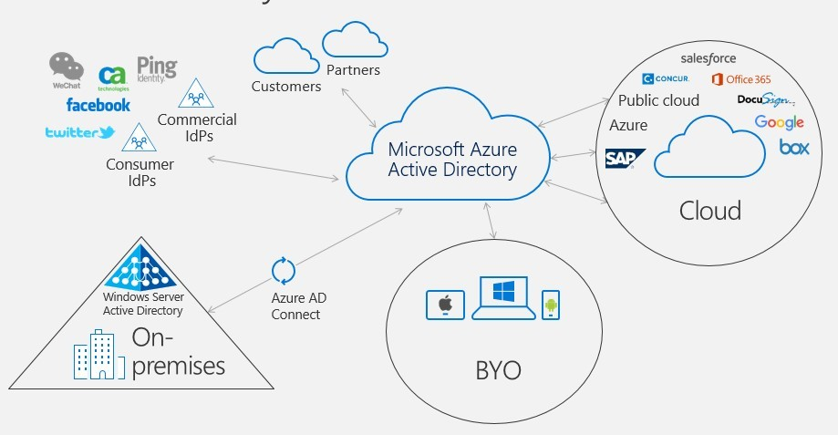
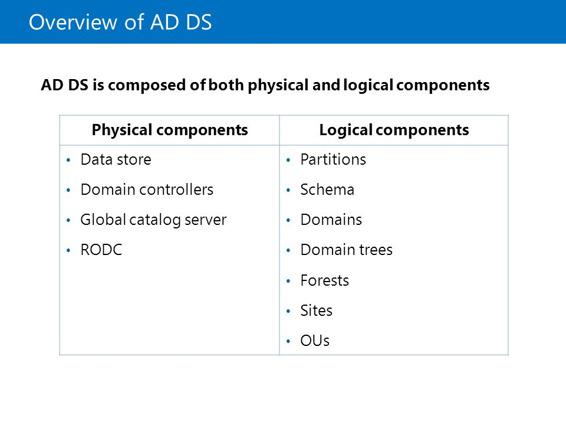

# Active Directory ( AD ) 101


Active Directory ( AD ) เป็นการจัดการข้อมูล Directory Service ภายในองค์กรแบบ Centralized Administrator ในการเก็บข้อมูลของ User & Computer เพื่อใช้ในการ Authentication & Authorization หรือที่เรียกกันว่า Single Sign-On นอกจากนี้ยังใช้ในการจัดการ Security Policy เพื่อเข้าถึง Shared Network Resource ต่าง ๆ


## **Directory Service**


โดยปกติจะมีการจัดการอยู่ 2 รูปแบบ คือ Centralized Administrator เป็นการจัดการจากศูนย์กลาง และ Dispersed Administrator ( Work Group ) เป็นการจัดการแบบแต่ละแผนก การใช้งาน Active Directory บน Windows Server จะมี Service ที่ให้บริการอยู่ 5 ตัวด้วยกัน ได้แก่


.png>)

* Active Directory Domain Services ( AD DS )
* Active Directory Certificate Services ( AD CS )
* Active Directory Federation Services ( AD FS )
* Active Directory Lightweight Diretory Services ( AD LDS )
* Active Directory Rights Management Services ( AD RMS )

## **Active Directory Domain Service ( AD DS )**


เมื่อเราทำการเปิดใช้งาน Active Directory Domain Service มันจะ Provide Service ที่คอยให้บริการหน้าที่หลักที่สำคัญและขาดไม่ได้อยู่ 4 อย่าง


NTDS

เป็นไฟล์ฐานข้อมูล Database ของ Active Directory ที่มีการเข้ารหัสแบบ MD5 หมายความว่าหากทำการ Copy ไปที่เครื่องอื่นจะไม่สามารถเปิดได้ และการเปิดจะต้องใช้ Service ในการเปิดเท่านั้น _**%systemroot%\ntds**_

SYSVOL

เป็น File Sharing ที่เก็บข้อมูล Group Policy Object ( GPO ) ของ User _**\\\lab.local\SYSVOL**_

NETLOGON

เป็น File Sharing ที่เก็บข้อมูล Legacy Script ที่ใช้ในการรันโปรแกรมอัตโนมัติเมื่อทำการ Logon _**\\\lab.local\netlogon**_

DNS

เป็นตัวที่คอยให้บริการแปลง Domain Name เป็นหมายเลย IP หรือแปลงหมายเลข IP เป็น Domain ซึ่งหากเราทำการเปิดใช้งาน AD DS จะทำการเปิดใช้งาน DNS โดยอัตโนมัติ _**%systemroot%\system32\dns**_

## **AD DS Component**

<figure><figcaption></figcaption></figure>

## **Logical Component**

Schema

ใช้ในการระบุ Type ของ Object ต่าง ๆ ในระดับ Forest หมายความว่าใน Forest เดียวกันจะมีการ Share Schema ร่วมกัน ซึ่งแบ่งออกเป็น 2 ประเภท

* Class Object : ใช้ในการระบุ Object ที่ถูก New Create บน Directory เช่น User & Computer
* Attribute Object : ใช้ในการระบุ Information ที่ถูกเก็บอยู่ในแต่ละ Object Class เช่น Display Name

Domain

ใช้ในการทำ Group & Manage Object ที่อยู่บน AD DS ซึ่งเมื่อทำการสร้าง Domain จะมีความสามารถที่ถูก Provide มาให้ 3 อย่าง

* Administrative Boundary : ใช้ในการ Apply Policy ของ Object ในแต่ละ Group ที่อยู่ใน Domain เดียวกัน
* Replication Boundary : ใช้ในการ Replicate Data ระหว่าง Domain Controller ที่อยู่ใน Domain เดียวกัน ทำให้ Domain Controller ทั้งหมดมีข้อมูลที่เหมือนกัน และแต่ละ Domain Controller สามารถทำเป็น Multi-master ได้
* Authentication & Authorization Boundary : ใช้ในการกำหนด Scope ในการ Access Resource ที่อยู่ใน Domain เดียวกัน

Domain Tree

เป็นกลุ่มของ Domain ที่อยู่ภายใต้ Forest เดียวกัน โดย Domain ที่อยู่ใน Domain Tree จะมีคุณสมบัติ Contiguous Namespace, Additional Child Domain และ Two-way Transitive Trust ซึ่งหากต้องการให้แต่ละ Domain สามารถ Access Resource ของอีก Domain ได้จะต้องมีการทำ Trust โดยแบ่งออกเป็น 2 แบบ

* Directional : เป็นการทำ Trust Direction ที่เกิดจากการกำหนดทิศทาง ได้แก่ One-way แบบทิศทางเดียว หรือ Two-way แบบสองทิศทาง ( Incoming & Outgoing )
* Transitive : เป็นการทำ Trust Relationship ที่เกิดจากการถ่ายทอดโดยอัติโนมัติ เช่น ตอนสร้าง Child Domain จะเกิด Transitive กับ Parent Domain โดยอัตโนมัติ

Forest

เป็นกลุ่มของ Domain Tree ที่จะมีการ Shared Network Resource ร่วมกัน เช่น Schema, Partition, Global Catalog

Organization Unit

เป็นกลุ่มของ Object ประกอบไปด้วย User, Group และ Computer ที่สามารถทำการ Delegate Permission ในการถ่ายทอดสิทธิ์ และ Apply Policy

## **Physical Component**

Data Store

เป็นไฟล์ Database ( ntds.dit ) อยู่ใน _**%systemroot%\ntds**_ ที่ใช้ในการจัดเก็บ File & Process และใช้ในการจัดการ Data Information ของ User รวมถึง Service & Application

Domain Controller

เป็นเครื่อง Server ที่มีการติดตั้ง AD DS ที่ใช้ในการ Authentication & Authorization, Manage User & Computer, Shared Network Resource นอกจากนี้ยังสามารถทำ Replicate Update ระหว่าง Domain Controller ที่อยู่ใน Forest เดียวกัน และช่วยจัดการในเรื่องของ Security ด้วย Read-Only Domain Controller ( RODC )

Global Catalog

เป็นกลุ่มของ Attribute ของแต่ละ Object ทั้งหมด ของแต่ละ Domain ที่อยู่ใน Forest เดียวกัน โดยการ Replicate เป็น Database ที่ใช้ในการ Query Object

Read-Only Domain Controller

เป็นเครื่อง Additional Domain Controller ที่ถูกกำหนดให้สามารถ Read-Only ได้อย่างเดียว ไม่สามารถทำการ Write ได้

## **AD DS Site**


ในกรณีที่องค์กรมีหลายสาขา สามารถทำการสร้าง Site ที่เป็น Location ของ Active Directory ตามตำแหน่งที่ตั้งจริง เพื่อจัดการ Network Segment ของ Domain Controller ทั้งหมดให้สามารถทำการ Replication กันได้แบบ Fast & Reliable ซึ่งในกรณีที่องค์กรมีหลายสาขา การทำ Replication ผ่าน WAN จะขึ้นอยู่กับ Bandwidth ระหว่างสาขา




กรณีที่ Bandwidth > 512 kbps ไม่ต้องทำการแยก Site เนื่องจากการทำ Replication จะไม่มีการ Compress โดยทำการส่งผ่าน Domain Controller ด้วยโปรโตคอล Remote Procedure Call ( RPC )



กรณีที่ Bandwidth < 512 kbps จะต้องทำการแยก Site เนื่องจากการทำ Replication จะมีการ Compress และมีการกำหนด Schedule โดยทำการส่งผ่าน Bridgehead Server

* IP Link : กรณีที่ Bandwidth อยู่ระหว่าง 128 – 512 kbps
* SMTP Link : กรณีที่ Bandwidth < 128 kbps



การแยก Site จึงลด Traffic ของการทำ Replication และลดภาระของ Domain Controller ผ่านการตั้ง Bridgehead Server
