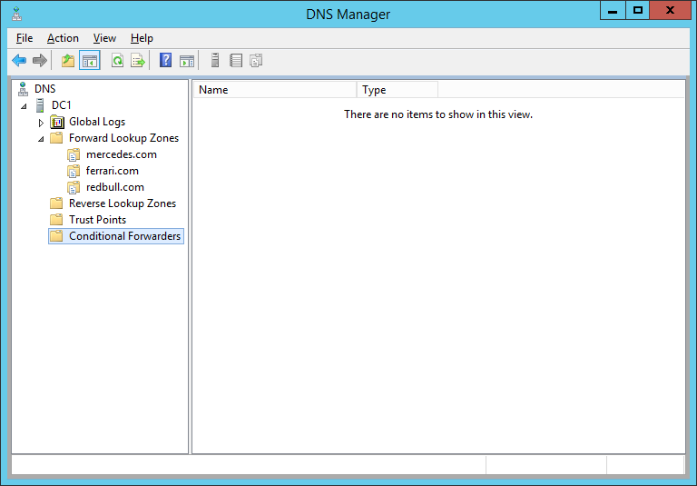
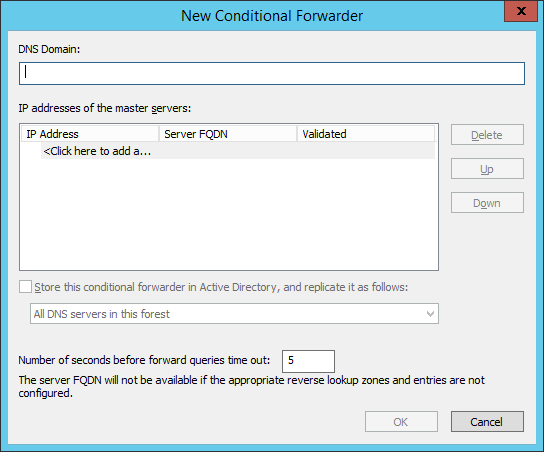
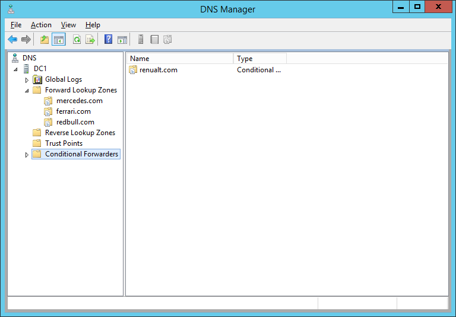
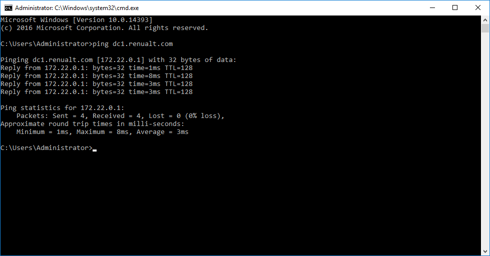

# 📦 Create Conditional Forwarder DNS on Windows Server 2012 R2


หลังจากที่เราได้ลองติดตั้ง DNS แบบ Workgroup โดยไม่มีบริการ AD DS และทำการสร้าง DNS Zone กันไปหมดแล้ว ซึ่งต้องอาศัยการ Allow Zone Transfer แต่กรณีที่เราไม่สามารถทำการ Allow Zone Transfer ได้ สามารถใช้ Conditional Forwarder เพื่อทำการส่งต่อไปถามที่ DNS เครื่องอื่น


## **Requirement**

* Primary DNS Server ( DC2 )
* Conditional Forwarder DNS Server ( DC1 )

## **LAB Diagram**

## **Get Started**

* ทำการเปิด DNS Manager เลือก Conditional Forwarder แล้วคลิกขวา New Conditional Forwarder

* ทำการระบุ Domain Name และ IP ของเครื่อง DC2 แล้วคลิก Next

* จะแสดง Domain ท้ังหมดที่อยู่ใน Conditional Forwarder ซึ่งจะส่งไปถามยัง DNS เครื่องอื่น

* ทำการทดสอบที่เครื่อง Client โดยการ ping จะทำการถามตอบที่เครื่อง DC1 แต่จะเป็นการส่งไปถามที่เครื่อง DC2

