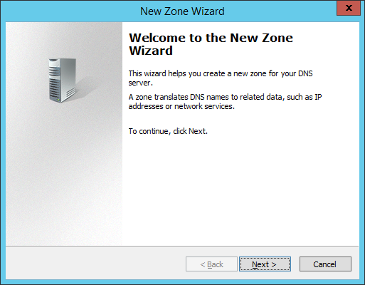

# 📦 Create Stub DNS Zone on Windows Server 2012 R2


หลังจากที่เราได้ลองติดตั้ง DNS แบบ Workgroup โดยไม่มีบริการ AD DS และทำการสร้าง Primary DNS Zone และ Secondary DNS Zone กันไปเรียบร้อยแล้ว ต่อมาเราจะมาลองสร้าง Stub DNS Zone กัน ซึ่งเป็นรูปแบบ DNS ที่ทำการเก็บ Record ไว้ เฉพาะบางส่วน เหมาะกับกรณีที่เป็น Active Directory


## **Requirement**

* Primary DNS Server ( DC2 ) – Allow Zone Transfer
* Stub DNS Server ( DC1 )

## **LAB Diagram**

<figure><figcaption></figcaption></figure>

## **Get Started**

* ทำการเปิด DNS Manager เลือก Forward Lookup Zone แล้วคลิกขวา New Zone

<figure><figcaption></figcaption></figure>

* คลิก Next

<figure><figcaption></figcaption></figure>

* เลือก Stub Zone แล้วคลิก Next ( กรณีที่ไม่ได้ติดตั้ง Active Directory Domain Service จะไม่สามารถใช้ Option สุดท้ายได้ )

<figure><figcaption></figcaption></figure>

* กำหนดชื่อ Zone Name ตาม Diagram ที่ออกแบบไว้ แล้วคลิก Next

<figure><figcaption></figcaption></figure>

* คลิก Next

<figure><figcaption></figcaption></figure>

* ทำการระบุ IP ของเครื่อง DC2 แล้วคลิก Next

<figure><figcaption></figcaption></figure>

* คลิก Finish

<figure><figcaption></figcaption></figure>

* จะแสดง Record SOA และ NS ที่อยู่ใน Stub DNS Zone เพื่อใช้ในการส่งไปถามเครื่องอื่น

<figure><figcaption></figcaption></figure>
