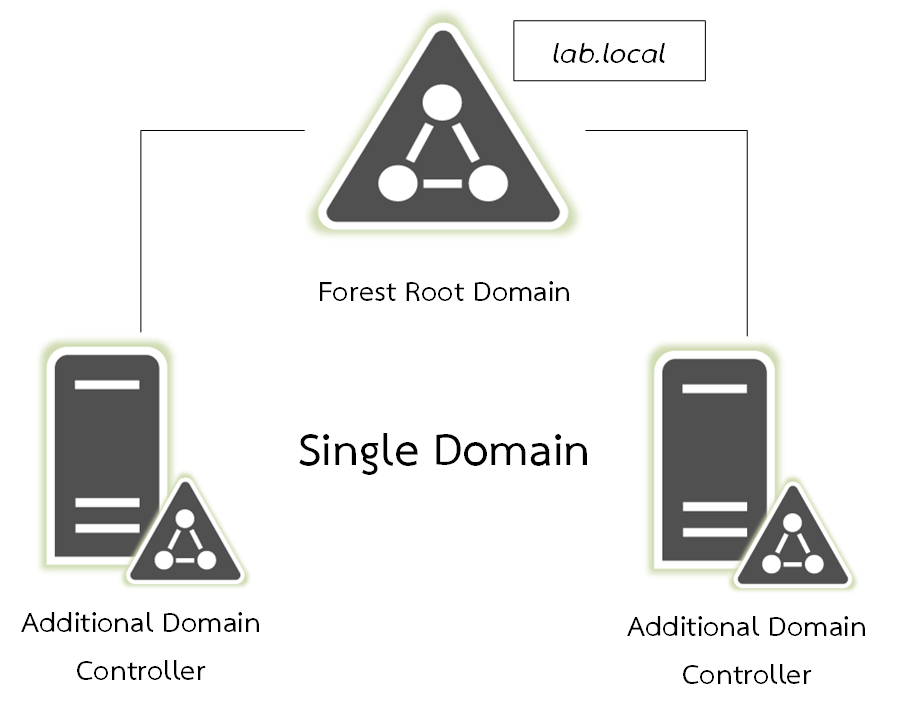
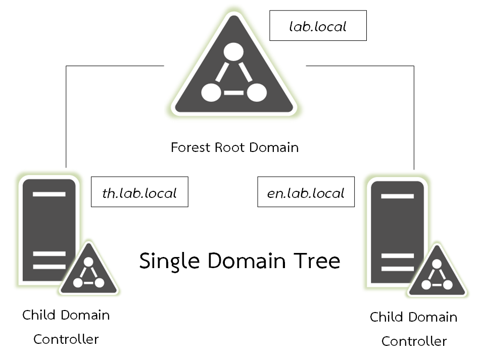
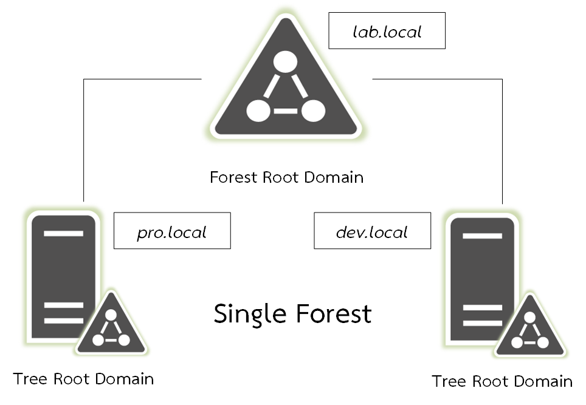
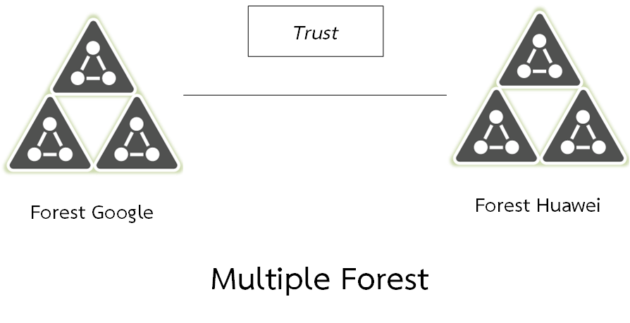

# 📦 Domain Model


หลังจากที่เราได้ทำความเข้าใจกับ Active Directory เบื้องต้นกันไปแล้ว เราจะมาทำความเข้าใจกับรูปแบบของการสร้าง Domain ซึ่งมีอยู่ด้วยกัน 4 แบบ โดยแต่ละแบบก็จะมีความสัมพันธ์ที่แตกต่างกันไป รวมถึงการบริหารจัดการของ Service และการจัดการด้าน Security


## **Single Domain**


แบบแรก Single Domain ซึ่งเป็นรูปแบบที่องค์กรหลาย ๆ ที่นิยมใช้กันมากที่สุด จะเป็นการสร้าง Domain แค่ Domain เดียว และทำ Additional เพิ่มกรณีที่ Primary Domain ตัวหลักไม่สามารถทำงานได้ Secondary Domain ตัวสำรองจอต้องทำแทน


## **Single Domain Tree**


แบบที่สอง Single Domain Tree ก็ยังนิยมในองค์กรหลาย ๆ ที่อีกเช่นกัน จะเป็นการสร้าง Parent Domain และ Child Domain ซึ่งจะเหมาะกับองค์กรที่มีหลายสาขา


## **Single Forest**


แบบที่สาม Single Forest จะนิยมกับองค์กรที่มีขนาดใหญ่ จะเป็นการสร้าง Domain หลาย ๆ Domain ที่อยู่ภายใต้ Forest เดียวกัน ซึ่งจะเหมาะกับองค์กรที่มีหลายบริษัทในเครือ หรือ มีบริษัทย่อย


## **Multiple Forest**


แบบสุดท้าย Multiple Forest จะนิยมกับองค์กรที่ควบรวมกิจการระหว่าง 2 องค์กร ซึ่งแต่ละที่มี Domain ของตัวเองอยู่แล้ว แต่อยากให้สามารถทำการ Shared Network Resource ร่วมกัน จะใช้วิธีการทำ Trust

