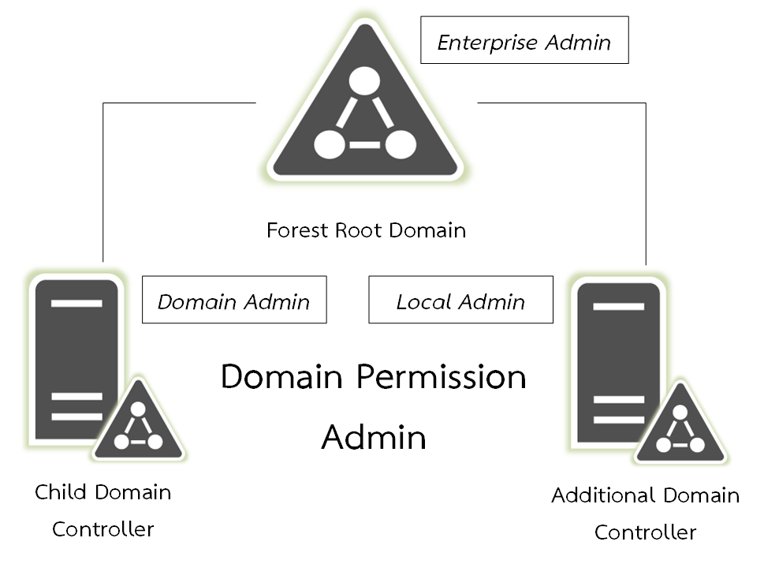

# 📦 Domain Permission Admin


หลังจากที่เราได้อธิบาย Domain Model กันไปแล้ว ต่อไปก็จะอธิบายถึงสิทธิ์ในการจัดการ Domain ที่อยู่ภายใน Forest ของผูู้แลระบบ Administrator โดยสิทธิ์ในการจัดการ Domain จะถูกสร้างพร้อมกับตอน Promote Active Directory ซึ่งจะแบ่งออกเป็น 3 ระดับ


## **🍧 Enterprise Admin**


เป็นสิทธิ์ในการจัดการสูงสุด โดยสามารถจัดการ Domain ที่อยู่ในภายใน Forest ได้ทุก Domain ไม่ว่าจะเป็น Additional Domain, Child Domain และ Tree Root Domain สามารถจัดการและให้สิทธิ์ในการจัดการได้ทั้งหมด


## **🍨 Domain Admin**


เป็นสิทธิ์ในการจัดการระดับ Domain โดยสามารถจัดการ Domain ที่อยู่ในภายใน Forest ได้เฉพาะ Domain ของตัวเอง รวมถึงสามารถจัดการ Additional Domain ได้ด้วย แต่จะไม่สามารถจัดการ Domain อื่นได้


## **🧁 Local Admin**


เป็นสิทธิ์ในการจัดการระดับ Local โดยสามารถจัดการ Domain ได้เฉพาะ Local Domain ของเครื่องเท่านั้น เครื่องใครเครื่องมันไม่สามารถจัดการข้ามเครื่องได้

