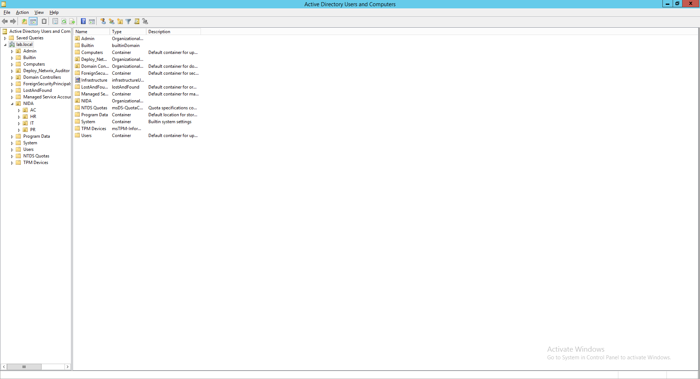
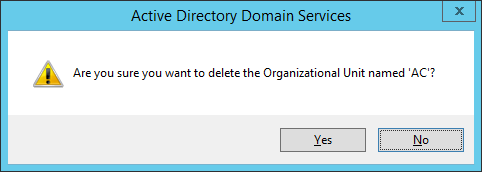

# 📬 Fix can’t Delete Object on Active Directory


ในกรณีที่เราทำการ Delete Object บน Active Directory จะไม่สามารถทำการลบได้ เนื่องจากบน Active Directory จะมีการป้องกันการ Delete Object เป็นค่า Default ของด่านแรก ส่วนด่านที่ 2 ต้องไปเปิด Recycle Bin ซึ่งเป็น Feature ที่มากับ Windows Server 2012 R2



**Cause** : สาเหตุเนื่องมาจาก Active Directory จะทำการ Protect Object เพื่อป้องกันการเกิด Accidental Delete จากความผิดพลาดของ Admin เป็นค่า Default ซึ่งถ้าไม่ได้เปิด Recycle Bin หมายความว่า ลบแล้วหายไปเลยไม่สามารถนำกลับมาได้


## **Configuration**

* ทำการเปิด Active Directory Users and Computers คลิก View แล้วเลือก Advanced Features

* เลือก Object ที่ต้องการลบ แล้วคลิกขวา Properties

* ทำการ Uncheck Protect object from accidental deletion แล้วคลิก Apply -> OK

* ลองทำการ Delete Object อีกครั้งหนึ่ง

**อ่านเพิ่มเติม** : [https://bit.ly/2YL0kFg](https://bit.ly/2YL0kFg)
