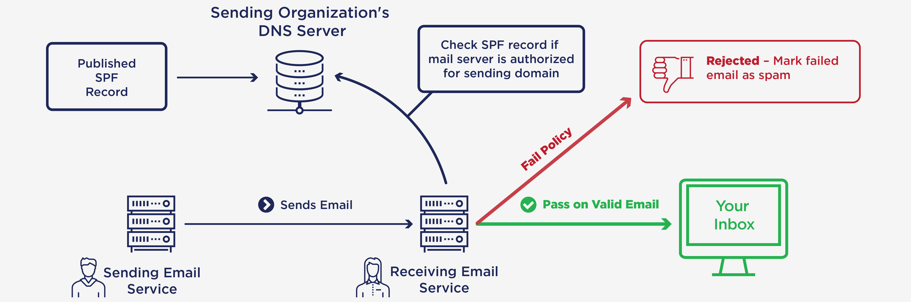
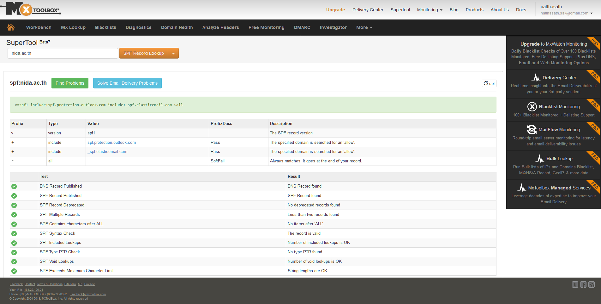

# 📦 Sender Policy Framework Record


Sender Policy Framework ( SPF ) เป็นวิธีการที่ใช้ในการป้องกันการก่อกวนจาก Spam Mail รวมถึงการหลอกลวงจาก Email Spoofing ด้วย SPF Record ซึ่งเป็น TXT Record บน DNS ที่ทำหน้าที่ในการ Authorized ยืนยัน Domain Name และ IP Address




โดยปกติการสร้าง Mail Server จะต้องมีการกำหนด Domain Name และ IP Address พร้อมทำการสร้าง A Record เพื่อใช้ในการแปลง Domain Name เป็นหมายเลข IP Address และ MX Record เพื่อใช้ในการบอกว่าเครื่องใดใน Domain เป็น Mail Server

## **SPF Record**


หลังจากที่สร้าง Mail Server พร้อมทำการสร้าง A Record และ MX Record เสร็จเรียบร้อย เราก็จะสามารถ Send & Receive Email ได้ปกติ แต่จะเกิดปัญหาที่ว่าเมื่อทำการ Send Mail ไปแล้วไม่เข้า Inbox แต่ไปเข้า Junk Mail แทน นั่นเป็นเพราะเราไม่ได้ตั้งค่า SPF Record เพื่อทำการอนุญาติให้สามารถ Send Mail ออกจาก Domain ด้วยหมายเลข IP Address ที่กำหนด ทำให้เมื่อทำการ Send Mail ออกไป Mail Server ปลายทางจะทำการตรวจสอบหมายเลข IP Address ของ Mail Server ต้นทางที่เราส่งว่าได้รับการอนุญาติจาก SPF Record มั้ย หากไม่ได้รับการอนุญาติจะไปอยู่ในโฟลเดอร์ Spam นั่นเอง


## **SPF Record Check**



เราสามารถทำการตรวจสอบ SPF Record Online ได้จาก [https://mxtoolbox.com/spf.aspx](https://mxtoolbox.com/spf.aspx) ด้วยการระบุ Domain Name หรือ IP Address จากรูปก็จะเห็นว่า

```
v=spf1 include:spf.protection.outlook.com include:_spf.elasticemail.com ~all

+all (Pass) = inbox
-all (Hard Fail) = rejected
~all (Soft Fail) = junk
?all (Neutral) = do nothing
```

**อ่านเพิ่มเติม** : [https://bit.ly/2IskIWe](https://bit.ly/2IskIWe)
