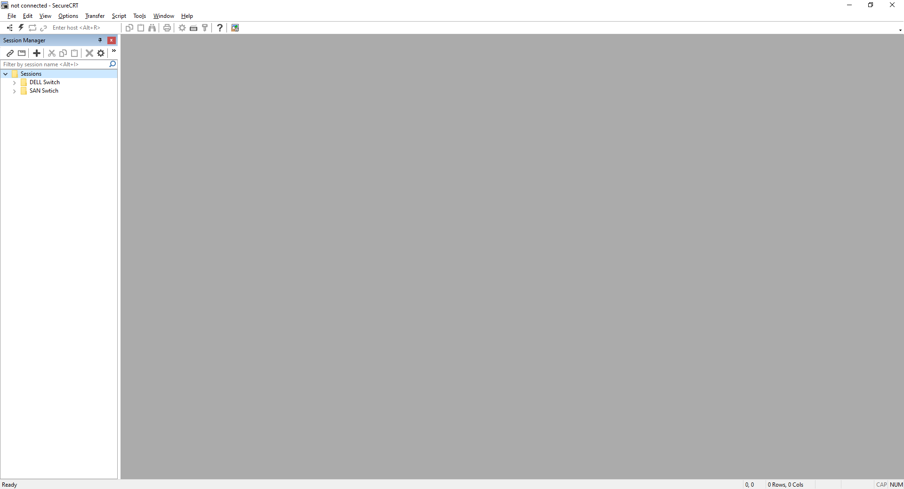
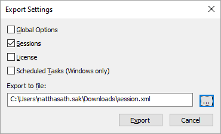
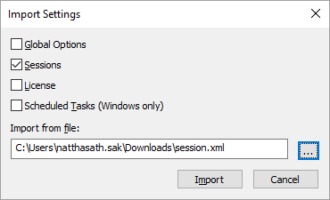

# 👥 Export and Import Session on SecureCRT


หลายคนคงเคยใช้ SecureCRT ในการเขียน Remote Server ผ่านทาง Network Protocol ต่าง ๆ ไม่ว่าจะเป็น SSH, Telnet, Serial ซึ่งการทำงานก็จะคล้าย ๆ กับ Putty แต่สามารถทำการบันทึก Session และสามารถเปิดพร้อมกันหลาย Session ได้


## **Get Started**

* ทำการ Import โดยคลิก Tools > Export Settings

* เลือก Session ทำการระบุ Path แล้วคลิก Export

* ทำการ Import โดยคลิก Tools > Import Settings

