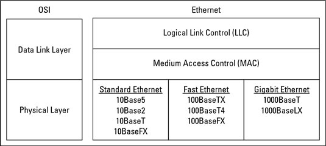

# 🐦 Local Area Network 101


Local Area Network ( LAN ) เป็นการเชื่อมต่อคอมพิวเตอร์เข้าด้วยกันภายในบริเวณที่มีระยะทางไม่ไกลมาก เช่น บ้าน, อาคาร, องค์กร ทำให้สามารรับส่งข้อมูลระหว่างคอมพิวเตอร์ผ่านทางสายสัญญาณ ทำให้สามารถใช้ทรัพยากรร่วมกันได้ โดยมีเทคโนโลยีในการรับส่งข้อมูลที่เรียกว่า Ethernet


## **🦅 Ethernet**

<figure><figcaption></figcaption></figure>

เป็นเทคโนโลยีบนระบบเครือข่าย LAN ( Local Area Network ) ที่นิยมใช้อยู่ในปัจจุบัน อยู่ภายใต้การดูแลของสถาบันวิศวกรรมไฟฟ้าและวิศวกรรมอิเล็กทรอนิกส์นานาชาติ IEEE ( Institute of Electronic and Electrics Engineering ) ซึ่งเป็นองค์กรที่กำหนดมาตรฐานการสื่อสารข้อมูลบนระบบเครือข่ายคอมพิวเตอร์ โดยมีหน่วยในการรับส่งข้อมูลเป็น Mbps บนมาตรฐาน IEEE 802. 3

ปัจจุบันได้มีการพัฒนาความเร็วในการรับส่งข้อมูล Bandwidth จากเดิม 10 Mbps เป็น 100 Mbps ( Fast Ethernet – IEEE 802. 3u ) ไปจนถึง 1,000 Mbps ( Gigabit Ethernet – IEEE 802. 3z ) ซึ่งจะใช้สายสัญญาณในการรับส่งข้อมูลที่ต่างกันอย่าง Fast Ethernet จะใช้สาย Twisted pair ( 100Base-T ) ส่วนการรับส่งข้อมูลแบบ Gigabit Ethernet จะใช้สาย Fiber Optic ( 1000Base-T ) โดยระยะทางในการรับส่งก็ขึ้นอยู่กับประเภทของสายสัญญาณด้วย

## **🐦 CSMA / CD**

การทำงานของ Ethernet จะประกอบไปด้วย Packet และ Frame ทำงานอยู่ในชั้นของ Physical Layer และ Data Link Layer ตามมาตรฐานของ OSI Model ในการรับส่งข้อมูลบนระบบเครือข่าย LAN เนื่องจากมีการใช้สายสัญญาณร่วมกัน จึงต้องมีวิธีในการควบคุมการรับส่งข้อมูลเพื่อไม่ให้เกิดการชนกัน ซึ่งเทคนิคของ Media Access Control ที่ใช้ก็คือ CSMA / CD ( Carrier Sense Multiple Access/Collision Detection ) โดยมีหลักการทำงานดังนี้

* ก่อนที่ผู้ใช้จะส่งข้อมูลออกไป จะต้องมีการแจ้งออกไปก่อนเพื่อตรวจสอบดูว่ามีสัญญาณของผู้ใช้รายอื่นใช้งานอยู่หรือไม่
* ถ้าไม่มีสัญญาณของผู้ใช้รายอื่นใช้งาน ถึงจะเริ่มส่งข้อมูล
* หากพบสัญญาณของผู้ใช้รายอื่นใช้งานอยู่ จะต้องรอจนกว่าสายจะว่างถึงจะส่งข้อมูลได้
* ในกรณีที่เกิดปัญหาในการตรวจสอบสัญญาณ ซึ่งอาจเกิดจากระยะทางในการรับส่งข้อมูลอยู่ไกลกันมาก อาจจะเกิดการชนกันของข้อมูลได้ ในกรณีนี้ให้ทุกสถานีหยุดการส่งข้อมูลทันที
* หลังจากนั้น ให้ทำการการสุ่มช่วงระยะเวลาในการรอ เพื่อทำการส่งข้อมูลออกไปใหม่เพื่อไม่ให้มีการชนกันเกิดขึ้นอีก
* หากยังมีการชนกันของข้อมูลอีก จะต้องหยุดรอโดยเพิ่มช่วงระยะเวลาในการสุ่มเป็นสองเท่า เพื่อให้ลดโอกาสไม่ให้มีการชนกันเกิดขึ้นอึก ทำซ้ำจนกว่าจะส่งข้อมูลได้

แม้ว่าเทคนิค CSMA / CD ดูเหมือนจะเป็นวิธีการควบคุมการรับส่งข้อมูลในระบบเครือข่ายที่ไม่เรียบร้อยนัก แต่ก็ทำงานได้ผลเป็นอย่างดี หากมีจำนวนเครื่องคอมพิวเตอร์บนระบบเครือข่ายพิ่มขึ้น ก็จะทำให้โอกาสเกิดการชนกันของข้อมูลเพิ่มขึ้นด้วย ซึ่งจะส่งผลให้ระบบเครือข่ายทำงานช้าลงตามไปด้วย

**อ่านเพิ่มเติม** : [https://bit.ly/3hlTksn](https://bit.ly/3hlTksn)
