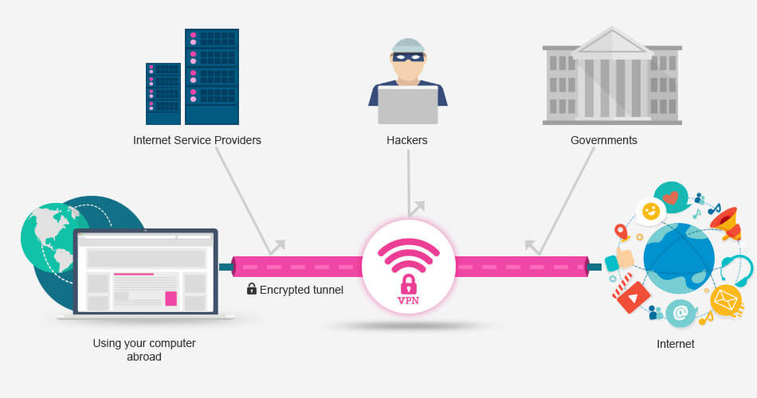

# 👥 VPN Protocol


VPN ( Virtual Private Network ) เป็นเครือข่ายส่วนตัวเสมือน โดยจะสร้าง Tunnel เป็นท่อในการส่งข้อมูล ซึ่งข้อมูลที่วิ่งผ่านจะถูกเข้ารหัส หากมีผู้ดักจับ Packet ไปก็ไม่สามารถอ่านได้ ส่วนใหญ่จะใช้ในการเชื่อมต่อระหว่าง Branch กับ Head Office และ Home กับ Office ในการใช้งานความปลอดภัยจะขึ้นอยู่กับ Protocol ที่เลือกใช้ด้วย


## **OpenVPN**


เป็นโปรโตคอลแบบใหม่ที่มีการเข้ารหัสโดยใช้ SSLv3/TLSv1 และ OpenSSL Library ที่รองรับ Algorithm การเข้ารหัสแบบต่าง ๆ เช่น 3DES, AES, Camellia, Blowfish, CAST-128 มักถูกใช้เป็น Third-Party VPN Client, การแชร์ไฟล์ P2P และเป็นโปรโตคอลมาตรฐานที่ใช้ในเชิงพาณิชย์กับ VPN Provider เจ้าต่าง ๆ ปัจจุบันรองรับทั้ง Mobile และ PC แต่มีความยุ่งยากในการ Configuration รวมถึงการใช้งาน


## **L2TP/IPsec ( Layer 2 Tunneling Protocol )**


เป็นโปรโตคอลที่ไม่มีการเข้ารหัสเหมือนโปรโตคอลอื่น มันจึงถูกนำมารวมกับ IPsec เพื่อเข้ารหัสข้อมูล อย่าง PSK ( Pre-Shared Key ) เข้ารหัสข้อมูลด้วย Key ที่กำหนด, **RSA** ( Rivest-Shamir-Adleman ) เข้ารหัสข้อมูลด้วย Algorithm และใช้การตรวจสอบด้วย Signature เป็นโปรโตคอลที่มีความเร็วช้าที่สุด ถูกพัฒนาโดย Cisco และ Microsoft ปัจจุบันรองรับทั้ง Mobile และ PC ทำให้นิยมใช้ในหน่วยงานเอกชน และภาครัฐต่าง ๆ


## **PPTP ( Point-to-Point Tunneling )**&#x20;


เป็นโปรโตคอลแบบดั้งเดิมที่มีการเข้ารหัสแบบ **AES** ( Advance Encryption Standard ) 128-bit ทำให้สามารถถอดรหัสได้ภายใน 2 วัน ใช้สำหรับการเชื่อมต่อ Internet และ Intranet รวมถึงการสตรีมมิ่งและการเล่มเกม เป็นโปรโตคอลที่มีความเร็วมากกว่า L2TP และ OpenVPN ถูกพัฒนาโดย Microsoft ปัจจุบันรองรับทั้ง Mobile และ PC <mark style="color:red;">แต่ไม่นิยมใช้แล้ว เนื่องจากไม่มีความปลอดภัย</mark>


## **SSTP ( Secure Socket Tunneling )**


เป็นโปรโตคอลที่มีการเข้ารหัสแบบ **AES** ( Advance Encryption Standard ) ที่มีความปลอดภัยกว่า PPTP เป็นโปรโตคอลที่มีความเร็วใกล้เคียงกับ OpenVPN ถูกพัฒนาโดย Microsoft ปัจจุบันรองรับเฉพาะ PC สามารถทำงานได้ทั้ง Windows และ Linux แต่ไม่ได้ Open Source ส่วนใหญ่จึงใช้บน Windows


## **IKEv2 ( Internet Key Exchange Version 2 )**


เป็นโปรโตคอลที่มีการเข้ารหัสได้ทั้ง **AES** ( Advance Encryption Standard ) และ **IPsec** เหมาะกับอุปกรณ์ที่ใช้เครือข่าย 3G, 4G เพราะสามารถเชื่อมต่อใหม่ได้ทุกครั้ง เมื่อการเชื่อมต่อหลุดไป เป็นโปรโตคอลที่มีความเร็วมากที่สุด ถูกพัฒนาโดย Cisco และ Microsoft ปัจจุบันรองรับทั้ง Mobile และ PC แต่ไม่ค่อยได้รับความนิยม เนื่องจาก Open Source เป็นบางเวอร์ชั่น ทำให้ไม่ได้รับการ Support อีกทั้งการใช้งานยังขึ้นอยู่กับอุปกรณ์ที่ Compatible ด้วย


**อ่านเพิ่มเติม** : [https://bit.ly/2GMYqM2](https://bit.ly/2GMYqM2), [https://bit.ly/383EYeg](https://bit.ly/383EYeg)
