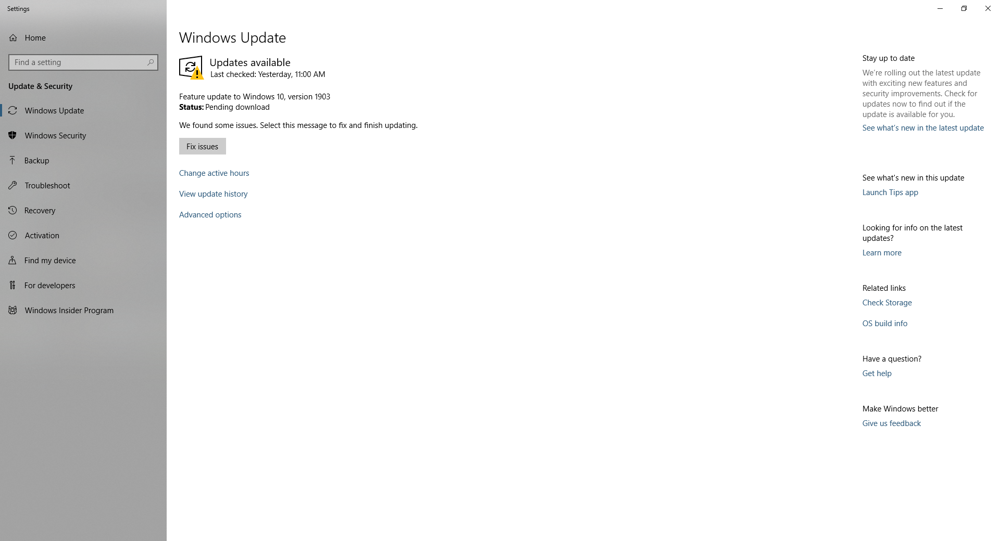
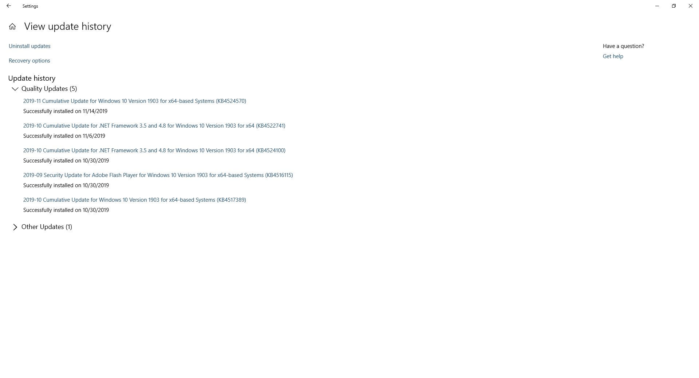
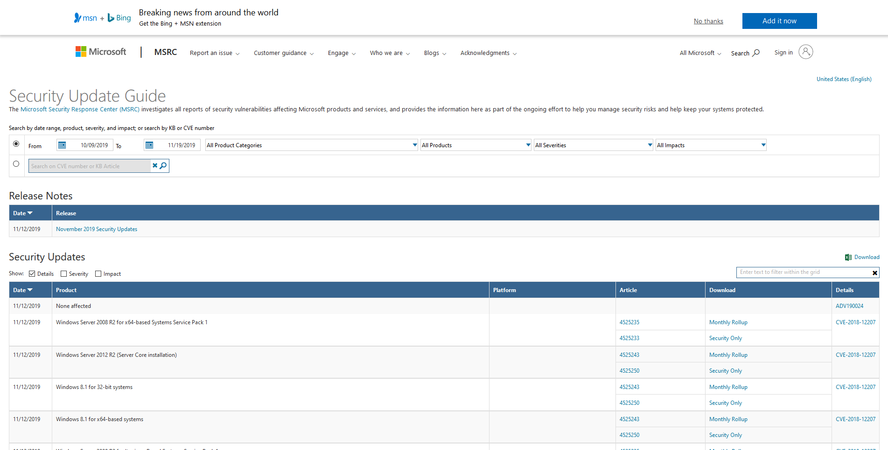

# 🎩 Check Installed Patch Compare Vulnerable on Windows 10


หลายคนคงเคยใช้ Windows Update ในการ Install Patch ต่าง ๆ ของ Windows หรือจะทำการ Download มา Install ก็ได้ ในกรณีที่เราต้องการดูว่า [Vulnerable](https://www.acisonline.net/?p=1283\&lang=th) ใดได้ทำการปิดไปแล้ว ต้องดูเทียบกับ Patch ที่ได้ทำการติดตั้ง ซึ่งถ้าหากไม่ได้ใช้ Patch Management ก็มีหลายวิธี แต่จะแนะนำวิธีที่ง่ายในการตรวจสอบโดยเปรียบเทียบระหว่าง Patch จะแทนด้วยหมายเลข Knowledge Base ( KB ) และ Vulnerable จะแทนด้วยหมายเลข Common Vulnerabilities and Exposures ( CVE )


## **Download**

* [Windows Update Catelog](https://www.catalog.update.microsoft.com/home.aspx)

## **Get Started**

* ทำการรันคำสั่งใน Poweshell แล้วนำเลข HotFixID ไปตรวจสอบ


```
Get-HotFix
```


```
Source        Description      HotFixID      InstalledBy          InstalledOn
------        -----------      --------      -----------          -----------
MERCEDES      Update           KB4343669     NT AUTHORITY\SYSTEM  8/3/2018 12:00:00 AM
MERCEDES      Update           KB4346084     NT AUTHORITY\SYSTEM  6/14/2019 12:00:00 AM
MERCEDES      Update           KB4456655     NT AUTHORITY\SYSTEM  10/6/2018 12:00:00 AM
MERCEDES      Security Update  KB4465663     NT AUTHORITY\SYSTEM  11/25/2018 12:00:00 AM
MERCEDES      Security Update  KB4477137     NT AUTHORITY\SYSTEM  12/16/2018 12:00:00 AM
MERCEDES      Security Update  KB4485449     NT AUTHORITY\SYSTEM  2/14/2019 12:00:00 AM
MERCEDES      Security Update  KB4497398     NT AUTHORITY\SYSTEM  5/25/2019 12:00:00 AM
MERCEDES      Security Update  KB4503308     NT AUTHORITY\SYSTEM  6/12/2019 12:00:00 AM
MERCEDES      Security Update  KB4509094     NT AUTHORITY\SYSTEM  7/10/2019 12:00:00 AM
MERCEDES      Security Update  KB4512501     NT AUTHORITY\SYSTEM  8/14/2019 12:00:00 AM
```

* ทำการเปิด Windows Update Setting แล้วคลิก View update history



* จะแสดง Update History ที่ได้ทำการ Installed ซึ่งเราสามารถคลิกเพื่อดูรายละเอียดของ KB ที่อยู่บนเว็บไซต์ [https://support.microsoft.com/en-us](https://support.microsoft.com/en-us)



* เข้าไปที่เว็บไซต์ [https://portal.msrc.microsoft.com/en-US/security-guidance](https://portal.msrc.microsoft.com/en-US/security-guidance) แล้วทำการค้นหาจากหมายเลข KB



**อ่านเพิ่มเติม** : [https://portal.msrc.microsoft.com/en-US/](https://portal.msrc.microsoft.com/en-US/)
