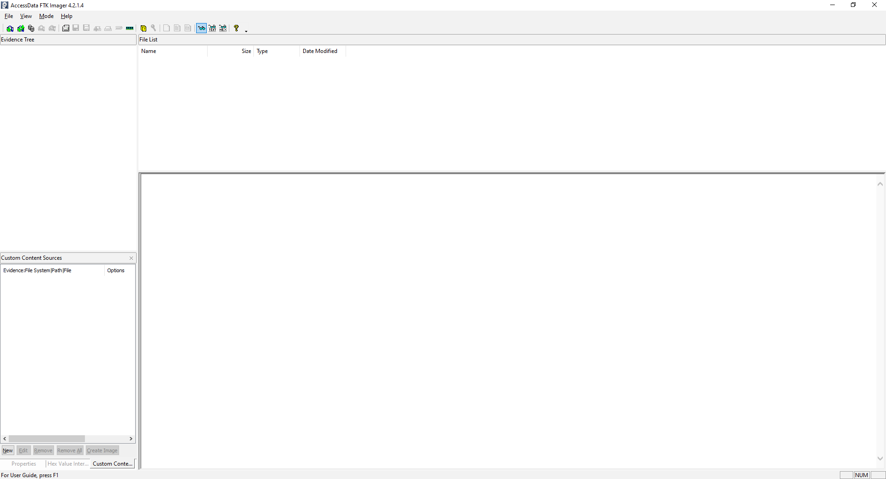
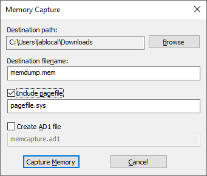
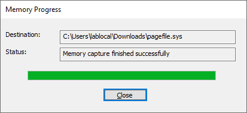
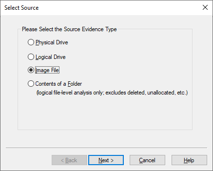
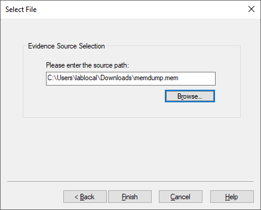
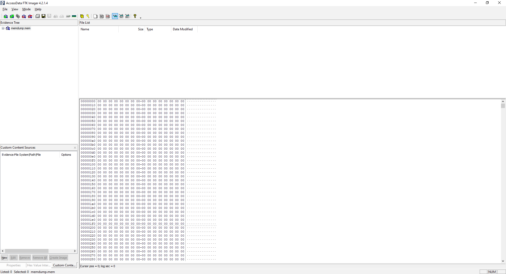

# 🎩 Digital Forensic


โดยปกติการตรวจพิสูจน์พยานหลักฐานทางดิจิทัล Digital Forensic จะประกอบไปด้วยเครื่องมือมากหมาย ซึ่งเราจะมาเริ่มที่พื้นฐานของการทำ Digital Forensic นั่นก็คือการทำสำเนาข้อมูลและการกู้คืนข้อมูล Forensics Imaging ด้วย FTK Imager


## Forensics Imaging

การตรวจพิสูจน์พยานหลักฐานทางดิจิทัล ห้ามทำกับต้นฉบับ จึงต้องมีการทำสำเนาข้อมูล Forensics Imaging โดยจะทำการสำเนาข้อมูลในแต่ละ Sector ตั้งแต่ Sector ถึง Sector สุดท้าย ไปยัง Hard Drive หรือ External Hard Drive โดยทั่วไปข้อมูลดิจิทัลสามารถแบ่งได้เป็น 2 ประเภท

Volatile Data

ข้อมูลในหน่วยความจำที่สามารถสูญหายได้เมื่อปิดอุปกรณ์อย่าง RAM เช่น Running Application, Running Process, Open Port, Password Cache รวมถึงบุคคลอื่นที่สามารถเข้ามาควบคุมคอมพิวเตอร์โดยที่เจ้าของไม่รู้ตัวผ่านทาง Malware

Non-Volatile Data

ข้อมูลในหน่วยความจำที่ไม่สูญหายเมื่อปิดอุปกรณ์อย่าง Hard Drive, Solid State Drive เช่น Image, File Document ทั่ว ๆ ไปที่เราใช้งานกันอยู่ทุกวัน ปัจจุบันมีขนาด 1TB กันแล้ว ในการทำสำเนาข้อมูลควรคำนึงถึงคำนวณความเร็วในการอ่านเขียนข้อมูล ( Read / Write ) เวลาที่ใช้ในการตรวจสอบความถูกต้องของข้อมูล ( Hashing ) ขนาดของสื่อที่ใช้ในการทำสำเนาข้อมูลห้ามน้อยกว่าต้นฉบับ และควรล้างข้อมูลสื่อที่ใช้ในการทำสำเนา ด้วยการการแทนที่ข้อมูลทั้งหมดด้วยเลข 0 ( [Zero-Fill](https://codeinsane.wordpress.com/2018/10/02/low-level-format-vs-zero-fill/) ) รวมถึงการทำสำเนาข้อมูลต้องทำผ่านอุปกรณ๋ Write Blocker เพื่อป้องกันการเปลี่ยนแปลงของข้อมูลหลักฐาน ซึ่งมีผลต่อการนำไปใช้อ้างอิงพยานหลักฐานในชั้นศาล

## **Download**

* [FTK Imager](https://accessdata.com/product-download/)

## **Get Started**

* ทำการดาวน์โหลดและติดตั้ง FTK Imager

* ทำการเปิดโปรแกรม FTK Imager แล้วคลิก File -> Capture Memory

* เลือก Destination Path แล้วคลิก Capture Memory

* คลิก Close

* คลิก File -> Add Evidence Item -> Image File แล้วคลิก Next

* เลือก Source Path แล้วคลิก Finish

* จะแสดงค่า Hash ของไฟล์

**อ่านเพิ่มเติม** : [https://bit.ly/2RVDCc0](https://bit.ly/2RVDCc0)
