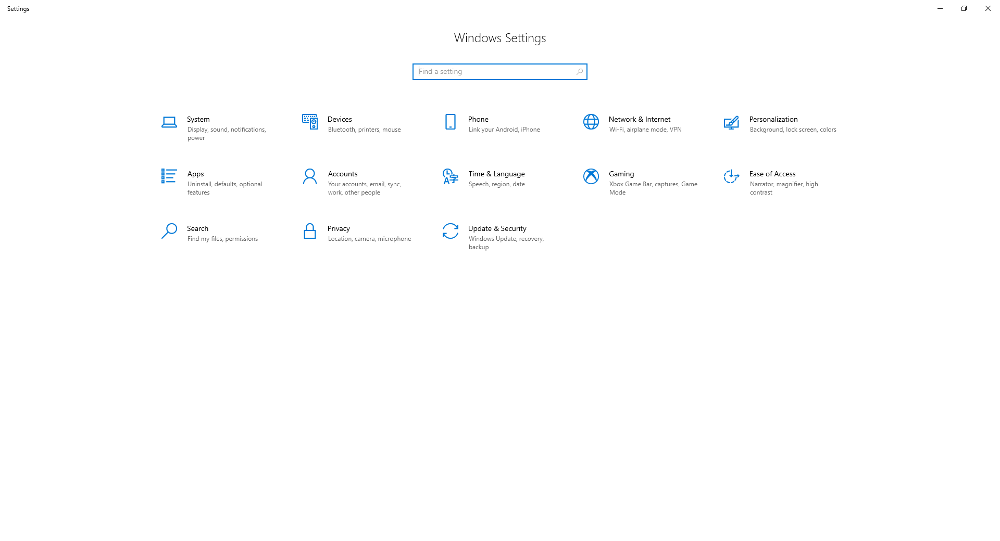
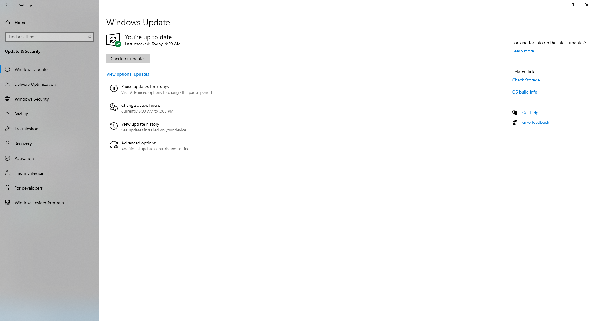
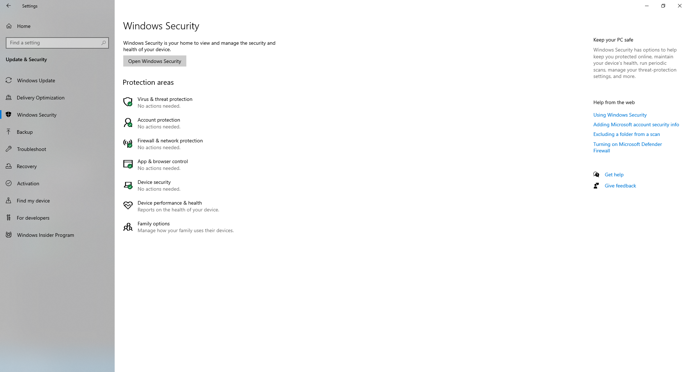
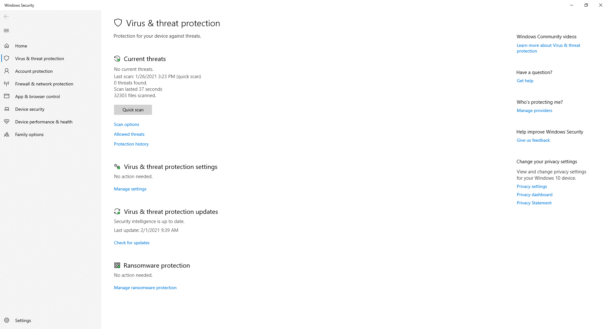
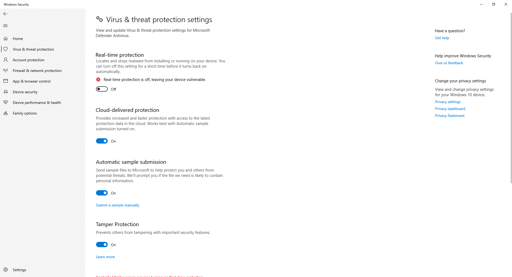

# 🎩 Disable Antivirus Protection on Windows 10


ในกรณีที่เราทำการ Install Windows 10 ใหม่ ๆ เราจะไม่สามารถติดตั้งโปรแกรมเถื่อนได้ เนื่องจากทาง Microsoft มีการ Enable Feature ในการป้องกัน Real-Time Antivirus Protection บน Windows Security ซึ่งเราสามารถทำการ Disable แล้วทำการติดตั้งโปรแกรมเถื่อนได้ตามปกติ


## **Get Started**

* ทำการเปิด Windows Settings แล้วคลิก Update & Security

<figure><figcaption></figcaption></figure>

* คลิก Windows Security

<figure><figcaption></figcaption></figure>

* คลิก Virus & threat protection

<figure><figcaption></figcaption></figure>

* คลิก Virus & threat protection settings -> Manage settings

<figure><figcaption></figcaption></figure>

* เลือก Real-time protection แล้วทำการ Turn-Off

<figure><figcaption></figcaption></figure>

**อ่านเพิ่มเติม** : [https://bit.ly/2VVHTyI](https://bit.ly/2VVHTyI)
