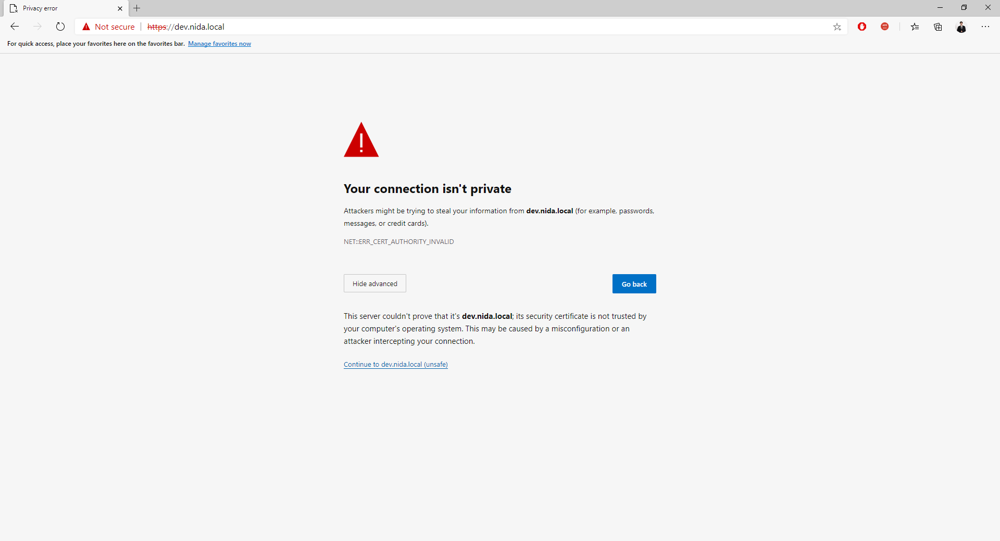
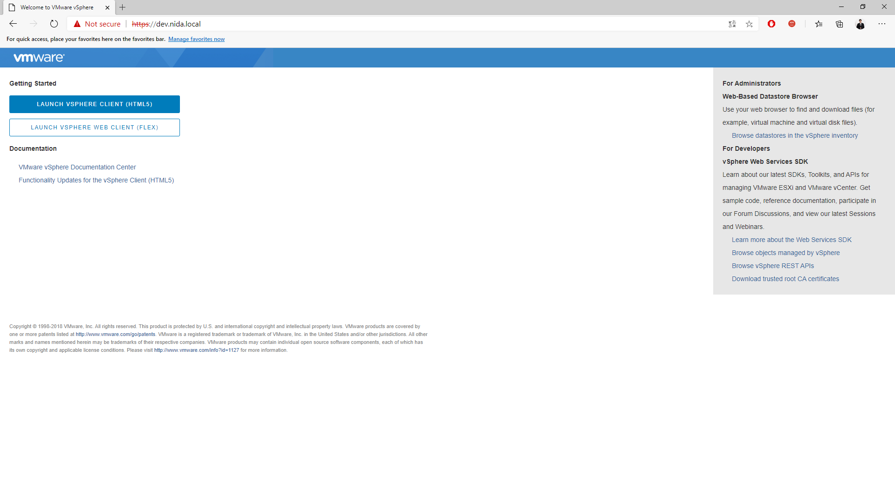

# 🎩 Fix Security Certificate is not Trusted


ในกรณีที่เราทำการ Call Website บน Web Browser แล้วเกิด Error Security Certificate is not Trusted เนื่องจากไม่ได้ติดตั้ง SSL Certificate ซึ่งจะพบได้บ่อยกับเครื่องที่เป็น Development Server ส่วน Production Server จะไม่ค่อยเจอ โดยปกติเราสามารกด Continue to unsafe ต่อไปได้ แต่ในกรณีที่เราไม่มีให้ปุ่มกด เราสามารถทำการ Bypass ต่อไปได้ สามารถใช้ได้กับทุก Web Browser


<figure><figcaption></figcaption></figure>


**Cause** : สาเหตุเนื่องมาจากไม่ได้ทำการติดตั้ง SSL Certificate ซึ่งหากไม่ทำการติดตั้ง SSL Certificate สามารถทำการ Bypass ด้วยคำสั่ง thisisunsafe


## **Configuration**

* ทำการพิมพ์ thisisunsafe โดยไม่ต้องกด Enter จะสามารถเข้าใช้งาน Website ได้ตามปกติ

<figure><figcaption></figcaption></figure>
