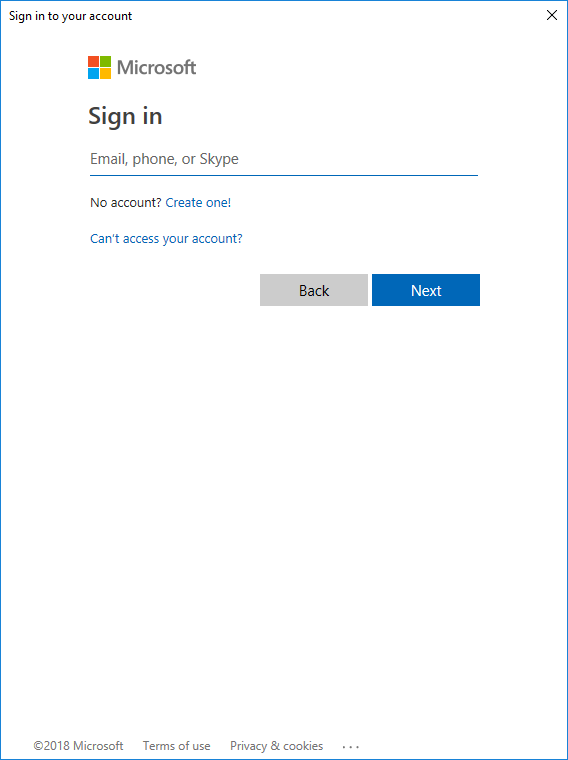

# 😱 Redo Provisioning Microsoft Office 365


โดยปกติการสร้าง Account บน Microsoft Office 365 หลังจากทำการ Provisioning แล้ว อาจจะเกิดข้อผิดพลาด เช่น Mail ไม่สามารถใช้งานได้ โดยจะขึ้นข้อความว่า We are preparing ซึ่งหลังจากทำการตรวจสอบ Provisioning Status แล้วพบว่า Exchange Error ซึ่งหากทำการ Redo Provisioning แล้วยังไม่ได้อาจจะต้องทำการ Remove License แล้วทำการ Assign License ใหม่ ผ่านทาง Powershell



## **Requirement**

* [Install Microsoft Online Services Sign-In Assistant for IT Professionals RTW](https://go.microsoft.com/fwlink/p/?LinkId=286152)

## **Get Started**

* ทำการเชื่อมต่อ Azure Active Directory


```
Connect-MsolService
```


* กรอก Username และ Password ด้วย Account ที่มีสิทธิ์จัดการ Azure Active Directory



* ทำการตรวจสอบ Provisioning Status จะเห็นว่า Exchange Error


```
(Get-MsolUser -UserPrincipalName "user@domain.com").Licenses[0].ServiceSta
```


```
ServicePlan            ProvisioningStatus
-----------            ------------------
EducationAnalyticsP1   Success
KAIZALA_O365_P2        Success
MICROSOFT_SEARCH       PendingProvisioning
WHITEBOARD_PLAN1       Success
BPOS_S_TODO_2          Success
AAD_BASIC_EDU          Success
SCHOOL_DATA_SYNC_P1    Success
STREAM_O365_E3         Success
TEAMS1                 Success
INTUNE_O365            PendingActivation
Deskless               Success
FLOW_O365_P2           Success
POWERAPPS_O365_P2      Success
RMS_S_ENTERPRISE       Success
OFFICE_FORMS_PLAN_2    Success
PROJECTWORKMANAGEMENT  Success
SWAY                   Success
YAMMER_EDU             Success
SHAREPOINTWAC_EDU      Success
SHAREPOINTSTANDARD_EDU Success
EXCHANGE_S_STANDARD    Error
OFFICESUBSCRIPTION     Success
MCOSTANDARD            Success
```

* ทำการตรวจสอบ License


```
Get-MsolUser -UserPrincipalName "user@domain.com" | fl licenses
```


```
Licenses : {nida365:STANDARDWOFFPACK_IW_STUDENT}
```

* ทำการ Remove License


```
Set-MsolUserLicense -UserPrincipalName "user@domain.com" -RemoveLicenses "organization365:STANDARDWOFFPACK_IW_STUDENT"
```


* ทำการ Assign License


```
Set-MsolUserLicense -UserPrincipalName "user@domain.com" -AddLicenses "organization365:STANDARDWOFFPACK_IW_STUDENT"
```


* ทำการตรวจสอบ ObjectID


```
Get-MsolUSer -Userprincipalname "user@domain.com" | select *ObjectID*
```


```
ObjectId
--------
8db6d85f-j073-4dcd-939e-f38842f15f4d
```

* ทำการ Redo Provisioning


```
Redo-MsolProvisionuser -ObjectID "8db6d85f-j073-4dcd-939e-f38842f15f4d"
```


**อ่านเพิ่มเติม** : [https://bit.ly/36vsmbT](https://bit.ly/36vsmbT)
