# 🧩 Integrate Microsoft Graph API with Function App on Azure


หลังจากที่เราได้ทำการสร้าง Function App กันไปแล้ว คราวนี้ก็ถึงเวลาที่จะต่อกับ Microsoft Graph API โดยมีข้อควรระวังคือไม่ควรคัดลอก JSON มาวาง เพราะอาจจะต้องทำการ Install Extension ซึ่งมันจะไม่ขึ้นให้ Install ต้องทำการ Add Parameter แบบคลิกแทน ถึงจะขึ้นให้ทำการ Install


## **Get Started**

* คลิก New Function

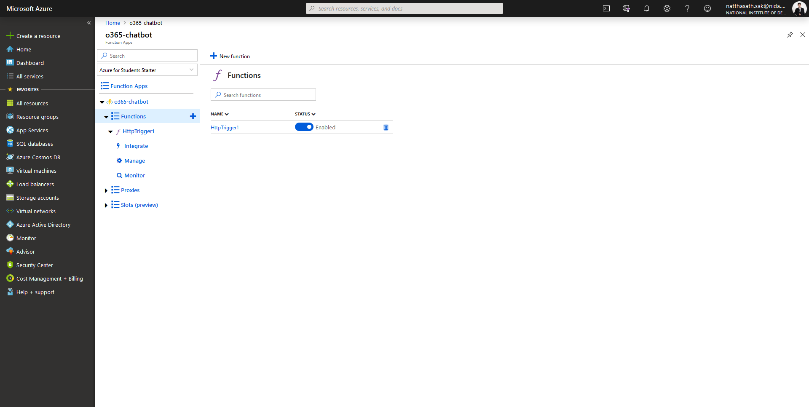

* คลิก HTTP Trigger

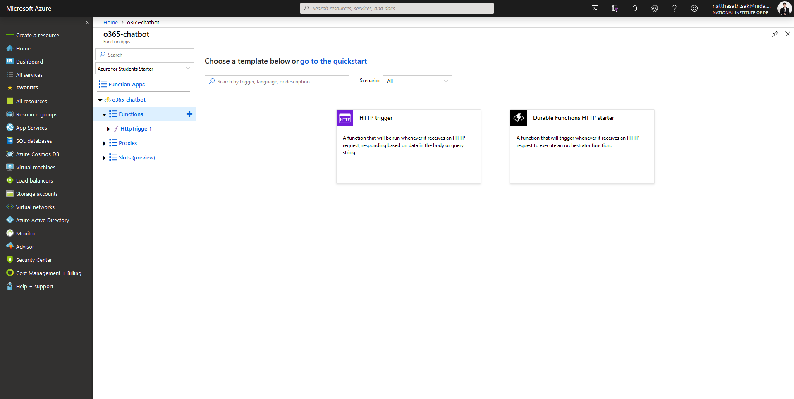

* กำหนดชื่อ Function Name แล้วคลิก Create

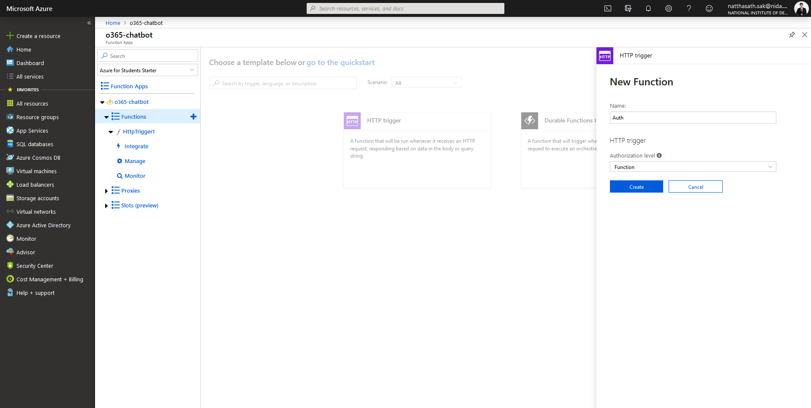

* ทำการแก้ไขไฟล์ run.csx


```
#r "Newtonsoft.Json"

using System.Net; 
using System.Net.Http; 
using System.Net.Http.Headers;
using Microsoft.Extensions.Logging; 

public static async Task Run(HttpRequestMessage req, string graphToken, ILogger log)
{
    HttpClient client = new HttpClient();
    client.DefaultRequestHeaders.Authorization = new AuthenticationHeaderValue("Bearer", graphToken);
    return await client.GetAsync("https://graph.microsoft.com/v1.0/me/");
}
```


* เลือกฟังก์ชั่นที่เราสร้าง Auth แล้วคลิก Integrate

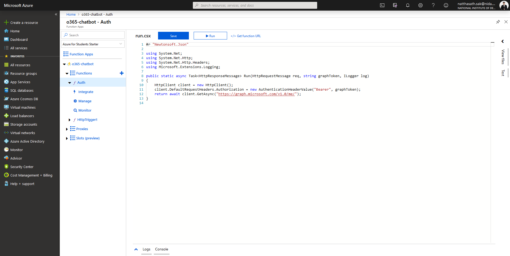

* คลิก Inputs

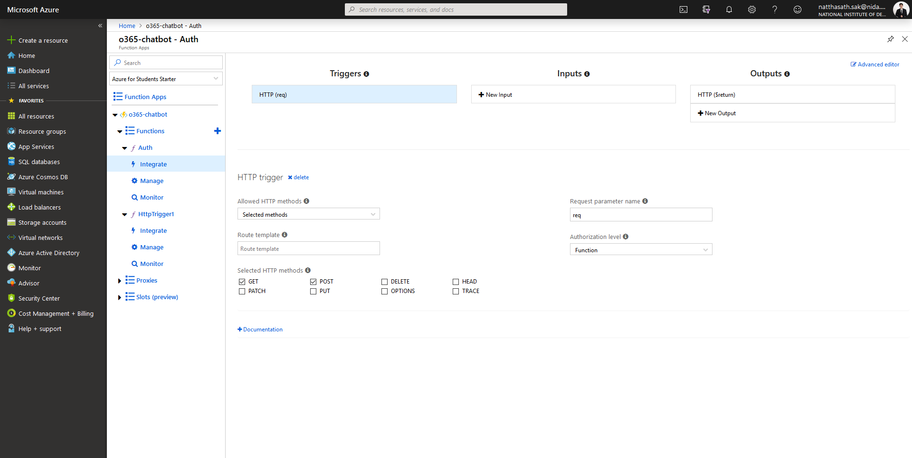

* เลือก Auth token แล้วคลิก Select

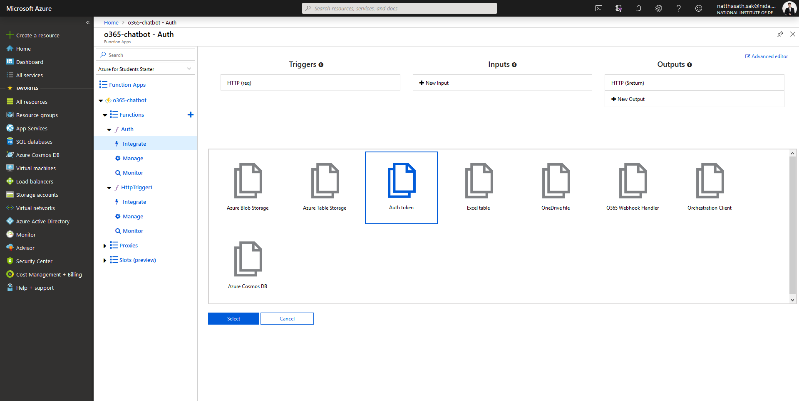

* ทำการติดตั้ง Extension คลิก Install

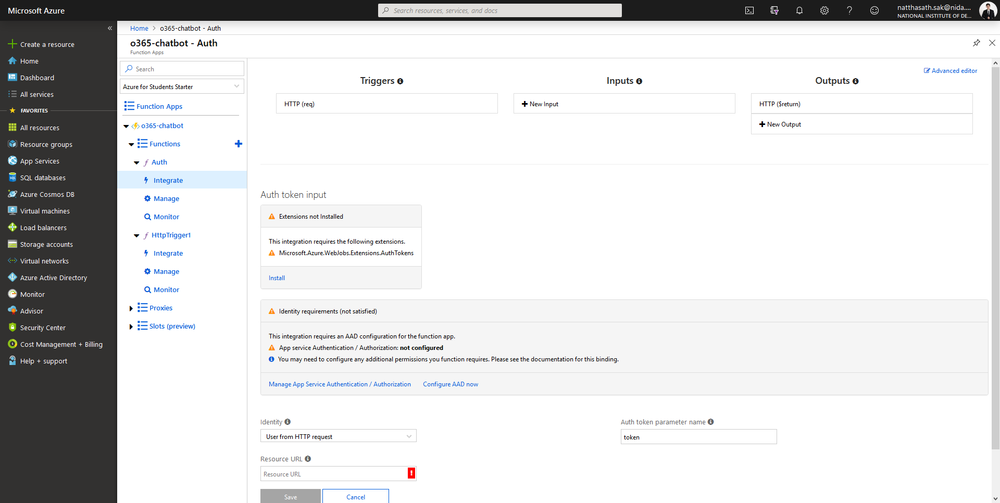

* คลิก Manage App Service Authentication / Authorization

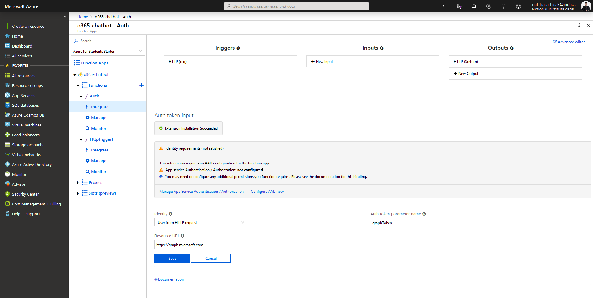

* ทำการ On App Service Authentication แล้วคลิก Azure Active Directory

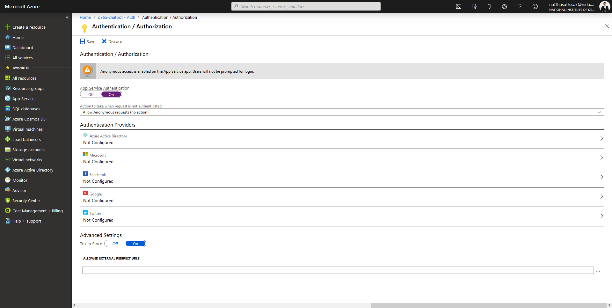

* เลือก Management Mode เป็น Express แล้วคลิก OK

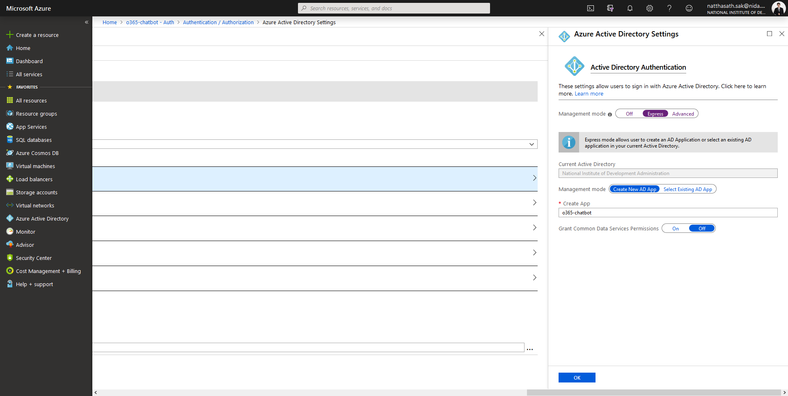

* เลือก Action Request เป็น Log in with Azure Active Directory แล้วคลิก Save

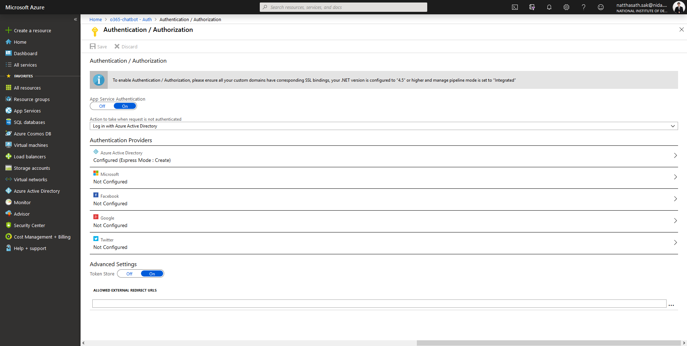

* ทำการแก้ไข Resource URL ที่จะยิงไปหา และแก้ไขชื่อ Parameter Name เป็น graphToken แล้วคลิก Save


* ทำการ Refresh หน้าจอ ฟังก์ชัน Auth จะพร้อมใช้งานแล้ว

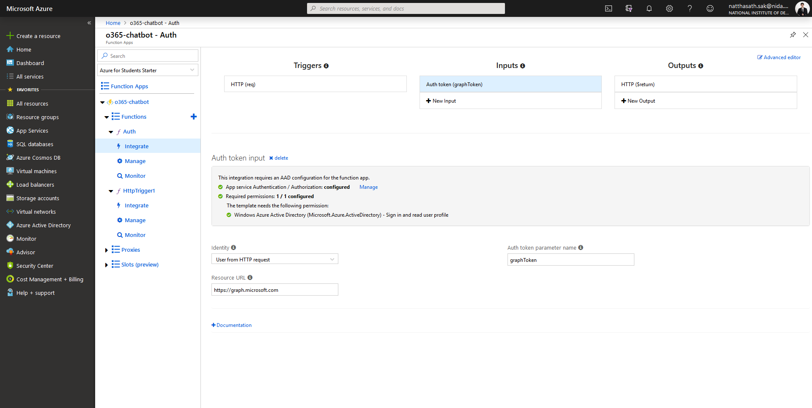

* ลองทำการเรียกผ่าน Browser โดยคลิก Get function URL

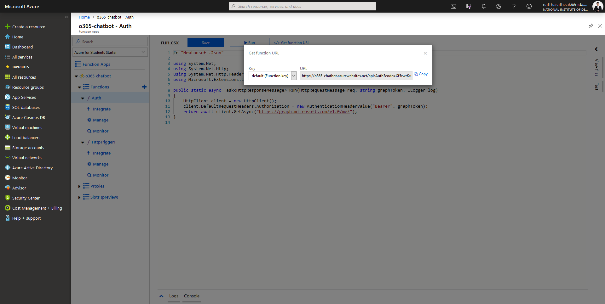

* คลิก Accept

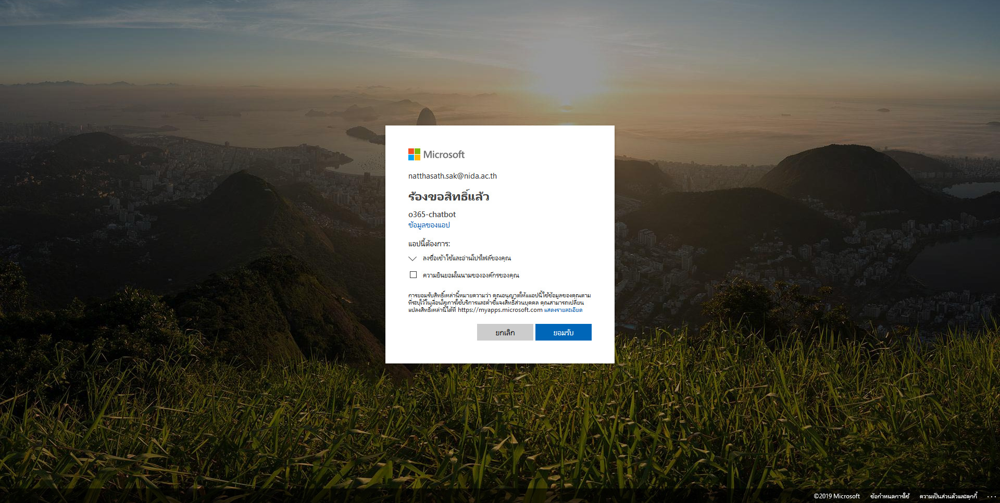

* จะแสดงผลลัพธ์ในรูปแบบ JSON

<figure>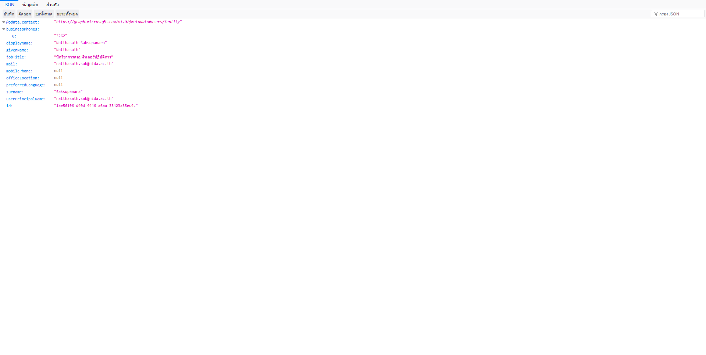<figcaption></figcaption></figure>

อ่านเพิ่มเติม : [https://bit.ly/2FSLgi6](https://bit.ly/2FSLgi6)
