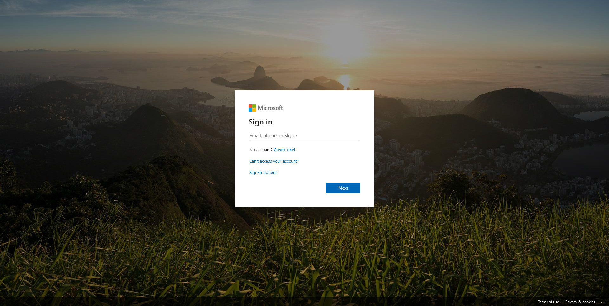
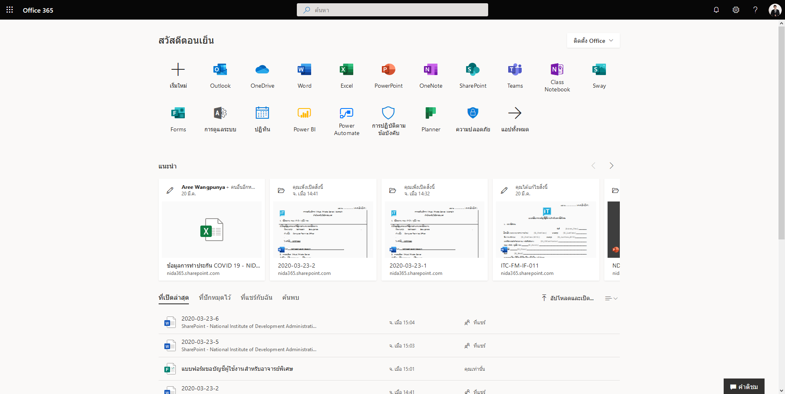
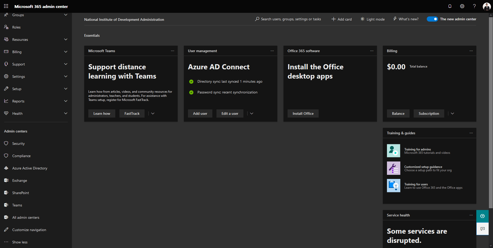
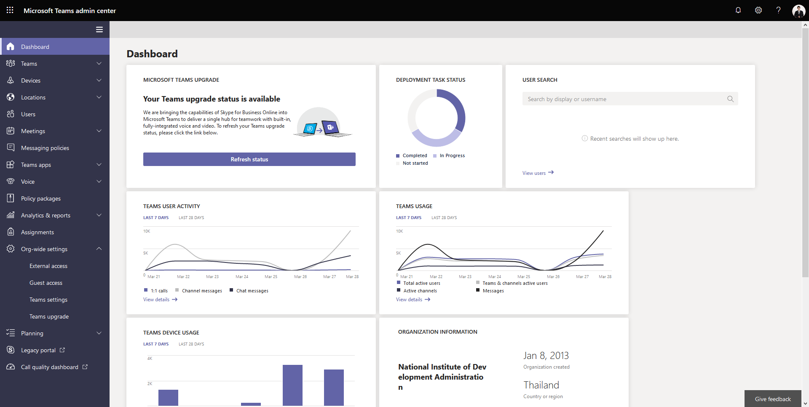

# 👔 How to enable Guest Access on Microsoft Team


หลายคนที่ใช้ Microsoft Team ในการ Work From Home ทำงานอยู่บ้าน รวมถึงสถาบันการศึกษาที่ใช้ในการสอนออนไลน์ อาจจะติดปัญหากรณีที่ต้องการ Add Member คนจากหน่วยงานภายนอกองค์กร ที่ไม่มี Account บน Microsoft Office 365 จะไม่สามารถทำได้ ซึ่งจะต้อง Enable Guest Access โดย Global Administrator ก่อน


## **Get Started**

* เข้าไปที่หน้าเว็บ [http://portal.office.com](http://portal.office.com/)

* คลิก Admin

* คลิก Team

* เลือก Org-wide settings แล้วคลิก Guest access

* ทำการ Enable แล้วคลิก Save คำเตือนหลังจากทำการ Enable จะต้องรอ 24 ชั่วโมงในทางทฤษฎี ส่วนในทางปฏิบัติจะต้องรอ 2 วัน

.png>)

* ลองทำการ Add Member จะพบว่าสามารถ Invite บุคคลภายนอกด้วยอีเมลอย่าง Gmail เข้ามาใน Team ได้

**อ่านเพิ่มเติม** : [https://bit.ly/2UoFrRf](https://bit.ly/2UoFrRf)
