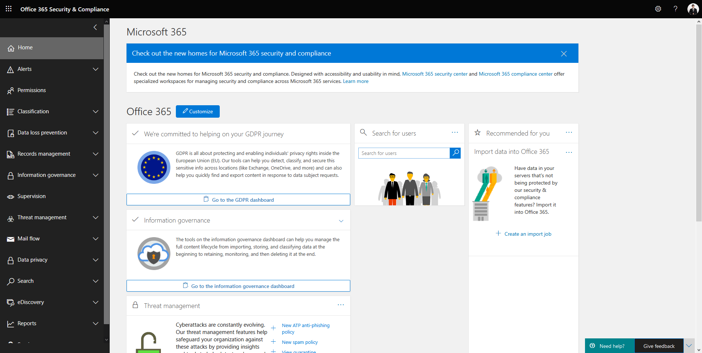
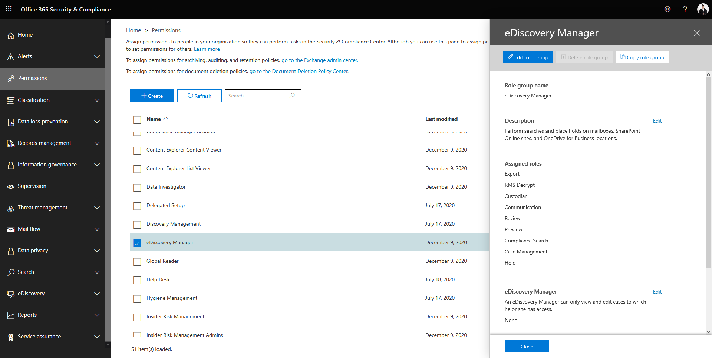
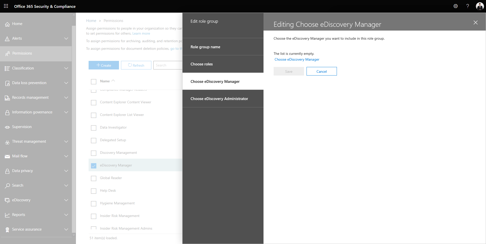
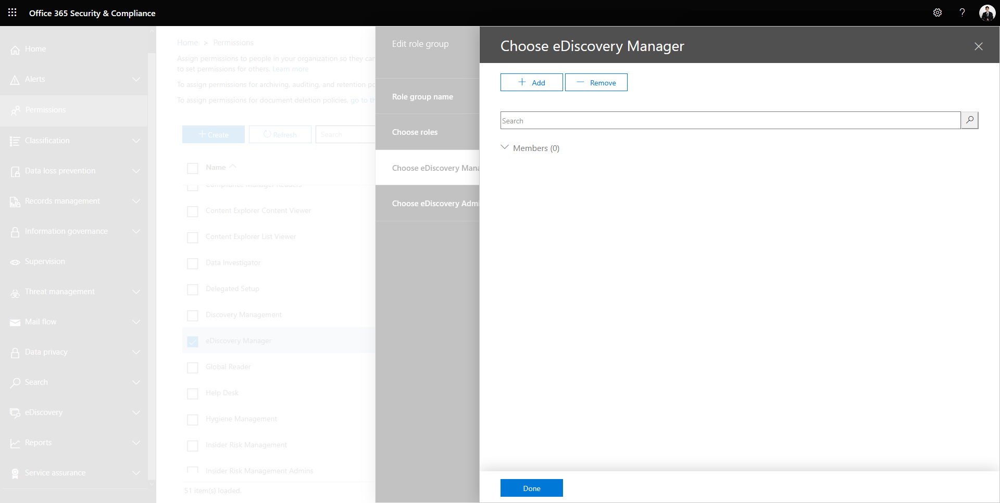

# 📩 Fix Mailbox Storage Limit on Microsoft Office 365 with Compliance Search


ในกรณีที่เราทำการ Send Mail บน Outlook จน Storage Full จะทำให้ไม่สามารถ Send Mail ได้ โดยจะต้องทำการ Clear Storage Mailbox ก่อน ซึ่ง [Storage Limit](https://docs.microsoft.com/en-us/office365/servicedescriptions/exchange-online-service-description/exchange-online-limits) จะแตกต่างกันไปตาม Microsoft Office 365 Plan ที่เลือกใช้ แต่เริ่มต้นจะอยู่ที่ 50 GB



**Cause** : สาเหตุเนื่องมาจากข้อจำกัด Storage Limit บน Outlook ซึ่งมีวิธีแก้ 3 วิธี คือ 1. ทำการ Export Data ออกมา 2. ทำการ Choose Office 365 Plan ที่สูงขึ้น ซึ่งค่าใช้จ่ายก็จะแพงขึ้นตามไปด้วย 3. ทำการ Clear Storage Mailbox ด้วย [Content Search](https://docs.microsoft.com/en-us/microsoft-365/compliance/content-search?view=o365-worldwide) ซึ่งเราสามารถเขียน Regular Expression ผ่าน [Property](https://docs.microsoft.com/en-us/microsoft-365/compliance/keyword-queries-and-search-conditions?view=o365-worldwide) โดยเราจะเลือกใช้วิธีที่ 3 ในการแก้ไขปัญหา


## **Configuration**

* เข้าไปที่หน้าเว็บ [https://protection.office.com](https://protection.office.com/)

<figure><figcaption></figcaption></figure>

* เลือก Permissions -> eDiscovery Manager แล้วคลิก Edit role group

<figure><figcaption></figcaption></figure>

* คลิก Choose eDiscovery Manager

<figure><figcaption></figcaption></figure>

* คลิก Add แล้วคลิก Done

<figure><figcaption></figcaption></figure>

* ทำการเพิ่ม Global Variable ขึ้นในไฟล์ Configuration.ps1


```
# O365
$Global:complianceuri = 'https://ps.compliance.protection.outlook.com/powershell-liveid/'
```


* ทำการสร้างไฟล์ Clear-Mailbox.ps1

```
. "$PSScriptRoot\Configuration.ps1"
Connect-ExchangeOnline -Credential $credential

$session = New-PSSession -ConfigurationName Microsoft.Exchange -ConnectionUri $url -Credential $credential -Authentication Basic -AllowRedirection

Import-PSSession -AllowClobber $session -DisableNameChecking

$storage = Get-Mailbox -Identity 'Natthasath Saksupanara' | Select-Object Displayname,
        @{Name='IssueWarningQuota (GB)';Expression={[Math]::Round($_.IssueWarningQuota.ToString().Split(” “)[0], 0)}},
        @{Name='ProhibitSendQuota (GB)';Expression={[Math]::Round($_.ProhibitSendQuota.ToString().Split(” “)[0], 0)}},
        @{Name='TotalItemSize (GB)';Expression={[Math]::Round(((Get-MailboxStatistics -identity $_.identity).TotalItemSize.ToString().Split(” “)[0]),2)}},
        @{Name='ItemCount';Expression={[String]::join(";",((Get-MailboxStatistics -identity $_.identity).ItemCount))}}

$percent = [math]::Round(([double]$storage."TotalItemSize (GB)" / [double]$storage."ProhibitSendQuota (GB)") * 100, 1)

if ($percent -gt 80) {
    
        $folder = Get-MailboxFolderStatistics -Identity 'natthasath.sak@nida.ac.th' | Where-Object {$_.FolderPath -eq '/Sent Items'} | Select-Object FolderPath, FolderId, Identity
        $encoding= [System.Text.Encoding]::GetEncoding('us-ascii')
        $nibbler= $encoding.GetBytes('0123456789ABCDEF')
        $folderIdBytes = [Convert]::FromBase64String($folder."FolderId")
        $indexIdBytes = New-Object byte[] 48
        $indexIdIdx = 0
        $folderIdBytes | select -skip 23 -First 24 | %{$indexIdBytes[$indexIdIdx++]=$nibbler[$_ -shr 4];$indexIdBytes[$indexIdIdx++]=$nibbler[$_ -band 0xF]}
        $query = "folderid:$($encoding.GetString($indexIdBytes))"
        $search = New-ComplianceSearch -Name 'Delete Temp' -ExchangeLocation 'natthasath.sak@nida.ac.th' -ContentMatchQuery $query
        Start-ComplianceSearch -Identity $Search.Identity

        New-ComplianceSearchAction -SearchName 'Delete Temp' -Preview
        New-ComplianceSearchAction -SearchName 'Delete Temp' -Purge -PurgeType SoftDelete -Confirm:$false
    
}

Remove-PSSession $session
```

**อ่านเพิ่มเติม** :  [https://bit.ly/34adml6](https://bit.ly/34adml6), [http://bit.ly/3asDpYH](http://bit.ly/3asDpYH), [http://bit.ly/2Krt3xD](http://bit.ly/2Krt3xD)
