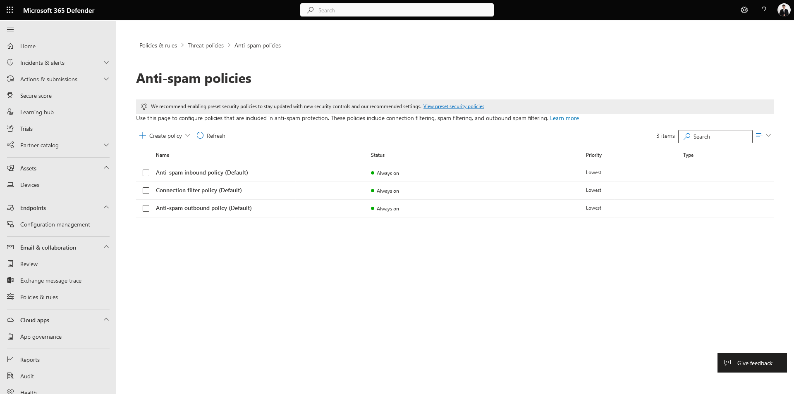
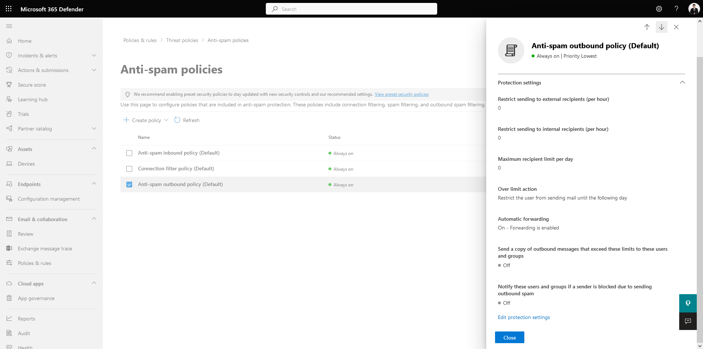

# 📩 How to enable Forward Email on Microsoft Office 365 to Another Domain


ในกรณีที่เราต้องการ Forward Email จาก Microsoft Office 365 ไปยัง Domain ภายนอก โดย Default จะไม่สามารถทำได้ เนื่องจาก Security Policy ของ Microsoft จะทำการ Disable เอาไว้ เพื่อป้องกัน Data Breach ภายในองค์กร แต่หากต้องการใช้งานจะต้องทำการ Enable ก่อน


## **Get Started**

* เข้าไปที่หน้าเว็บ [https://protection.office.com/antispam](https://protection.office.com/antispam)

<figure><figcaption></figcaption></figure>

* เลือก Anti-spam outbound policy แล้วคลิก Edit protection settings

<figure><figcaption></figcaption></figure>

* เลือก Automatic forwarding rules -> On – Forwarding is enabled แล้วคลิก Save

<figure><figcaption></figcaption></figure>

**อ่านเพิ่มเติม** : [http://bit.ly/3E5hbJE](http://bit.ly/3E5hbJE)
