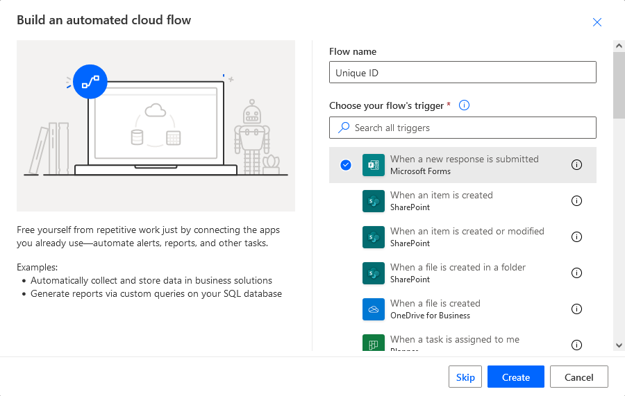
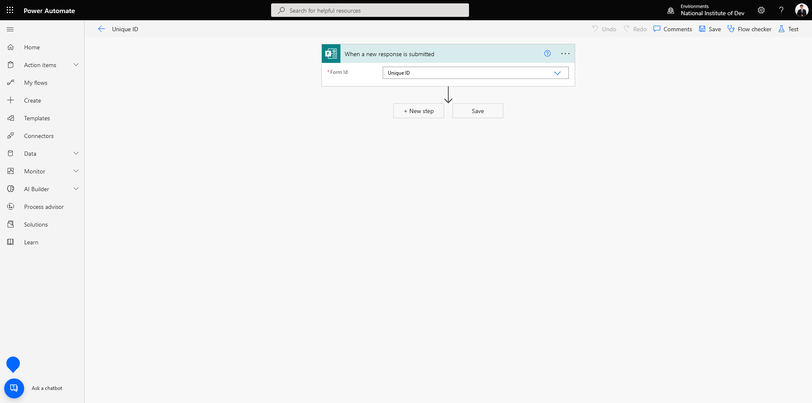
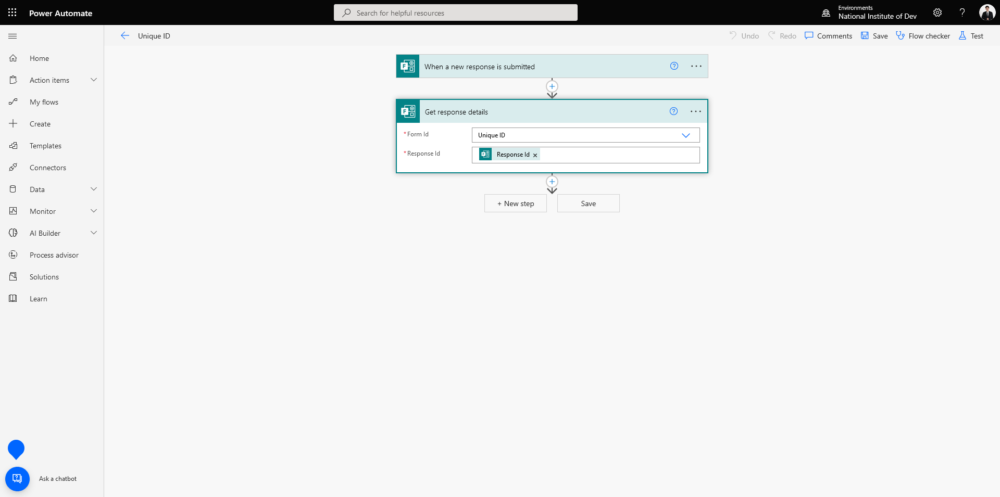
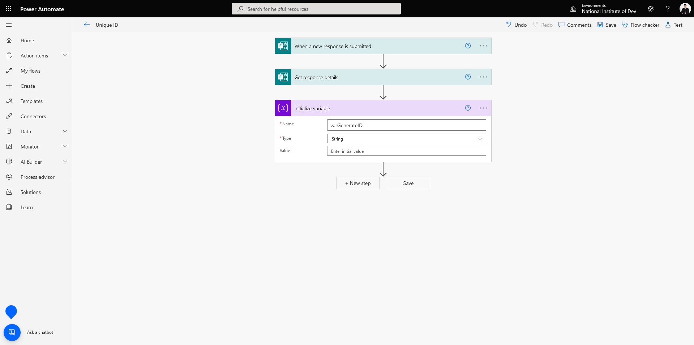
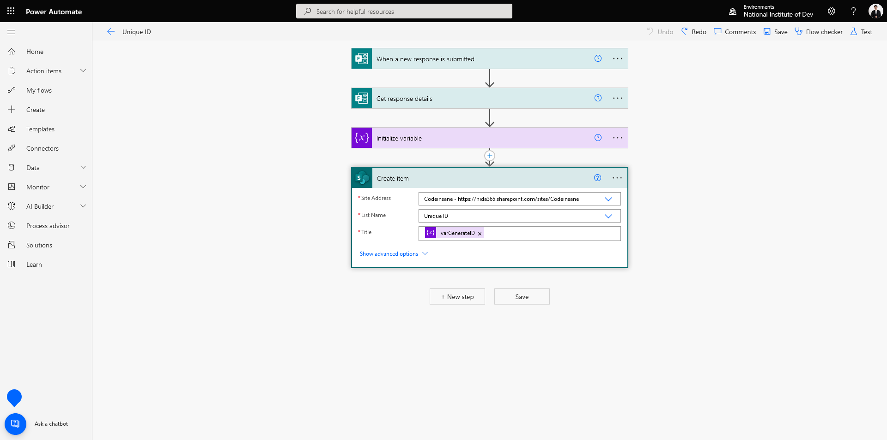

# 🤖 Generate Unique ID when Submit Microsoft Form with Power Automate


ในกรณีที่เราทำการ Submit Microsoft Form เราจะได้เลข Responder Id เริ่มตั้งแต่เลข 1 เป็นต้นไป ซึ่งถ้าเราทำเป็น Digital Form แล้วมันจะดูไม่ Professional เท่าไหร่ เราสามาร Custom ID ให้เป็นรูปแบบที่เราต้องการได้ ซึ่งผมจะใช้ 5 ตัวอักษร โดยใช้ปีขึ้นก่อน เช่น 65001


## **Get Started**

* เข้าไปที่หน้าเว็บ [https://asia.flow.microsoft.com/en-us/](https://asia.flow.microsoft.com/en-us/)

<figure><figcaption></figcaption></figure>

* คลิก My flows แล้วเลือก New Automated from blank

<figure><figcaption></figcaption></figure>

* ทำการกำหนด Flow name และเลือก When a new response is submitted แล้วคลิก Create <mark style="color:red;">คำเตือนชื่อต้องมากกว่า 3 ตัวขึ้นไป</mark>

<figure><figcaption></figcaption></figure>

* เลือก Form Id แล้วคลิก Next step

<figure><figcaption></figcaption></figure>

* เลือก Get response details ทำการกรอก Form Id และ Response Id แล้วคลิก Next step

<figure><figcaption></figcaption></figure>

* เลือก Initialize variable ตั้งชื่อ varGenerateID กำหนด Type เป็น String

<figure><figcaption></figcaption></figure>

* ทำการระบุ Expression แล้วคลิก Next step


```
add(mul(int(formatDateTime(outputs('Get_response_details')?['body/submitDate'],'yy', 'th-SE')), 1000), triggerOutputs()?['body/resourceData/responseId'])
```


* เลือก Create item แล้วทำการกรอกค่าที่รับมาจาก Microsoft Form เพื่อลง SharePoint List โดยตรง Title เลือกเป็น varGenerateID

<figure><figcaption></figcaption></figure>
