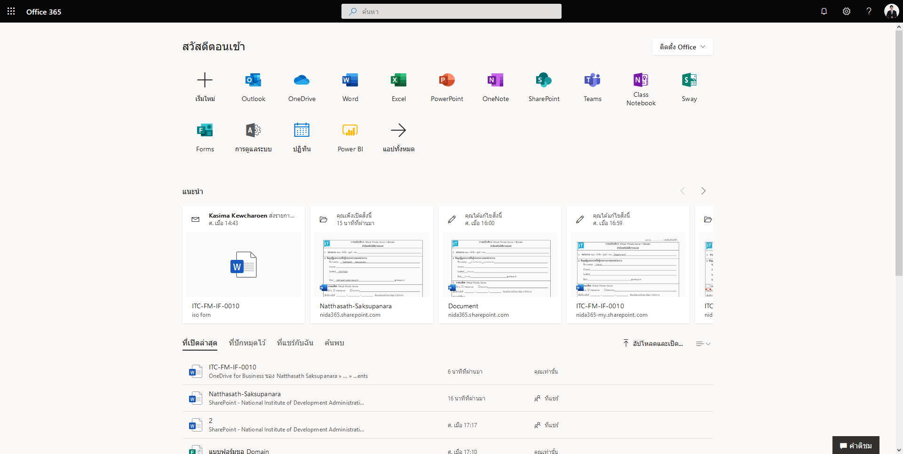

# 🤖 Generate Word Document when Submit Microsoft Form with Power Automate


หลังจากที่เราได้ลองสร้าง Condition บน Microsoft Flow เพื่อใช้ในการแจ้งเตือนผ่าน Email โดยการใช้ Trigger กันไปแล้ว เราจะมาลองทำแบบฟอร์มออนไลน์ Online Form ซึ่งการ Approve สามารถเขียน Condition ให้ทำการ Approve ผ่าน Email ได้ แต่หัวหน้าต้องการให้ปริ้นเป็นเอกสารได้ด้วย ซึ่งผมก็ไม่เข้าใจจะเก็บหลายที่ทำไม ในเมื่อจะลดใช้กระดาษแล้ว


## **Requirement**

* Install Microsoft Office
* Create SharePoint Site
* Create Microsoft Form

## **Get Started**

* เข้าไปที่หน้าเว็บ [http://portal.office.com](http://portal.office.com/)

* คลิก SharePoint Application เลือก SharePoint Site ที่เราสร้าง

### Step 1&#x20;

* ทำการสร้าง Group Column เพื่อทำการนำไป Mapping ค่าในแบบฟอร์ม Word Document  กับ SharePoint List คลิก Settings เลือก Site contents

.png>)

* คลิก Site settings

* คลิก Site columns

* คลิก Create

* ทำการกำหนดชื่อ Column Name และ Group แล้วคลิก OK

* จะแสดงข้อมูล Group Column

### Step 2&#x20;

* ทำการสร้าง SharePoint List เพื่อทำการเก็บข้อมูลที่ถูก Submit จาก Microsoft Form คลิก New เลือก List

* ทำการกำหนดชื่อ List Name แล้วคลิก Create

* คลิก Add from existing site columns

* เลือก FormGroup -> Add Column ที่ต้องการ แล้วคลิก OK

* จะแสดงข้อมูล Group Column ที่ถูกเพิ่มเข้ามาใน List

### Step 3&#x20;

* ทำการสร้าง Document Library สำหรับเก็บเฉพาะแบบฟอร์ม Word Document คลิก New เลือก Document Library

* ทำการกำหนดชื่อ Document Library แล้วคลิก Create

* คลิก Add from existing site columns

* เลือก FormGroup -> Add Column ที่ต้องการ แล้วคลิก OK

### Step 4&#x20;

* ทำการสร้าง Word Document คลิก New แล้วเลือก Word document

* คลิก Open in Desktop App

* คลิก Insert -> Quick Parts -> Document Property -> แล้วเลือก Column ใน Column Group ที่สร้าง

### Step 5&#x20;

* ทำการสร้าง Flow คลิก Power Automate Application

* คลิก Create เลือก Automated Flow

* ทำการกำหนดชื่อ Flow name โดยระบุ Trigger เป็น When an item is created ( SharePoint ) แล้วคลิก Create <mark style="color:red;">คำเตือนชื่อต้องมากกว่า 3 ตัวขึ้นไป</mark>

* ทำการกรอก Site Address และ List Name แล้วคลิก Next step

* เลือก Get file content ทำการกรอก Site Address และ File Identifier แล้วคลิก Next step

* เลือก Create file ทำการกรอก Site Address, Folder Path, File Name, File Content แล้วคลิก Next step

* เลือก Update file properties ทำการกรอก Site Address, Library Name และ Column จาก FormList มาใส่ใน FormDocument

* คลิก Test เลือก I’ll perform the trigger action คลิก Safe & Test แล้วคลิก Run flow <mark style="color:red;">คำเตือนต้องใส่ข้อมูลใน FormList ก่อน Flow ถึงจะทำการ Run ได้</mark>

### Step 6&#x20;

* ทำการใส่ข้อมูลใน FormList คลิก New กรอกรายละเอียดของ User Request แล้วคลิก Save <mark style="color:red;">คำเตือนข้อมูลใน FormList จะถูก Submit มาจาก Microsoft Form แต่จะทำการลองใส่ข้อมูลให้ดูก่อน</mark>

* จะแสดงข้อมูล Word Document ที่ถูก Generate มาจาก User Request เมื่อทำการ Submit จาก Microsoft Form

* ทำการเปิดไฟล์ Word แบบ Open in app <mark style="color:red;">คำเตือนหากทำการเปิดไฟล์ Word แบบ Open in browser จะไม่เห็นข้อมูล</mark>

**อ่านเพิ่มเติม** : [http://bit.ly/3d1sILy](http://bit.ly/3d1sILy)
