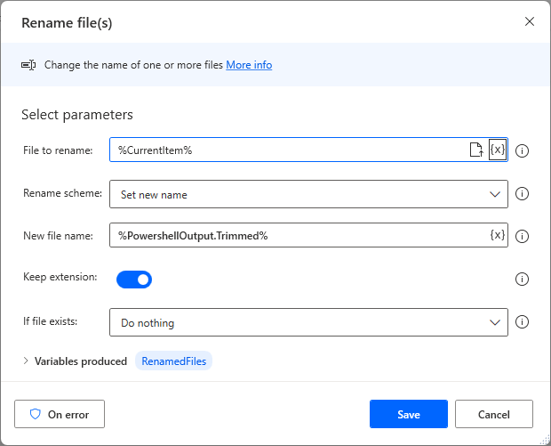
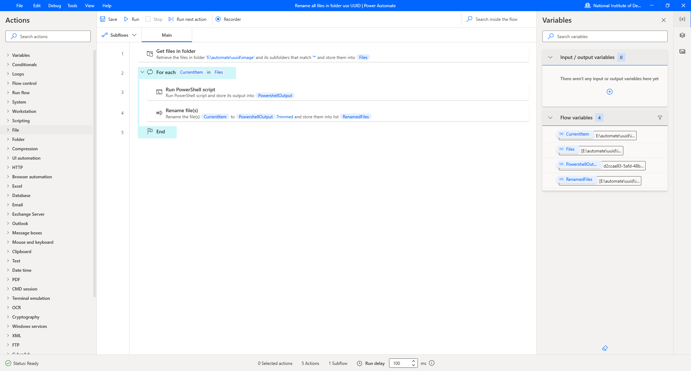
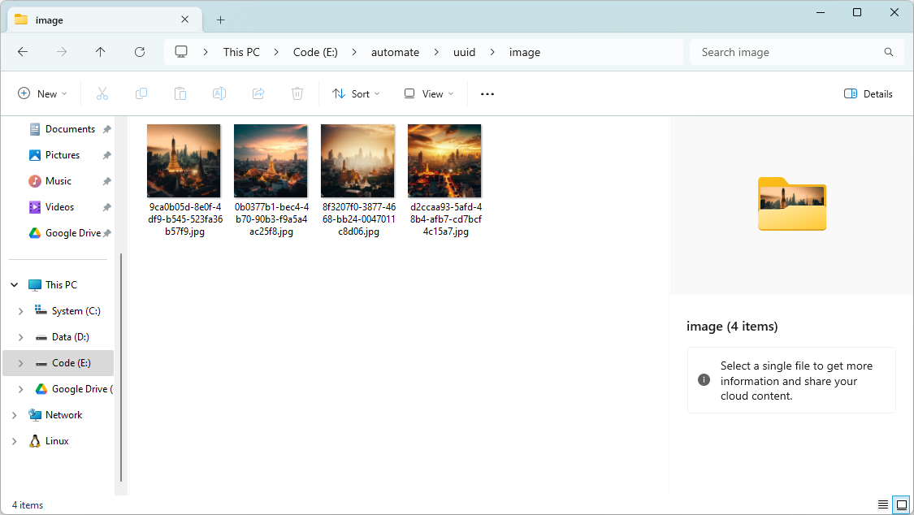

# ☁ How to Rename all Files in Folder use UUID with Power Automate Desktop


ในกรณีที่เราอยากจะทำการ Rename Files ทั้งหมดที่อยู่ใน Folder เมื่อก่อนเราจะต้องเขียน Code อย่างพวก Python แต่ปัจจุบันเราสามารใช้ Power Automate Desktop ในการ Rename Files ทั้งหมดได้แล้ว ซึ่งใช้งานสะดวกมาก


## **Get Started**

* ทำการเปิดโปรแกรม Power Automate Desktop แล้วคลิก New flow

<figure><figcaption></figcaption></figure>

* ทำการกำหนดชื่อ Flow name แล้วคลิก Create

<figure><figcaption></figcaption></figure>

* เลือก Folder -> Get files in folder ทำการกรอก Folder แล้วคลิก Save

<figure><figcaption></figcaption></figure>

* เลือก Loops -> For each ทำการกรอก Value to iterate แล้วคลิก Save

<figure><figcaption></figcaption></figure>

* เลือก Scripting -> Run PowerShell script วางในช่อง For each ทำการกรอก PowerShell code to run แล้วคลิก Save

```
(New-Guid | ft -hidetableheaders | out-string).trim()
```

<figure><figcaption></figcaption></figure>

* เลือก File -> Rename file(s) วางในช่อง For each ต่อจากข้างบน ทำการกรอก File to rename และ New file name แล้วคลิก Save

<figure><figcaption></figcaption></figure>

* ทำการ Save แล้วคลิก Run

<figure><figcaption></figcaption></figure>

* ลองเข้าไปดู Files ใน Folder

<figure><figcaption></figcaption></figure>

**อ่านเพิ่มเติม** : [https://bit.ly/45npewP](https://bit.ly/45npewP)
