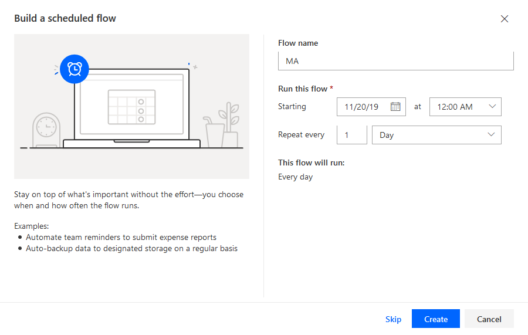
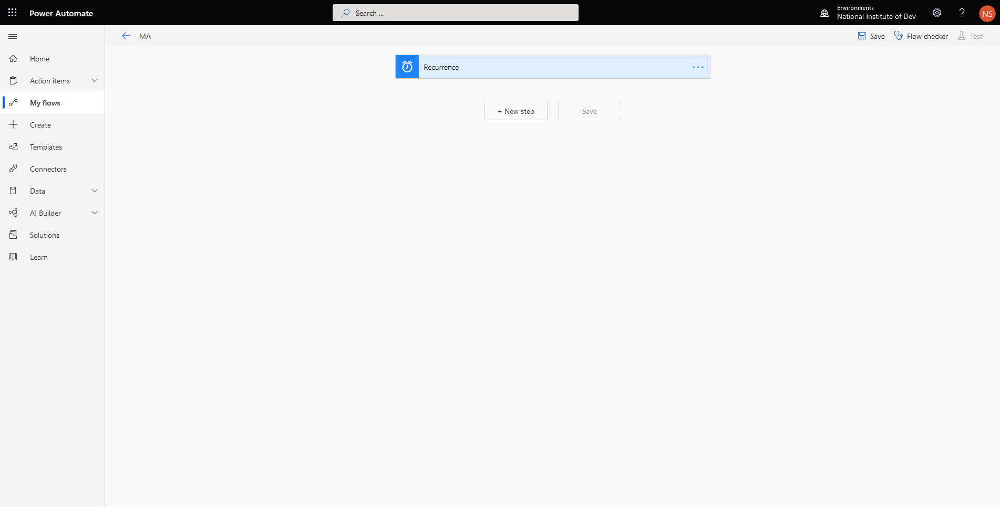
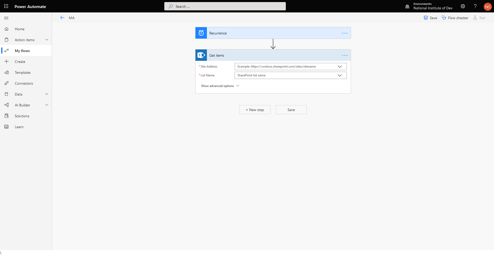
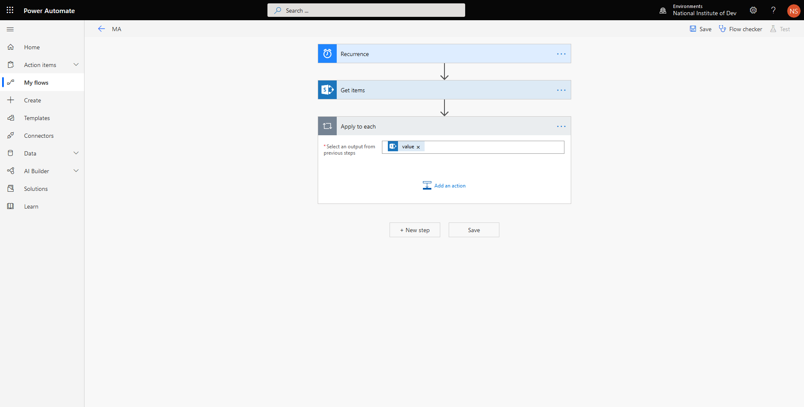
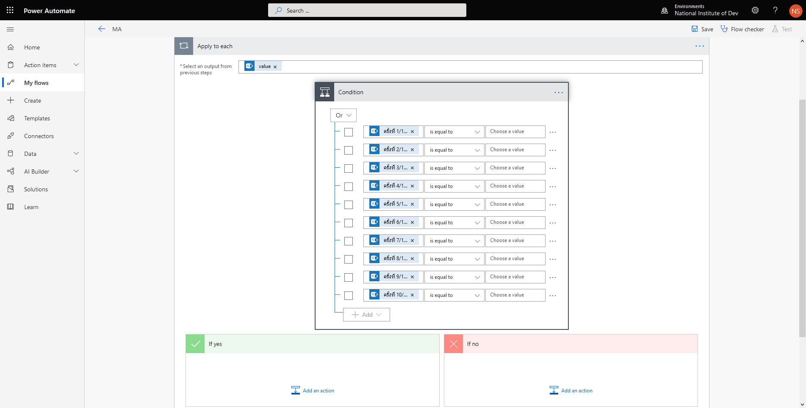
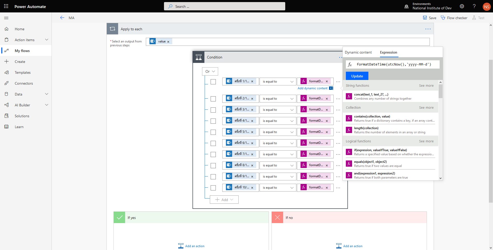
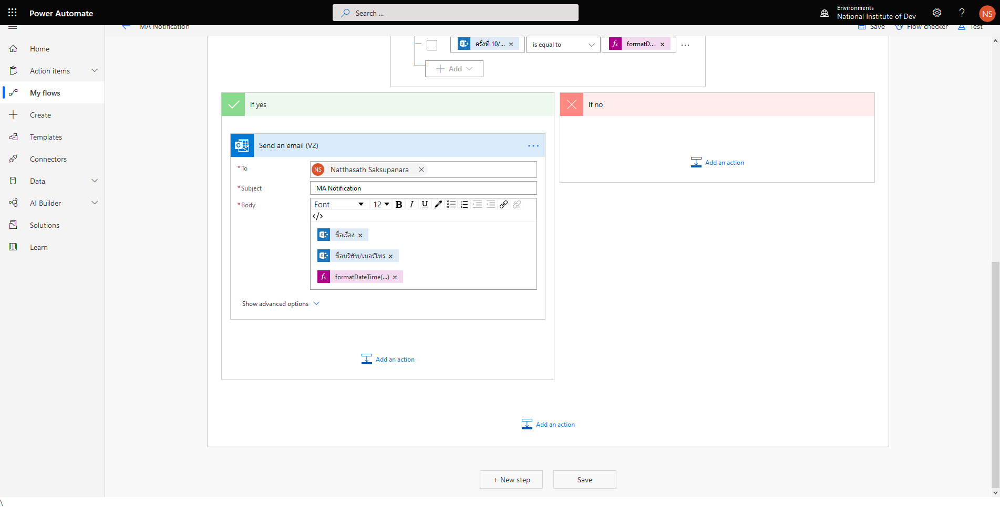
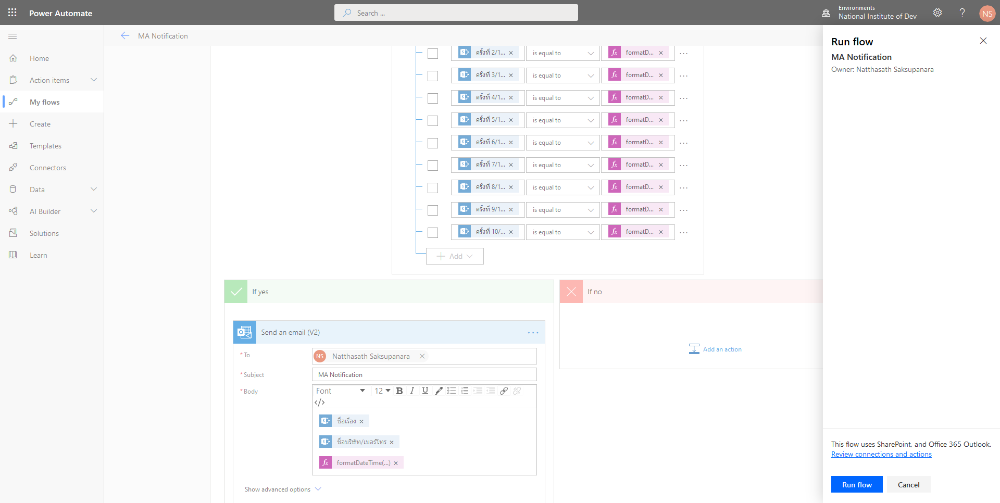
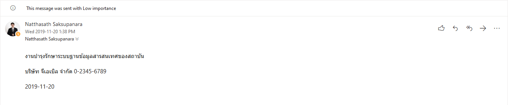

# 🤖 Notification Maintenance when SharePoint List Create with Power Automate


หลังจากที่เราได้ลองสร้าง SharePoint ของแต่ละหน่วยงานแยกตาม Department โดยเอาไว้เก็บ Document ต่าง ๆ รวมถึงการเก็บข้อมูลแบบ List บน SharePoint ซึ่งเราสามารถกำหนด Notification ให้สามารถแจ้งเตือนตามเงื่อนไขที่เรากำหนดด้วย Microsoft Flow อย่างเช่น List ตารางการเข้ามา Maintenance ระบบ หากตรงกับวันที่เข้ามาให้ทำการแจ้งเตือนผ่าน Email Notification


## **Download**

* [tpl\_ma\_plan.csv](https://drive.google.com/open?id=150EhsfweZN69PhzNqgLgvMRv5ROy3Clt)

## **Get Started**

* เข้าไปที่หน้าเว็บ [https://asia.flow.microsoft.com/en-us/](https://asia.flow.microsoft.com/en-us/)

.png>)

* คลิก My flows แล้วเลือก New Scheduled from blank

.png>)

* ทำการกำหนด Flow name และ Schedule แล้วคลิก Create <mark style="color:red;">คำเตือนชื่อต้องมากกว่า 3 ตัวขึ้นไป</mark>



* คลิก Next step



* เลือก Get items ( SharePoint ) ทำการกรอก Site Address และ List Name แล้วคลิก Next step



* เลือก Apply to each ทำการเลือก value แล้วคลิก Add an action



* เลือก Condition ทำการเลือก Column ที่จะนำมากำหนดเงื่อนไข โดยเลือก Column DateTime ที่บริษัทจะเข้ามาทำการ MA ได้แก่ ครั้งที่ 1 – 12 พร้อมทำการเลือกตัวดำเนินการของทุกเงื่อนไขเป็น Or <mark style="color:red;">คำเตือนกำหนดเงื่อนไขได้ไม่เกิน 10 เงื่อนไข หากต้องการกำนหดเพิ่มให้ทำเป็น Group แล้วกำหนดตัวดำเนินการของ Group เป็น Or</mark>



* แต่ละเงื่อนไขให้เลือกตัวดำเนินการเป็น is equal to พร้อมทำการกำหนด value เป็น Expression ด้วยฟังก์ชั่น formatDateTime() โดยทำการกำหนดเป็น วันที่และเวลาปัจจุบัน utcnow()

```
formatDateTime(utcNow(),'d/MM/yyyy')
```



* คลิก Add an action หาก Condition เป็น True โดยเลือกเป็น Send an email (V2) ทำการกรอก Email Address, Subject และ Body แล้วคลิก Save <mark style="color:red;">คำเตือนหากเลือกเป็น V3 จะไม่สามารถแนบ Attachment, Picture และ Link ได้ เพราะจะโดน Block ต้องไปกำหนด Safe Sender List</mark>



* คลิก Test เลือก I’ll perform the trigger action คลิก Safe & Test แล้วคลิก Run flow



* ลองทำการเปิด Microsoft Outlook จะเห็น Email เข้ามาใน Inbox



**อ่านเพิ่มเติม** : [https://bit.ly/2D16VmB](https://bit.ly/2D16VmB)
