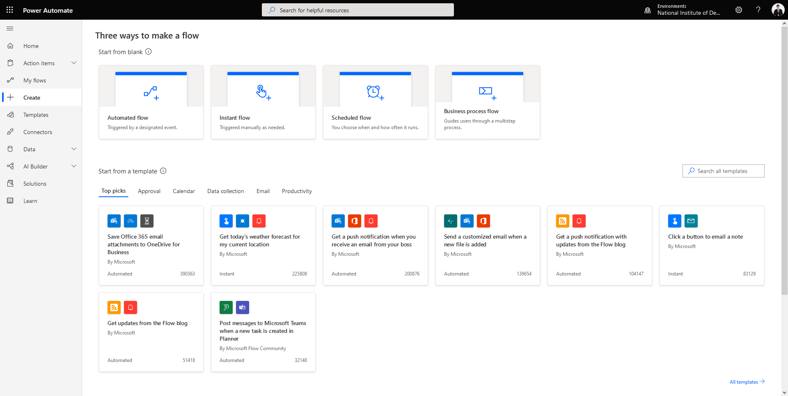
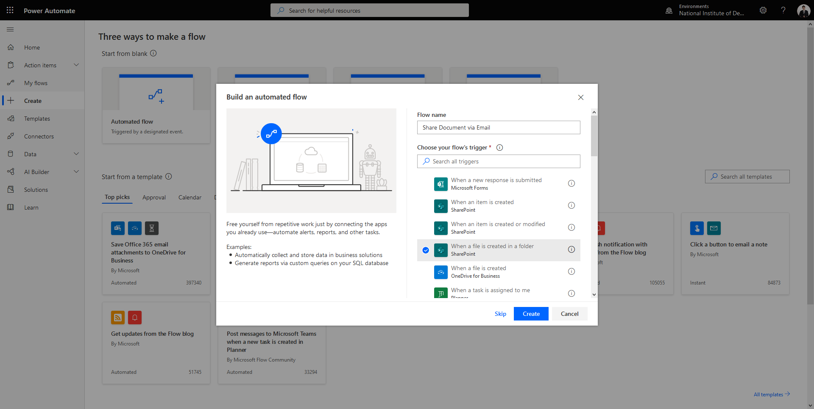
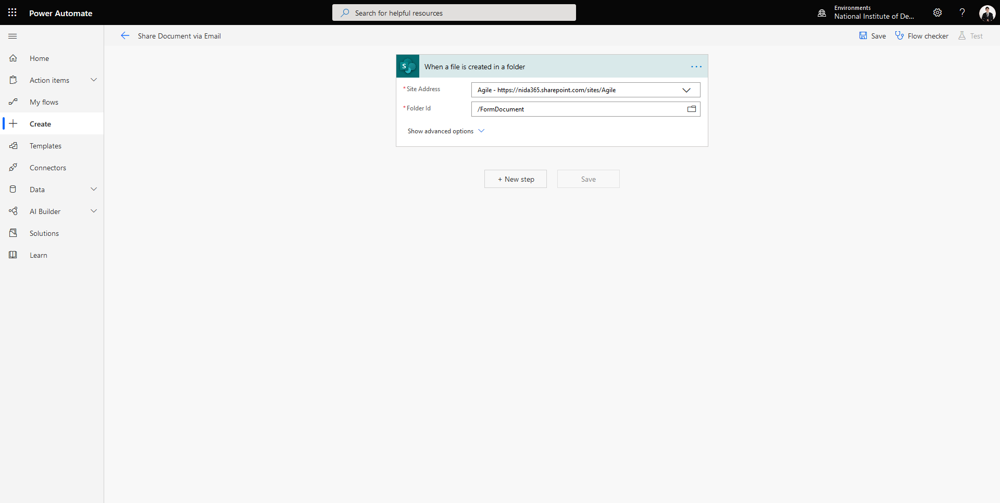
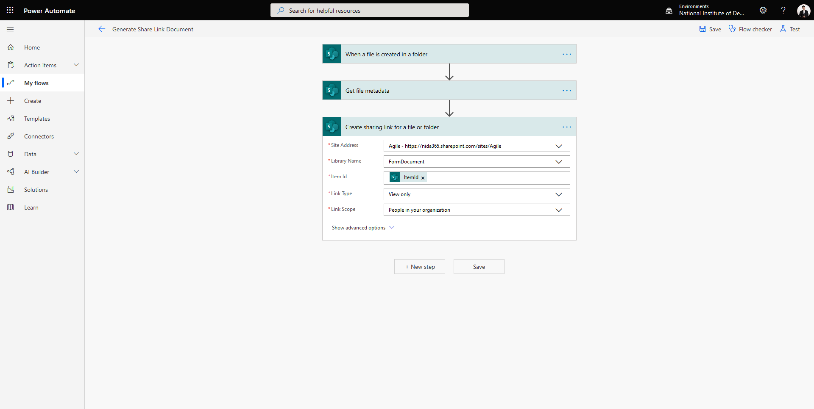
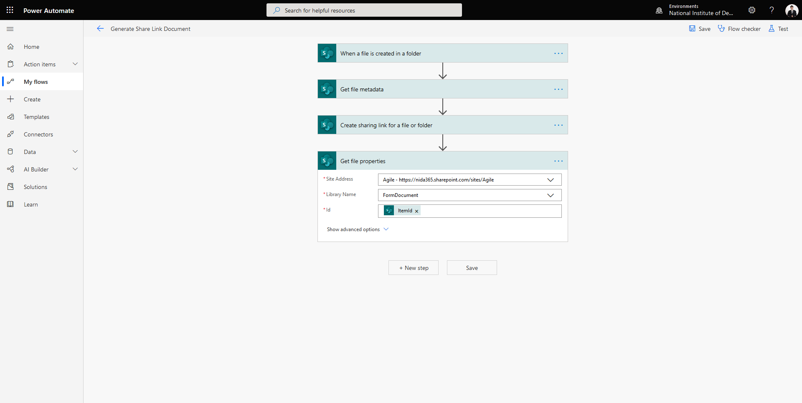
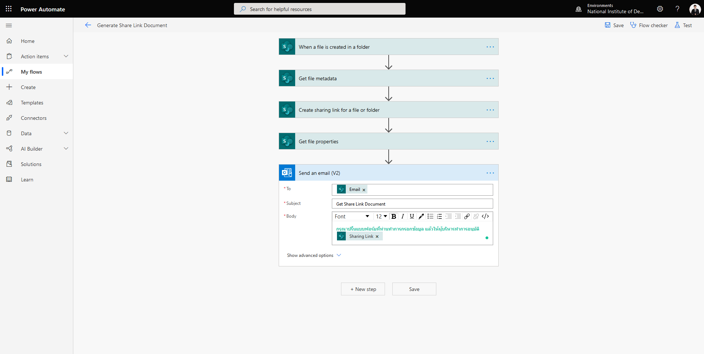
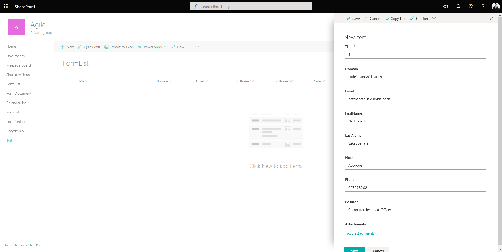
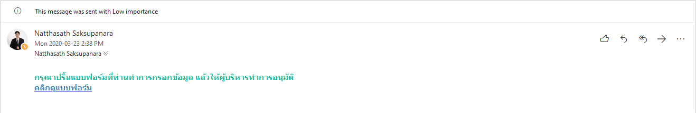

# 🤖 Send Email and Share File Word Document with Power Automate


หลังจากที่เราได้ลองสร้าง Generate Word Document เมื่อทำการ Submit Microsoft Form กันไปแล้ว เราจะทำการ Send Email พร้อมแนบไฟล์ Word Document ที่ทำการ Generate ขึ้นมาแนบไปด้วย กรณีที่ใช้ Digital Form อย่างเดียวไม่ได้ ต้องมีการ Sign Document บนเอกสารแบบเดิมอยู่


## **Requirement**

* Flow Generate Word Document

## **Get Started**

* เข้าไปที่หน้าเว็บ [http://portal.office.com](http://portal.office.com/)

* &#x20;คลิก Power Automate Application

* คลิก Create เลือก Automated Flow

* ทำการกำหนดชื่อ Flow name โดยระบุ Trigger เป็น When a file is created in a folder ( SharePoint ) แล้วคลิก Create คำเตือนชื่อต้องมากกว่า 3 ตัวขึ้นไป

* ทำการกรอก Site Address และ Folder Id แล้วคลิก Next step

* เลือก Get file metadata ทำการกรอก Site Address และ File Identifier แล้วคลิก Next step

* เลือก Create sharing link for a file or folder ทำการกรอก Site Address, Library Name, Link Type และ Link Scope แล้วคลิก Next step

* เลือก Create file properties ทำการกรอก Site Address, Library Name แล้วคลิก Next step

* เลือก Send an email (V2) ทำการกรอก Email Address, Subject และ Body แล้วคลิก Save คำเตือนหากเลือกเป็น V3 จะไม่สามารถแนบ Attachment, Picture และ Link ได้ เพราะจะโดน Block ต้องไปกำหนด Safe Sender List

* คลิก Test เลือก I’ll perform the trigger action คลิก Safe & Test แล้วคลิก Run flow คำเตือนต้องใส่ข้อมูลใน FormList ก่อน Flow ถึงจะทำการ Run ได้

.png>)

* ทำการใส่ข้อมูลใน FormList คลิก New กรอกรายละเอียดของ User Request แล้วคลิก Save คำเตือนข้อมูลใน FormList จะถูก Submit มาจาก Microsoft Form แต่จะทำการลองใส่ข้อมูลให้ดูก่อน

* ลองทำการเปิด Microsoft Outlook จะเห็น Email เข้ามาใน Inbox

