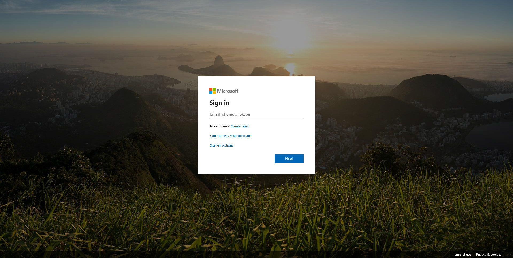
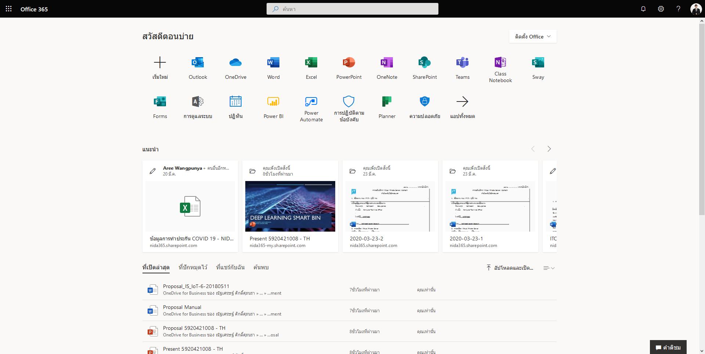
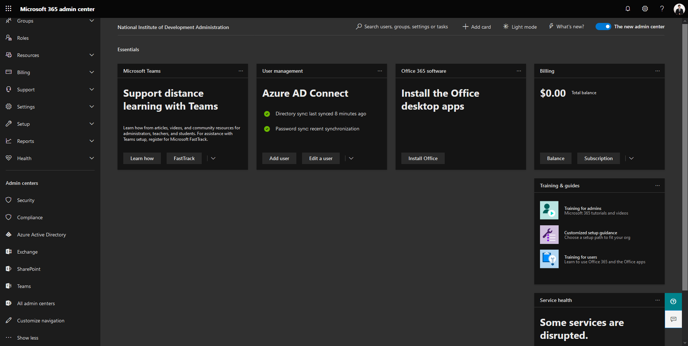
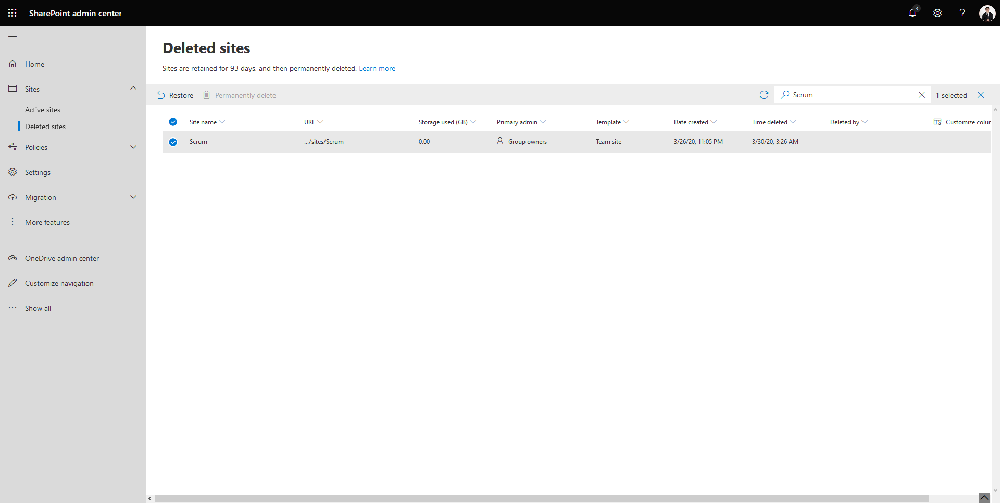
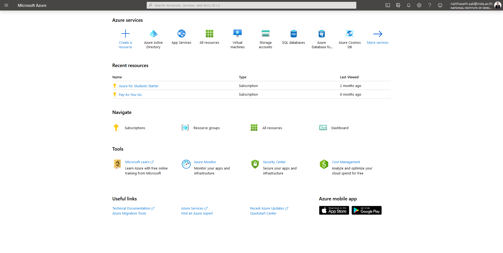
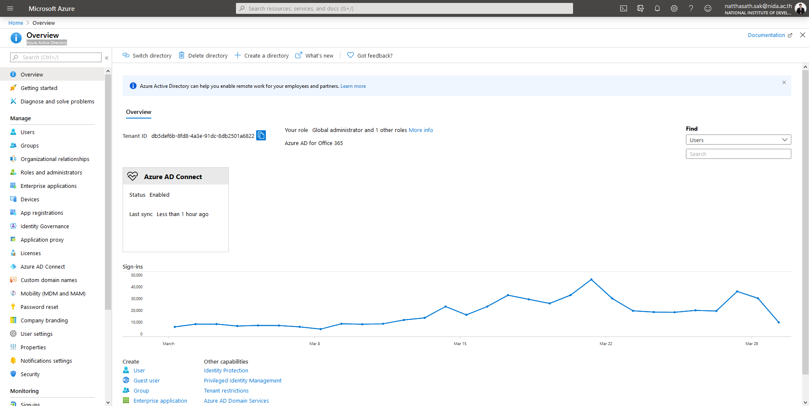
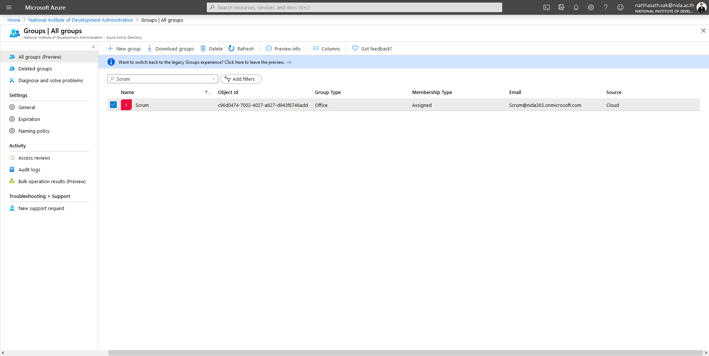
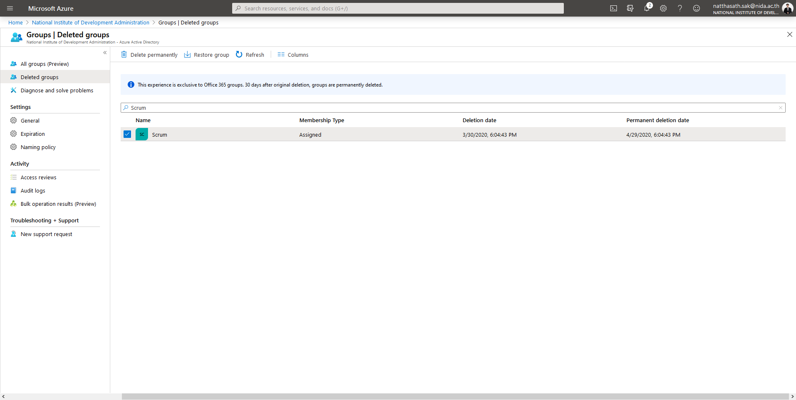

# 📙 How to delete Permanent SharePoint Site


ในกรณีที่เราทำการ Delete SharePoint Site สามารถทำการลบได้จากฝั่งของ Owner Site และทางฝั่งของ SharePoint Global Administrator หลังจากที่ทำการ Delete เรายังสามารถทำการ Restore ได้ ภายใน 93 วัน แต่หากต้องการลบแบบ Permanent จะต้องทำการลบ Office365 Group ก่อน ซึ่งเรายังสามารถทำการ Restore ได้ ภายในใน 30 วัน ซึ่งเราไม่สามารถทำการลบ Office365 Group ได้จากหน้า Microsoft 365 Admin Center เพราะเป็น Object อยู่บน Azure Active Directory


## **Get Started**

* เข้าไปที่หน้าเว็บ [http://portal.office.com](http://portal.office.com/)

* คลิก Admin

* คลิก SharePoint

* คลิก Delete sites แล้วทำการ Search จะเห็นว่าไม่สามารถคลิก Permanently delete ได้ เนื่องจากต้องทำการลบ Office365 Group บน Azure Active Directory ก่อน

* เข้าไปที่หน้าเว็บ [https://portal.azure.com](https://portal.azure.com/) แล้วคลิก Azure Active Directory

* คลิก Groups

* เลือก Office365 Group แล้วคลิก Delete -> OK

* คลิก Deleted groups เลือก Office365 Group แล้วคลิก Delete permanently -> OK

**อ่านเพิ่มเติม** : [https://bit.ly/3bCudyw](https://bit.ly/3bCudyw)
