# 📙 How to get SharePoint List Comment with Power Automate


หลังจากที่เราทำการเก็บ Approve Comment บน SharePoint List กันไปแล้ว เราจะทำการดึง Comment ที่เราเก็บบน SharePoint List ไปใช้ต่อ เช่น ใช้ในการส่งอีเมล


## **Get Started**

* เข้าไปที่หน้าเว็บ [https://asia.flow.microsoft.com/en-us/](https://asia.flow.microsoft.com/en-us/)

<figure>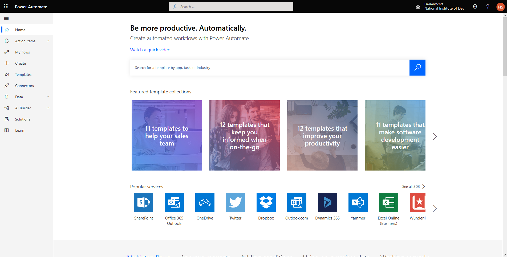<figcaption></figcaption></figure>

* คลิก My flows แล้วเลือก New Automated from blank

<figure>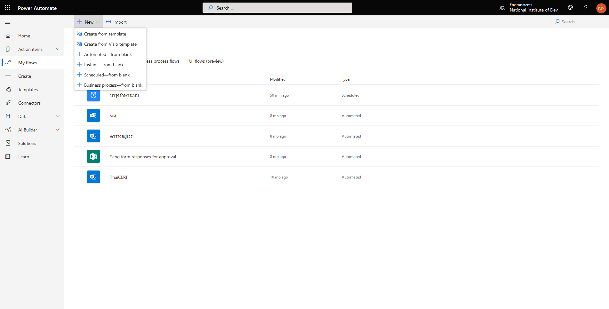<figcaption></figcaption></figure>

* ทำการกำหนด Flow name และเลือก When an item is created or modified แล้วคลิก Create <mark style="color:red;">คำเตือนชื่อต้องมากกว่า 3 ตัวขึ้นไป</mark>

<figure>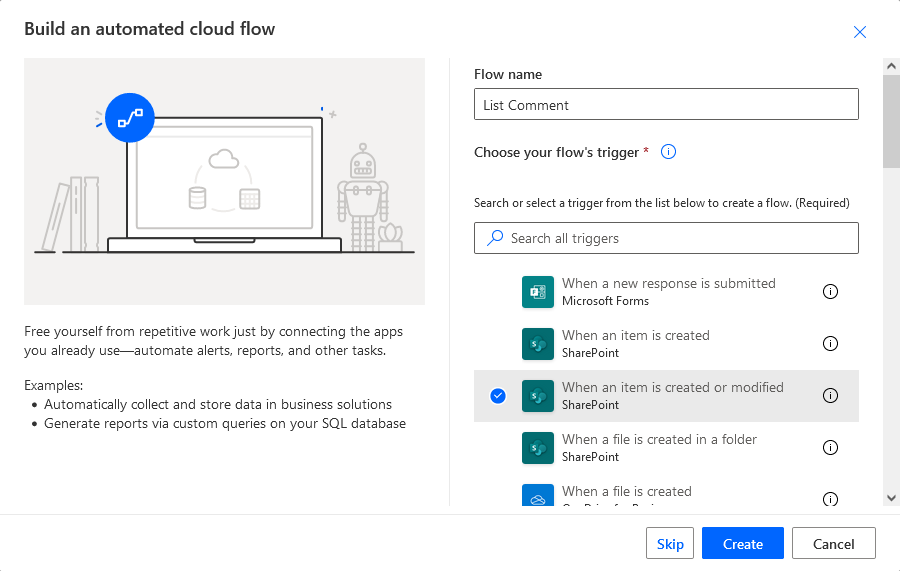<figcaption></figcaption></figure>

* เลือก Form Id แล้วคลิก Next step

<figure>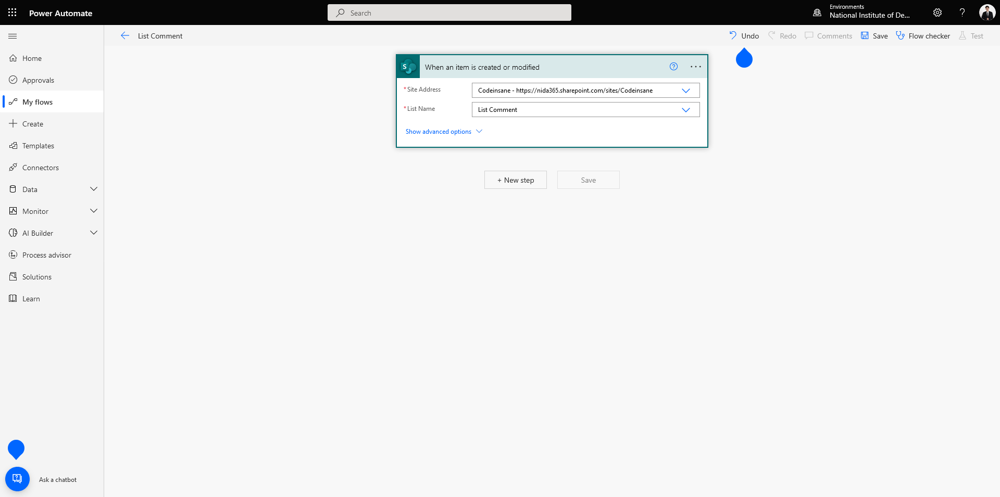<figcaption></figcaption></figure>

* เลือก Initialize variable สำหรับ Comment ID กำหนด Type เป็น String แล้วคลิก Next step

<figure>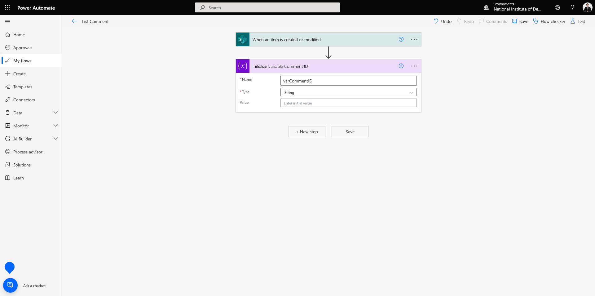<figcaption></figcaption></figure>

* เลือก Initialize variable สำหรับ Comment Text กำหนด Type เป็น String แล้วคลิก Next step

<figure>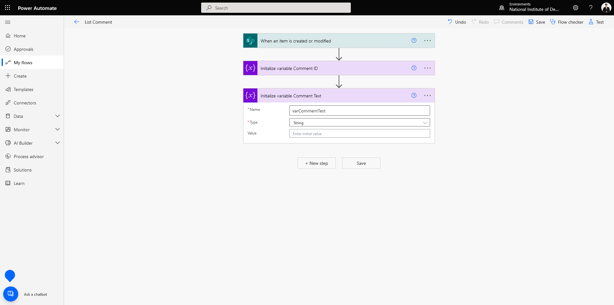<figcaption></figcaption></figure>

* เลือก Send an HTTP request to SharePoint ทำการกรอกรายละเอียด แล้วคลิก Next step

```
Uri : _api/web/lists/getbytitle('LIST')/items('ITEMID')/Comments
Headers : accept | application/json;odata=verbose
          content-type | application/json;odata=verbose
```

<figure>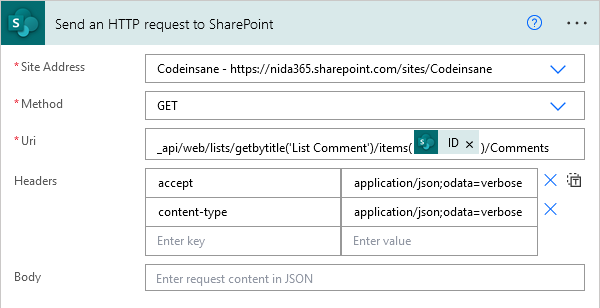<figcaption></figcaption></figure>

* เลือก Compose กำหนด Inputs แล้วคลิก Next Step

```
@{outputs('Send_an_HTTP_request_to_SharePoint')?['body/d/results']}
```

<figure>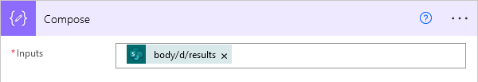<figcaption></figcaption></figure>

* เลือก Apply to each กำหนด Outputs ที่ได้จาก Compose แล้วคลิก Add an action

<figure>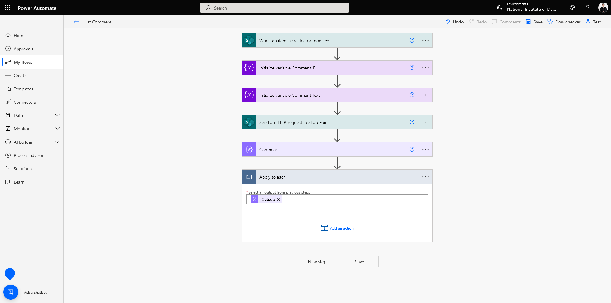<figcaption></figcaption></figure>

* เลือก Set variable สำหรับ Comment ID กำหนด Value แล้วคลิก Add an action กรณีที่ต้องการเลือก Comment จะใช้ ID เป็นตัวกำหนด Condition

```
@{items('Apply_to_each')?['ID']}
```

<figure>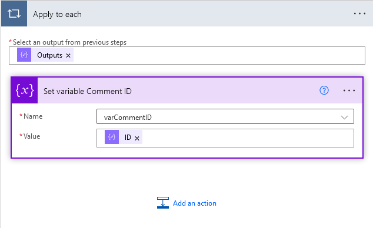<figcaption></figcaption></figure>

* เลือก Append to string variable สำหรับ Comment Text กำหนด Value แล้วคลิก Add an action

```
@{items('Apply_to_each')?['Text']}
```

<figure>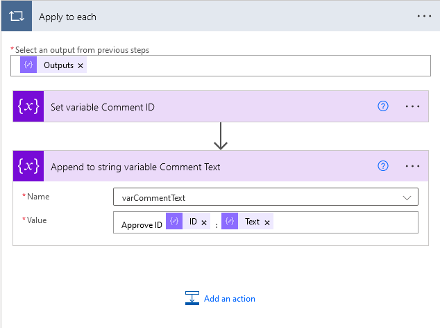<figcaption></figcaption></figure>

**อ่านเพิ่มเติม** : [https://bit.ly/3yIoAwS](https://bit.ly/3yIoAwS)
