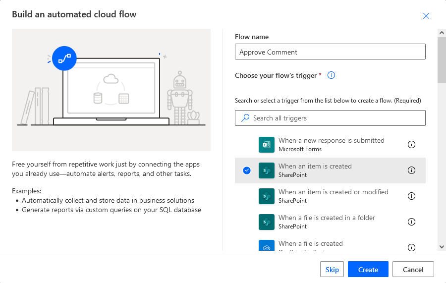
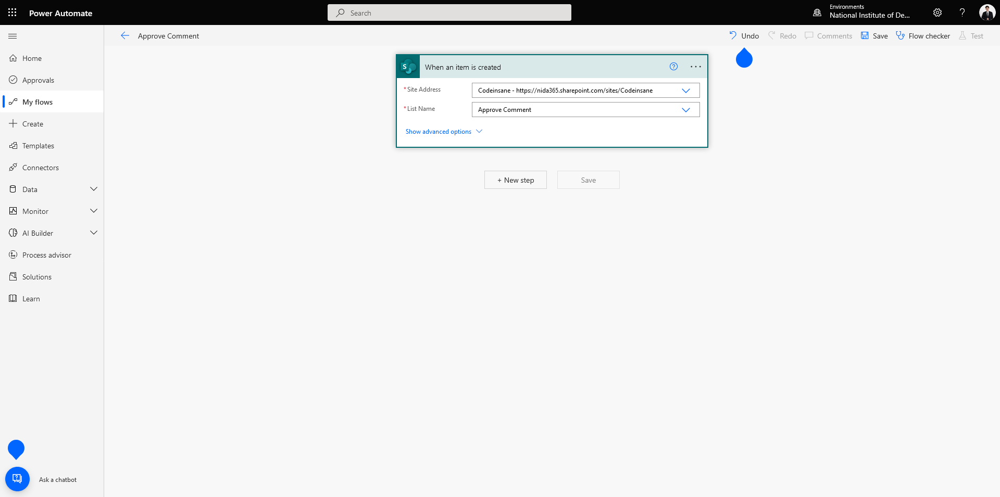
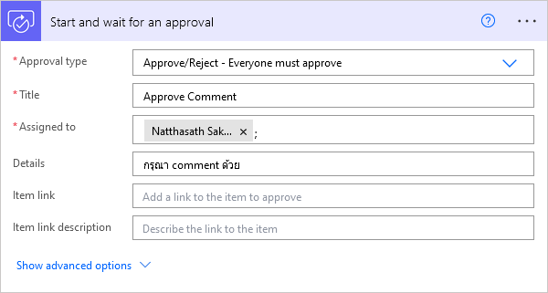
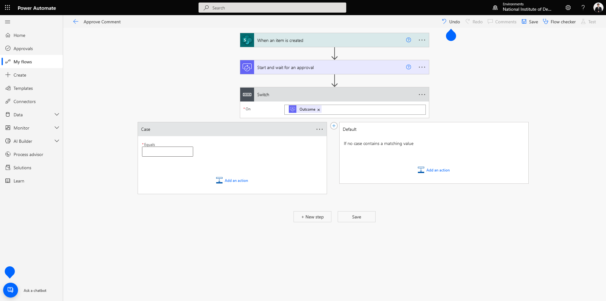
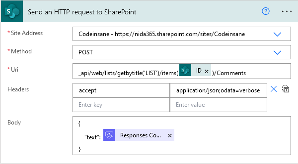

# 📙 How to post Approve Comment to SharePoint List with Power Automate


ในกรณีที่เราทำการ Approve Flow จะมีช่อง Comment ให้เรากรอกรายละเอียด เราสามารถนำ Approve Comment ไปเก็บบน SharePoint List ได้ เพื่อบอกว่าทำไมเราถึงอนุมัติหรือไม่อนุมัติรายการนั้นเพราะอะไร


## **Get Started**

* เข้าไปที่หน้าเว็บ [https://asia.flow.microsoft.com/en-us/](https://asia.flow.microsoft.com/en-us/)

<figure><figcaption></figcaption></figure>

* คลิก My flows แล้วเลือก New Automated from blank

<figure><figcaption></figcaption></figure>

* ทำการกำหนด Flow name และเลือก When an item is created แล้วคลิก Create <mark style="color:red;">คำเตือนชื่อต้องมากกว่า 3 ตัวขึ้นไป</mark>

<figure><figcaption></figcaption></figure>

* เลือก Form Id แล้วคลิก Next step

<figure><figcaption></figcaption></figure>

* เลือก Start and wait for an approval กำหนด Approval type ตามที่ต้องการ ทำการกรอกรายละเอียด แล้วคลิก Next step

<figure><figcaption></figcaption></figure>

* เลือก Switch แล้วกำหนด On เป็น Outcome ของ Approval กรณีที่มี Action ของ Approve กับ Reject ไม่เหมือนกัน

<figure><figcaption></figcaption></figure>

* เลือก Send an HTTP request to SharePoint ทำการกรอกรายละเอียด

```
Uri : _api/web/lists/getbytitle('LIST')/items('ITEMID')/Comments
Headers : accept | application/json;odata=verbose
Body : 
{
    "text": "This is a new comment @mention{0}.",
    "mentions": [
        {
            "email": "natthasath.sak@gmail.com"
        }
    ]
}
```

<figure><figcaption></figcaption></figure>

**อ่านเพิ่มเติม** : [https://bit.ly/3uu94SN](https://bit.ly/3uu94SN)
