# ⛱ Chatbot with Dialogflow and Firebase Realtime Database


หลังจากที่เราได้ลองทำ Chatbot ด้วย IBM Watson กันไปแล้ว แต่ไม่สามารถใช้งานกับภาษาไทยได้ เราจะมาลองสร้าง Chatbot ด้วย Dialogflow ที่สามารถใช้ภาษาไทยได้กัน ซึ่งการทำงานก็จะคล้ายกับ IBM Watson เพราะเป็น NLP เหมือนกัน


## **Dialogflow**


[Dialogflow](https://dialogflow.cloud.google.com/) สามารถทำการ Code Editor ด้วย [Inline Editor](https://cloud.google.com/dialogflow/docs/fulfillment-inline-editor) โดยใช้ภาษา Node.js ที่ใช้ในการ Build and Manage Fulfillment ผ่าน [Cloud Functions for Firebase](https://firebase.google.com/docs/functions/) ด้วยการดัก Event Trigger ที่เกิดขึ้นบน Firebase ซึ่งใช้หลักการเดียวกับ [Webhook](https://cloud.google.com/dialogflow/docs/fulfillment-webhook) โดยมีข้อควรระวังคือต้องเลือก Billing Plan เป็น Blaze แล้วทำการเชื่อม Billing Account เข้ากับ Project


## **Firebase Realtime Database**


[Firebase Realtime Database](https://firebase.google.com/docs/database) เป็นฐานข้อมูลที่ใช้ในการ Store and Sync ด้วยฐานข้อมูลแบบ NoSQL ซึ่งจะเก็บข้อมูลในรูปแบบ JSON ในลักษณะของ Key Value Store


* หากนำ JSON Data มา Import เองจะต้องทำการ Save แบบ UTF-8 Encoding
* หลีกเลี่ยงข้อมูลที่เป็น Nested Data ให้ใช้ Flatten Data แม้ว่าบน Firebase สามารถทำ Nested Data ได้ถึง 32 Level

## **Get Started**

* เข้าไปที่ [https://console.dialogflow.com/](https://console.dialogflow.com/) แล้วคลิก Create Agent

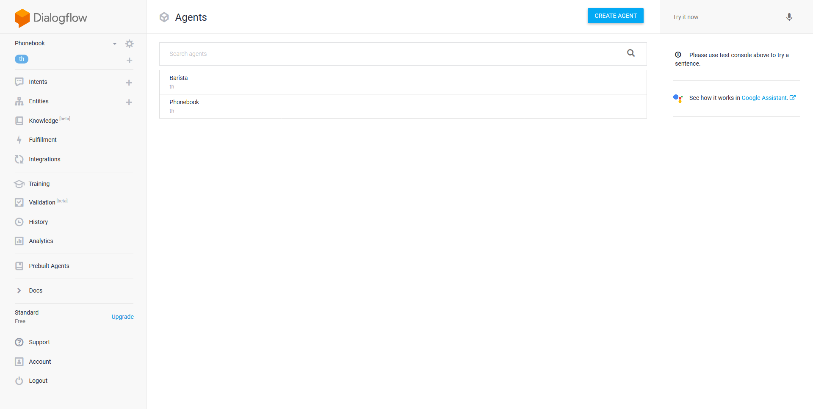

* กำหนดชื่อเป็น Firebase โดยเลือก Default Language เป็นภาษา Thai แล้วคลิก Create

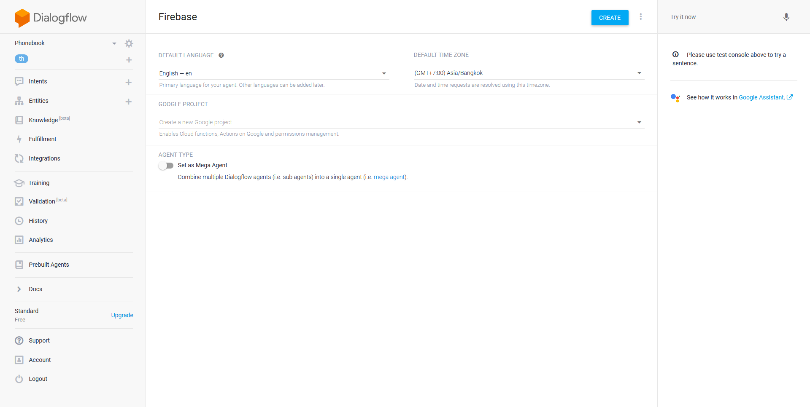

* คลิก Fulfillment แล้วทำการ Enable Inline Editor

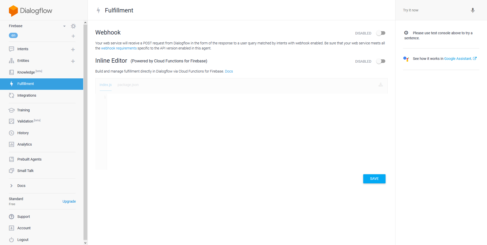

* คลิก Deploy

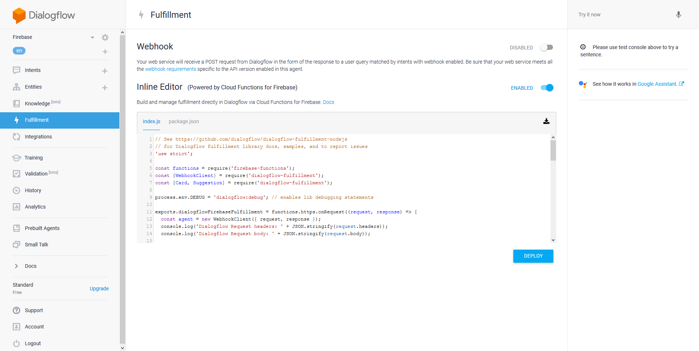

* รอจนทำการ Deploy เสร็จ แล้วคลิก View execution logs in the Firebase console

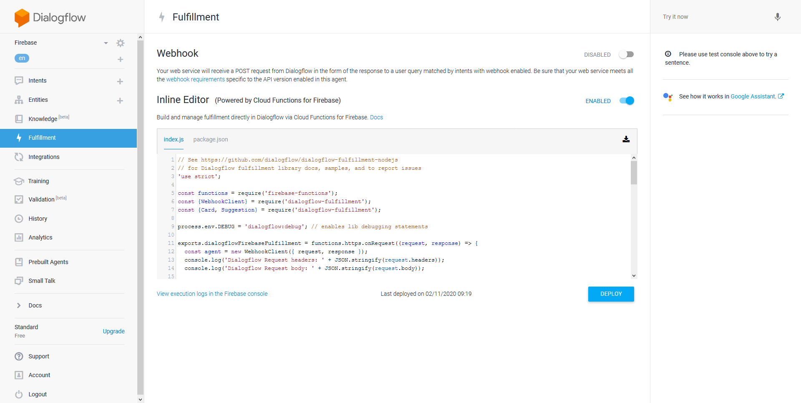

* เลือก Database แล้วคลิก  Create Database

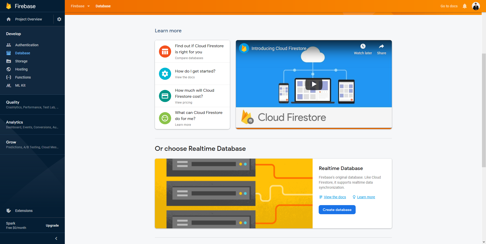

* เลือก Start in test mode แล้วคลิก Enable

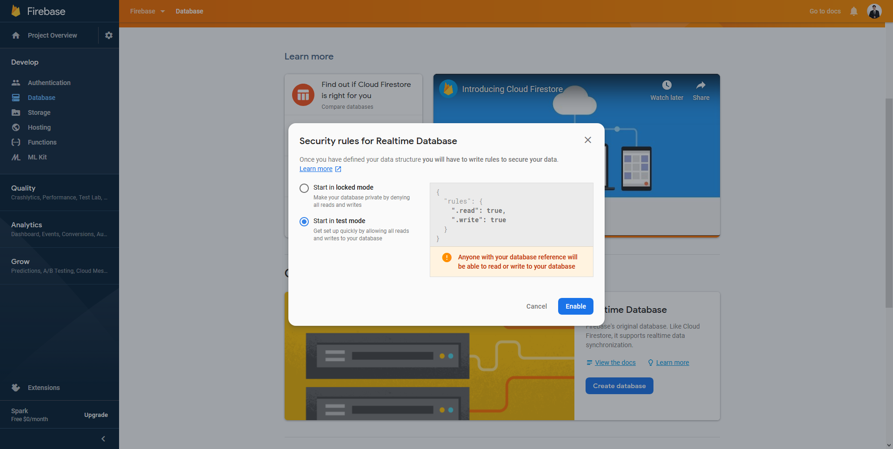

* จะเห็นว่าใน Test mode จะขึ้นเตือนว่าบุคคลอื่นสามารถทำการ Read, Write และ Delete ได้

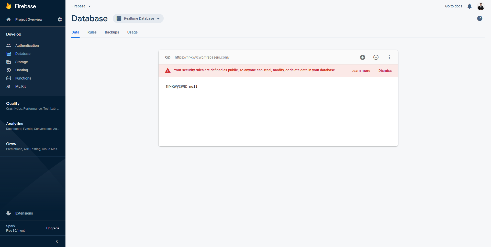

* คลิก Create Intent บน Dialogflow

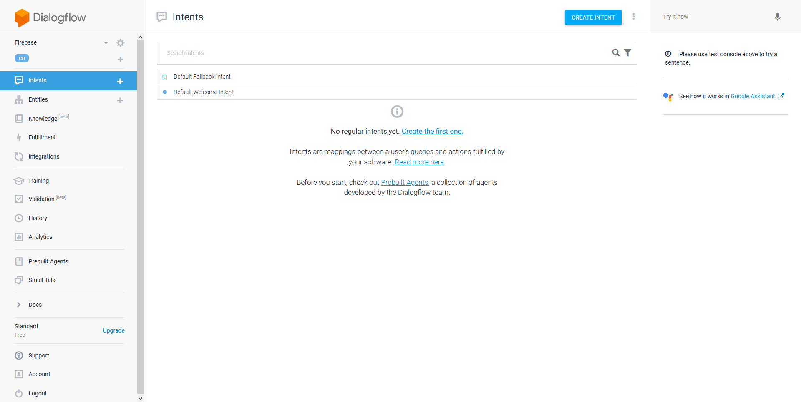

* คลิก Add Training Phrases

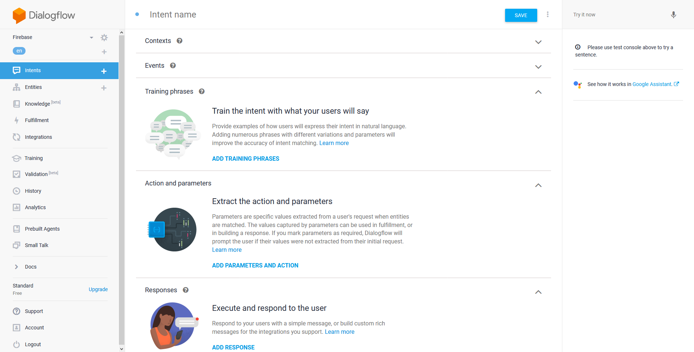

* ให้ทำการสร้าง Save Intent ซึ่งเปรียบเสมือนประโยคที่ลูกค้าจะสั่งบันทึกข้อมูล เช่น ลาเต้เย็นหวานน้อย, เอสเพรสโซ่ร้อน, Mocha ปั่น ซึ่งถ้าหากกำหนด Entity ก่อน แล้วมาสร้าง Intent มันจะทำการ Detect Entity ให้โดยอัตโนมัติ

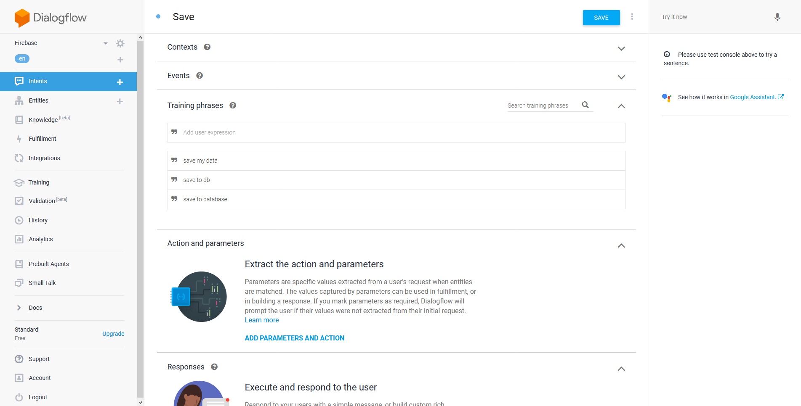

* ทำการ Connect Dialogflow กับ Firebase

```
const admin = require('firebase-admin');

admin.initializeApp({
  credential: admin.credential.applicationDefault(),
  databaseURL: 'ws://abc-def.firebaseio.com/'
});
```

* ทำการ Create Function

```
function save_firebase(agent) {
  const text = agent.parameters.text;
  return admin.database().ref('data').set({
    first_name: 'ณัฐเศรษฐ์',
    last_name: 'Saksupanara',
    text: text
  });
}

function read_firebase(agent) {
  return admin.database().ref('data').once('value').then((snapshot) => {
    const value = snapshot.child('text').val();
    if (value !== null) {
      agent.add(value);
    }
  });
}
```

* ทำการ Map Intent เข้ากับ Function

```
intentMap.set('Save', save_firebase);
intentMap.set('Read', read_firebase);
```

* คลิก Deploy

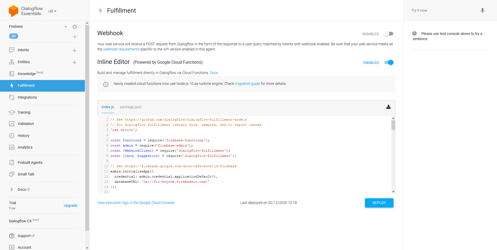

* ลองทำการ Try it now

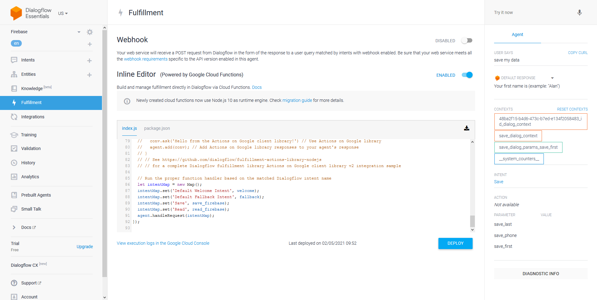

**อ่านเพิ่มเติม** : [https://bit.ly/3ttFMSo](https://bit.ly/3ttFMSo), [https://bit.ly/2OGI1Pu](https://bit.ly/2OGI1Pu)
