# 🐳 Install Nginx-RTMP and FSTV-Monitor on Docker


หลายคนคงเคยใช้งาน Streaming ผ่านทาง Facebook และ Youtube กันมาบ้าง ซึ่งเราสามารถทำการ Restream เพื่อใช้ในการถ่ายทอดสัญญาณพร้อมกันได้ ซึ่งเราจะใช้ Nginx-RTMP รันบน Docker ในการทำ Restream ร่วมกับ FSTV-Monitor ในการ Monitor แบบ Real-Time


## **Requirement**

* [OBS Studio](https://obsproject.com/)
* [VLC](https://get.videolan.org/vlc/3.0.6/win32/vlc-3.0.6-win32.exe)

## **Install**

* ดาวน์โหลด Docker Image


```
docker pull tiangolo/nginx-rtmp
```


* ทำการรัน Nginx-RTMP Container


```
docker run -d -p 1935:1935 -p 8080:80 --name nginx-rtmp tiangolo/nginx-rtmp
```


* ทำการดาวน์โหลด FSTV-Monitor จาก GitHub


```
git clone https://github.com/3m1o/nginx-rtmp-monitoring.git
```



```
cd nginx-rtmp-monitoring/
```


* ทำการแก้ไขไฟล์ config.json


```
{
  "site_title":"RTMP Monitoring",
  "http_server_port":9991,
  "rtmp_server_refresh":3000,
  "rtmp_server_timeout":15000,
  "rtmp_server_url":"http://ip_address:8080/stat.xml",
  "rtmp_server_stream_url":"rtmp://ip_address/stream/",
  "rtmp_server_control_url":"http://ip_address:8080/control",
  "session_secret_key":"stream_key",
  "username":"username",
  "password":"password",
  "language":"en",
  "template":"default",
  "login_template":"login",
  "version":"1.0.2"
}
```


* ทำการรัน Docker Compose


```
docker-compose up -d
```


* ทำการเปิดโปรแกรม OBS แล้วคลิก Add Source -> Video Capture Device

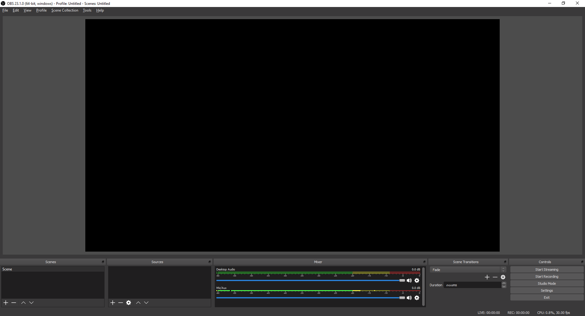

* เลือก Create new แล้วคลิก OK

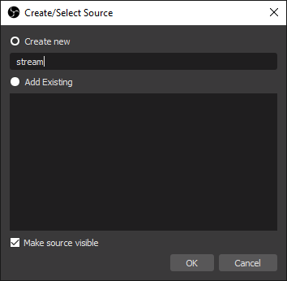

* เลือก Device แล้วคลิก OK

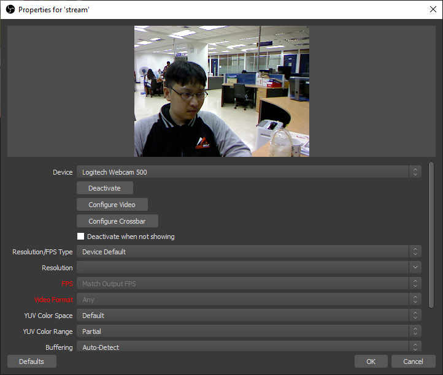

* คลิก Settings

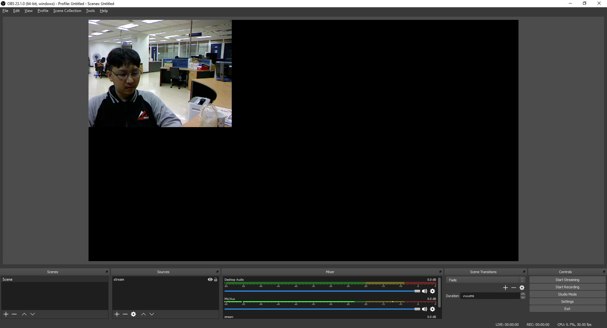

* คลิก Stream

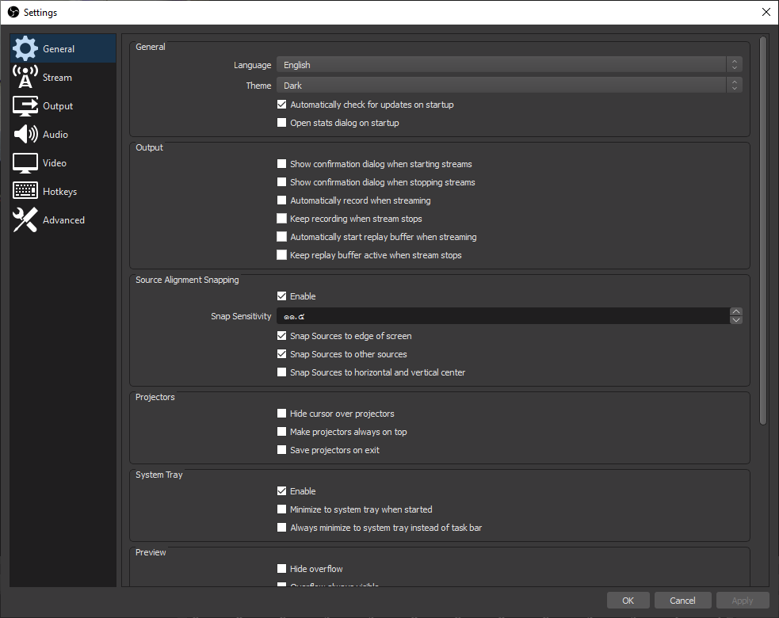

* ทำการกรอก Server RTMP และ Stream Key แล้วคลิก OK

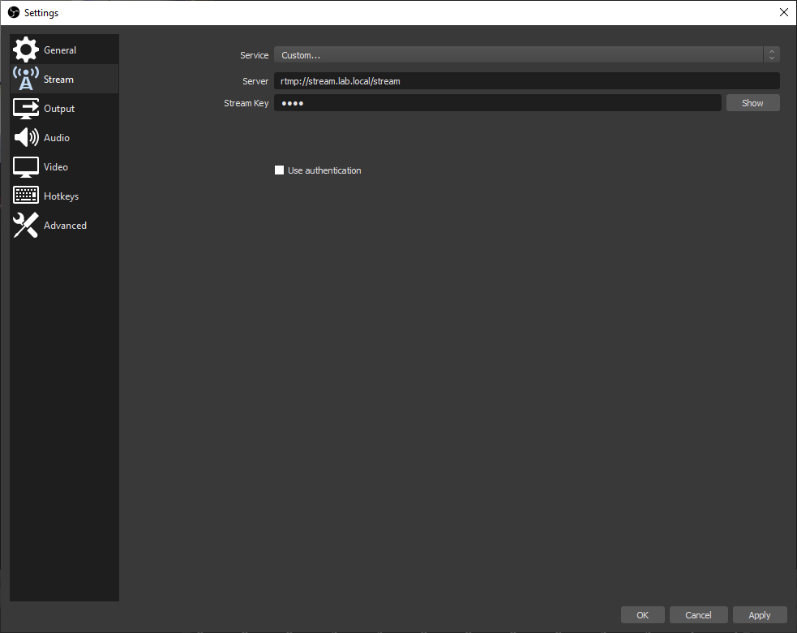

* คลิก Start Streaming

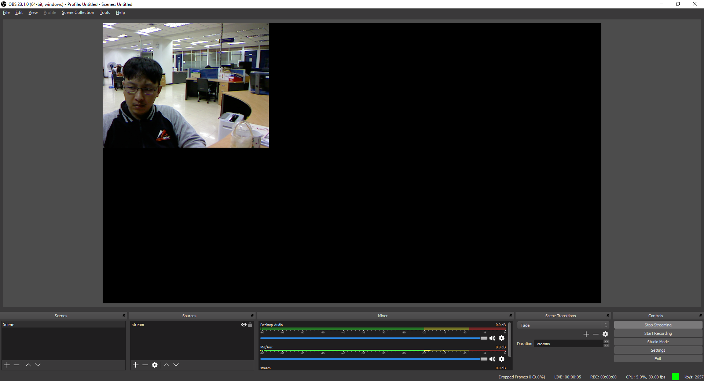

* ทำการเปิดโปรแกรม VLC แล้วคลิก Media -> Stream


* คลิก Network

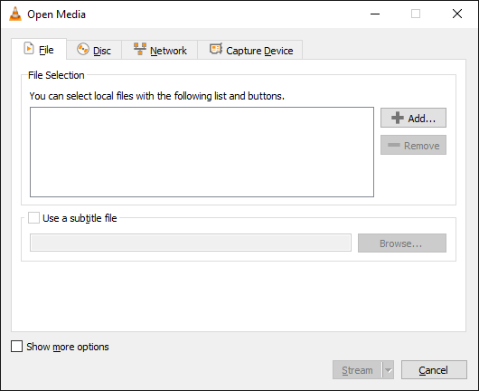

* ทำการกรอก Network URL แล้วคลิก Stream

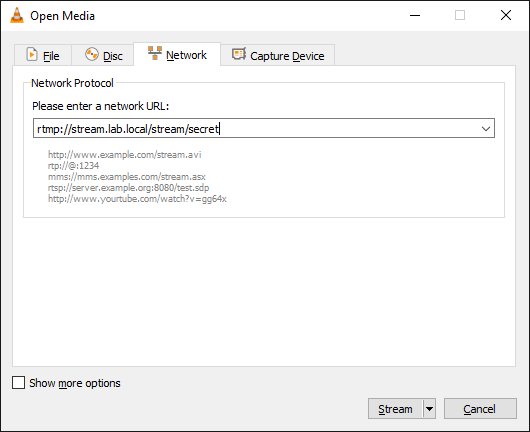

* คลิก Next

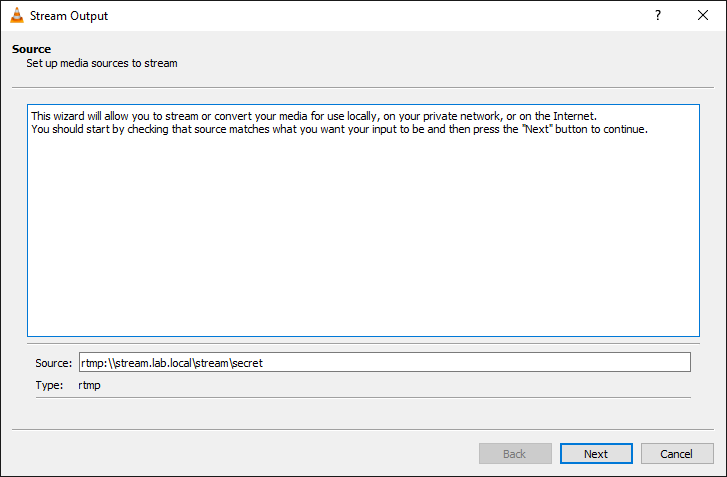

* คลิก Next

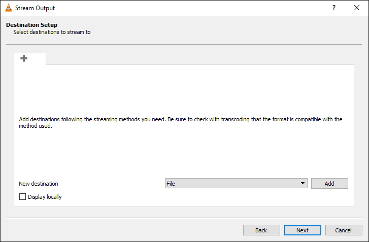

* คลิก Next

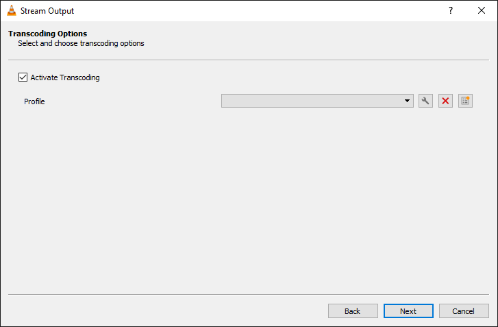

* คลิก Stream

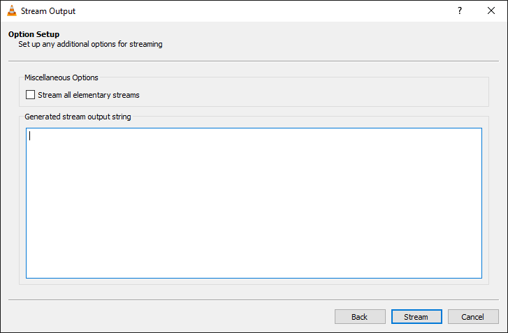

* จะแสดง Video Streaming

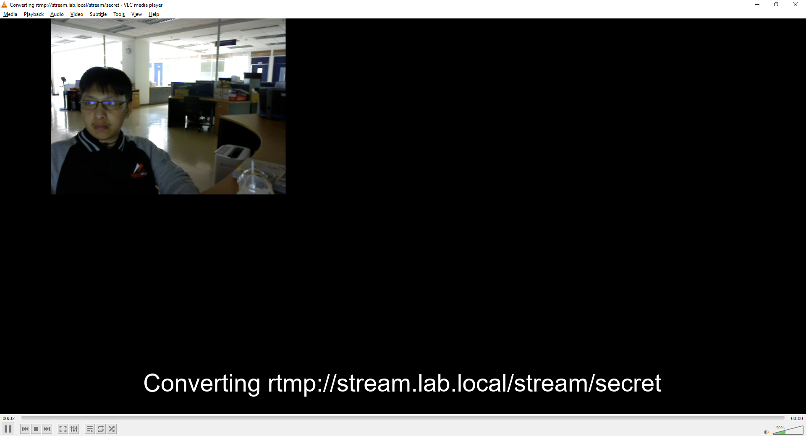

* ลองเข้าไปที่ [http://localhost:9991](http://localhost:9991/) แล้วกรอก Username และ Password ด้วย admin : password

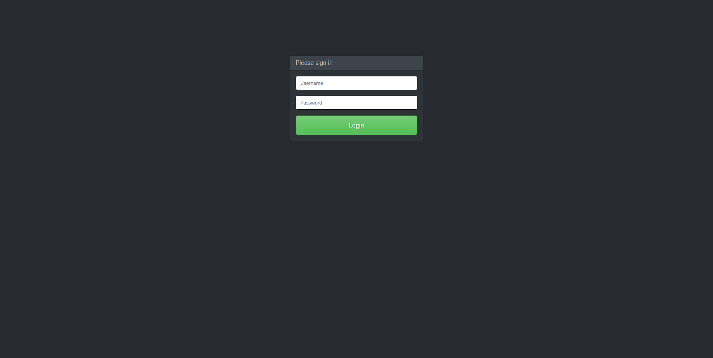

* หลังจาก Login เข้ามาจะเห็นหน้าตาแบบนี้

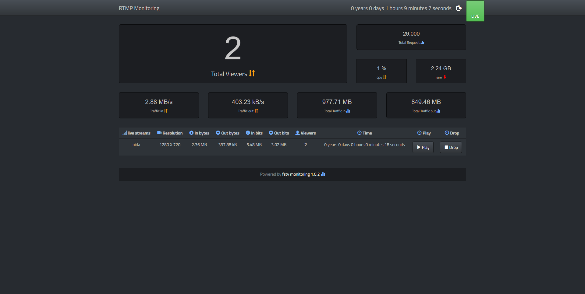

**อ่านเพิ่มเติม** : [https://dockr.ly/39A5uet](https://dockr.ly/39A5uet)
