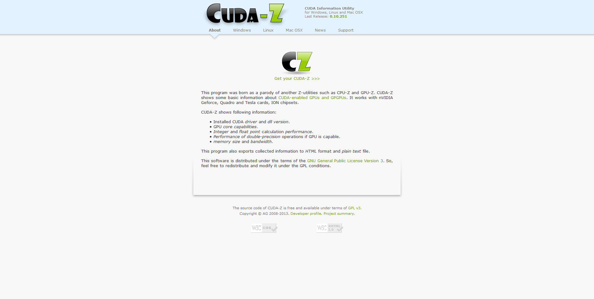

# 🧤 CUDA-Z


หลายคนคงเคยใช้เครื่องมือในการตรวจสอบ CPU และ GPU ของเครื่องคอมพิวเตอร์อย่าง CPU-Z และ GPU-Z กันมาบ้างแล้ว สำหรับคนที่ทำงานด้าน Machine Learning เองก็มีเครื่องมือในการตรวจสอบ CUDA ที่ใช้ในการประมวลผลด้วย GPU แทนการใช้ CPU


## **Download**

* [CUDA-Z](http://cuda-z.sourceforge.net/)

## **Get Started**

* ทำการดาวน์โหลด CUDA-Z

* เปิดโปรแกรม CUDA-Z จะทำการตรวจสอบ CUDA ว่าได้ทำการ Enable GPU หรือไม่ และยังสามารถตรวจสอบ Performance ของ GPU ได้อีกด้วย

.png>)
