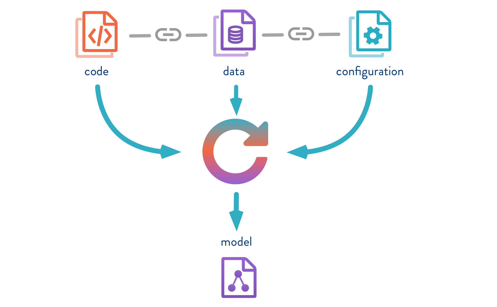
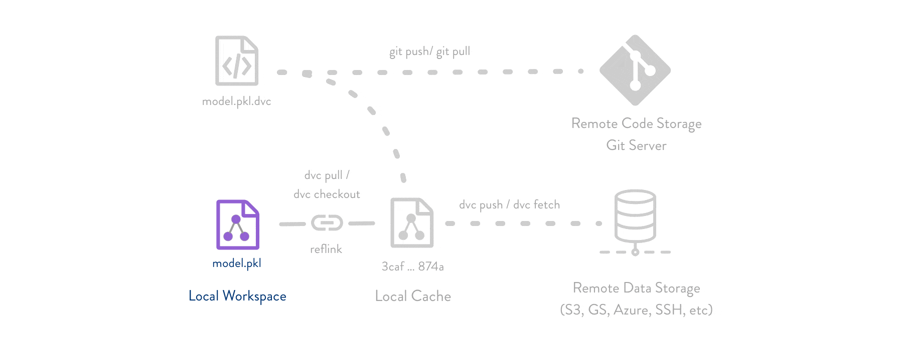
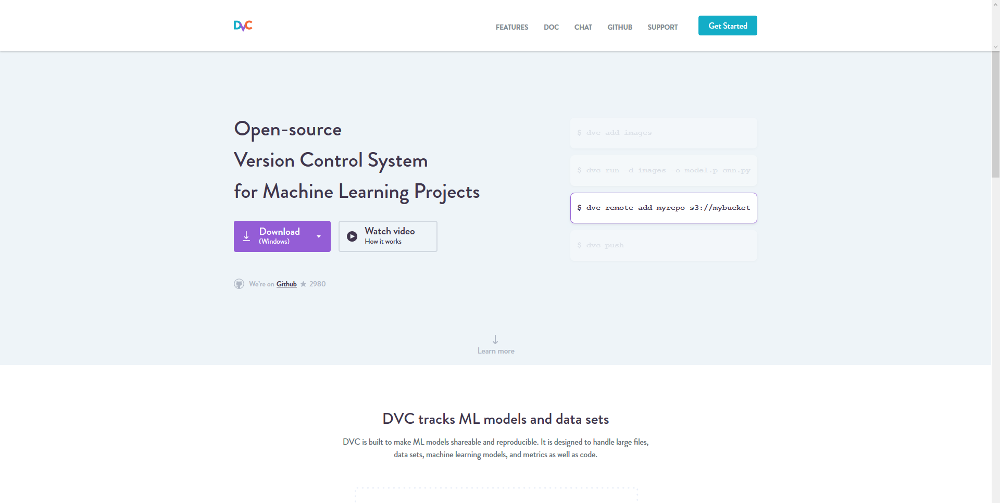
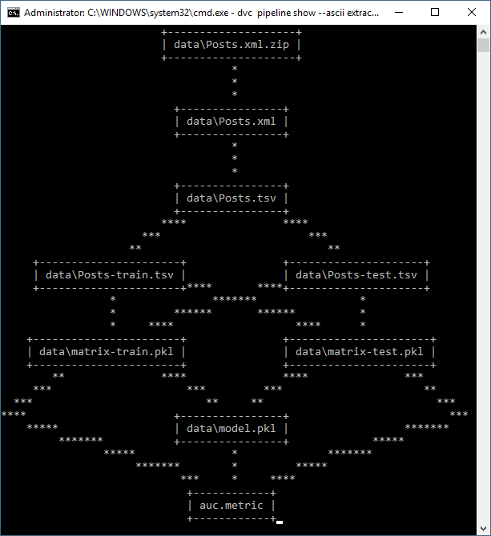

# 🧤 DVC Version Control for Machine Learning


การใช้งาน Version Control มีมานานแล้วสำหรับเหล่า Programmer และ Developer โดยในสายงานด้าน Data Science ที่ทำเกี่ยวกับ Machine Learning ก็มี Version Control เหมือนกัน เรียกว่า DVC ซึ่งจะคล้าย ๆ กับ Git


## **Workflow**


โดยปกติการสร้าง Model ของ Machine Learning จะประกอบไปด้วย 3 ส่วน คือ Code, Data และ Configuration นำมา Train เพื่อให้ได้ Model และจะมีการทำ Reproduce




หลักการทำงานของ DVC จะคล้าย ๆ กับ Git แต่จะแบ่่งการเก็บออกเป็น 2 แบบ คือ ส่วนที่เป็น Code จะเก็บอยู่ใน Remote Code Storage ของ Git Server และส่วนที่เป็น Model จะเก็บอยู่ใน Remote Data Storage เช่น S3, GS, Azure, SSH ตามรูปด้านล่าง



## **Download**

* [DVC](https://dvc.org/)

## **Get Started**

* ทำการดาวน์โหลดและติดตั้ง DVC



* ทำการดาวน์โหลด Code และสร้าง Git Repository


```
git init
```



```
wget https://dvc.org/s3/examples/so/code.zip
```



```
unzip code.zip && rm -f code.zip
```



```
git add code/
```



```
git commit -m "download and initialize code"
```


* ทำการสร้าง Virtual Environment


```
mkvirtualenv venv
```



```
workon venv
```


* ทำการติดตั้ง Package จากไฟล์ requirements.txt


```
pip install -r code/requirements.txt
```


* ทำการสร้าง DVC Repository


```
dvc init
```



```
git commit -m "initialize DVC"
```


* ทำการดาวน์โหลด Dataset และทำการ Add ใน DVC ด้วย


```
mkdir data
```



```
wget -P data https://dvc.org/s3/examples/so/Posts.xml.zip
```



```
dvc add data/Posts.xml.zip
```


* ทำการ Commit การเปลี่ยนแปลงไปยัง Git Repository


```
git add data/Posts.xml.zip.dvc data/.gitignore
```



```
git commit -m "add dataset"
```


* ทำการ Run ใน DVC เพื่อรวบรวมคำสั่งในแต่ละ Stage


```
dvc run -d data/Posts.xml.zip ^
        -o data/Posts.xml ^
        -f extract.dvc ^
        unzip data/Posts.xml.zip -d data
```


* ทำการ Convert ไฟล์จาก XML เป็น TSV ใน DVC เพื่อทำ Feature Extraction ได้ง่ายขึ้น


```
dvc run -d code/xml_to_tsv.py -d data/Posts.xml ^
          -o data/Posts.tsv ^
          -f prepare.dvc ^
          python code/xml_to_tsv.py data/Posts.xml data/Posts.tsv
```


* ทำการ Split Dataset ใน DVC เพื่อแบ่งข้อมูลที่ใช้ในการ Training และ Test โดยกำหนดให้ Test Dataset มีอัตราส่วนเป็น 0.2 และกำหนดค่า Seed ในการ Random เป็น 20170426


```
dvc run -d code/split_train_test.py -d data/Posts.tsv ^
          -o data/Posts-train.tsv -o data/Posts-test.tsv ^
          -f split.dvc ^
          python code/split_train_test.py data/Posts.tsv 0.2 20170426 ^
          data/Posts-train.tsv data/Posts-test.tsv
```


* ทำการ Extract Feature and Label ใน DVC ซึ่งจะได้ไฟล์ Pickle


```
dvc run -d code/featurization.py -d data/Posts-train.tsv -d data/Posts-test.tsv ^
        -o data/matrix-train.pkl -o data/matrix-test.pkl ^
        -f featurize.dvc ^
        python code/featurization.py data/Posts-train.tsv data/Posts-test.tsv ^
        data/matrix-train.pkl data/matrix-test.pkl
```


* ทำการ Train Model กับ Training Dataset ใน DVC


```
dvc run -d code/train_model.py -d data/matrix-train.pkl ^
        -o data/model.pkl ^
        -f train.dvc ^
python code/train_model.py data/matrix-train.pkl 20170426 data/model.pkl
```


* ทำการ Evaluate Model กับ Test Dataset ใน DVC


```
dvc run -d code/evaluate.py -d data/model.pkl -d data/matrix-test.pkl ^
          -M auc.metric ^
          -f evaluate.dvc ^
python code/evaluate.py data/model.pkl data/matrix-test.pkl auc.metric
```


* ทำการตรวจสอบ Accuracy ใน DVC ด้วย Metric


```
dvc metrics show
```


```
auc.metric: AUC: 0.587951
```

* ทำการ Commit การเปลี่ยนแปลงไปยัง Git Repository


```
git add *.dvc auc.metric
```



```
git commit -am "create pipeline"
```


* &#x20;ทำการแก้ไขไฟล์ code/featurization.py ( บรรทัดที่ 72-73 )


```
notepad code/featurization.py
```


```
bag_of_words = CountVectorizer(stop_words='english',
                               max_features=5000,
                               ngram_range=(1, 2))
```

* &#x20;ทำการ Reproduce สำหรับทุก Stage ซึ่งจะทำแบบ Auto หากมีการแก้ไขไฟล์


```
dvc repro evaluate.dvc
```


* ทำการตรวจสอบ Accuracy ใน DVC ด้วย Metric ในทุก Branch


```
dvc metrics show -a
```


* ทำการ Commit การเปลี่ยนแปลงไปยัง Git Repository


```
git add evaluate.dvc auc.metric
```



```
git commit -m "add evaluation step to the pipeline
```


* &#x20;ทำการ Tag ในการเก็บ Checkpoint เพื่อใช้ในการ Compare


```
git tag -a "baseline-experiment" -m "baseline"
```


* ทำการ Show Pipeline แบบ ASCII


```
dvc pipeline show --ascii train.dvc
```



```
dvc pipeline show --ascii train.dvc --commands
```



```
dvc pipeline show --ascii train.dvc --outs
```


* จะแสดง Visualize Pipeline ในแบบ ASCII



**อ่านเพิ่มเติม** : [https://bit.ly/2FOQM5v](https://bit.ly/2FOQM5v)
