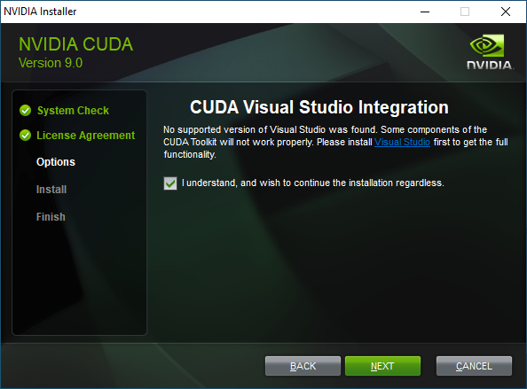

# 🧤 Install Tensorflow with GPU on Windows 10


หลังจากที่เราได้ลองจัดเสเปค Computer PC สำหรับนำมาใช้ด้าน Deep Learning ซึ่งผมก็ได้ทำการซื้อมาประกอบเรียบร้อย ก็มาถึงตอนติดตั้งเพื่อใช้งาน Tensorflow with GPU บน PC กัน ซึ่งเมื่อก่อนใช้งานบน Notebook ที่ใช้ CPU เป็น Intel และ GPU เป็น NVIDIA เลยอยากจะลอง CPU ที่เป็น AMD และ GPU เป็น NVIDIA มั้ง


## **Requirement**

* Install Python 3.6.6
* Install Virtualenv Package and Create Virtual Environment
* [CUDA Toolkit 9.0](https://developer.nvidia.com/cuda-toolkit-archive)
* [NVIDIA GPU Driver 410.x+ for CUDA 9.0](https://www.nvidia.com/Download/index.aspx?lang=en-us)
* [cuDNN 7.6.3 for CUDA 9.0](https://developer.nvidia.com/cudnn)
* [TensorRT 5.1 for CUDA 9.0](https://developer.nvidia.com/tensorrt)

## **Install**

### Step 1&#x20;

* ทำการดาวน์โหลด NVIDIA GPU Driver 410.x ขึ้นไป สำหรับ CUDA Toolkit 9.0 โดยเลือกเวอร์ชั่น NVIDIA ให้ตรงกับที่ใช้งาน ซึ่งผมใช้ Geforce GTX 1660 Ti อย่าลืมเลือกให้ตรงกับระบบปฏิบัติการ Windows 10 64-bit กรณีที่เป็น Windows ให้เลือก Driver Type เป็น [DCH](https://nvidia.custhelp.com/app/answers/detail/a\_id/4777/\~/windows-driver-types)


* คลิก OK


* เลือก NVIDIA Graphics Driver and Geforce Experience แล้วคลิก Agree and Continue


* เลือก Express แล้วคลิก Next


* เลือก Create Desktop Shortcut แล้วคลิก Restart Now


### Step 2&#x20;

* ทำการดาวน์โหลด CUDA Toolkit 9.0 อย่าลืมเลือกให้ตรงกับระบบปฏิบัติการ Windows 10 64-bit


* คลิก Agree and Continue


* เลือก Express แล้วคลิก Next


* เลือก I understand แล้วคลิก Next



* คลิก Next


* คลิก Close


### Step 3&#x20;

* ทำการดาวน์โหลด cuDNN 7.6.3 สำหรับ CUDA 9.0 อย่าลืมเลือกให้ตรงกับระบบปฏิบัติการ Windows 10 64-bit โดยสถาปัตยกรรมแบบใหม่ Volta สามารถ Train ข้อมูลได้เร็วกว่าแบบเดิมซึ่งเป็นแบบ Pascal ถึง 3 เท่า

.png>)

* จากนั้นทำการคัดลอกไฟล์ cudnn64\_7.dll ไปไว้ใน _C:\Program Files\NVIDIA GPU Computing Toolkit\CUDA\v9.0\bin_


* จากนั้นทำการคัดลอกไฟล์ cudnn.h ไปไว้ใน _C:\Program Files\NVIDIA GPU Computing Toolkit\CUDA\v9.0\include_


* จากนั้นทำการคัดลอกไฟล์ cudnn.lib ไปไว้ใน _C:\Program Files\NVIDIA GPU Computing Toolkit\CUDA\v9.0\lib\x64_


### Step 4&#x20;

* ทำการรัน sysdm.cpl เลือก Advanced แล้วคลิก Environment Variables


* เลือก Path แล้วคลิก Edit User variables


* ทำการระบุ Path ของ CUDA เป็น _C:\Program Files\NVIDIA GPU Computing Toolkit\CUDA\v9.0\bin_


* ทำการสร้าง Virtual Environment


```
mkvirtualenv venv
```



```
workon venv
```


* ติดตั้ง Tensorflow ( GPU )


```
pip install tensorflow-gpu==1.5.0
```


* ทำการสร้างไฟล์ tensorflow-begin.py


```
import tensorflow as tf
mnist = tf.keras.datasets.mnist

(x_train, y_train),(x_test, y_test) = mnist.load_data()
x_train, x_test = x_train / 255.0, x_test / 255.0

model = tf.keras.models.Sequential([
  tf.keras.layers.Flatten(input_shape=(28, 28)),
  tf.keras.layers.Dense(128, activation='relu'),
  tf.keras.layers.Dropout(0.2),
  tf.keras.layers.Dense(10, activation='softmax')
])

model.compile(optimizer='adam',
              loss='sparse_categorical_crossentropy',
              metrics=['accuracy'])

model.fit(x_train, y_train, epochs=5)
model.evaluate(x_test, y_test)
```


* ทำการรัน tensorflow-begin.py


```
python tensorflow-begin.py
```


* ลองดูผลลัพธ์


**อ่านเพิ่มเติม** : [https://bit.ly/2PTCMtg](https://bit.ly/2PTCMtg)
