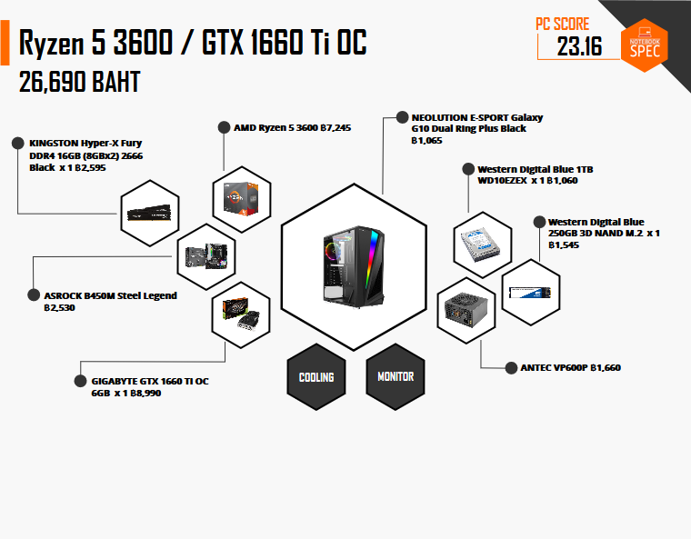

# 🧤 PC SPEC for Deep Learning 2019


การจัดเสปค Computer PC ซึ่งผมก็ไม่เคยจัด เลยอยากลองจัดดูว่าจะต้องรู้เกี่ยวกับอะไรบ้าง โดยเป็นการจัดเสปคในงบไม่เกิน 30,000 บาท ตั้งเหลือเอาไปซื้อจอพอดี สเปคที่ได้สามารถใช้กับงานด้าน Deep Learning ได้ เดี๋ยวจะเขียนผลการทดสอบเอาไว้คราวหน้ากัน


## ☑️ [SPEC Builder](https://notebookspec.com/pc/6745442)

## **✅ Requirement**

### CPU : [AMD Ryzen 5 3600](https://notebookspec.com/pc-cpu/AMD-Ryzen-5-3600/341)

การเลือก CPU ปัจจัุบันก็มีอยู่ 2 ค่าย คือ AMD และ Intel ซึ่งในแต่ละค่ายก็จะมี Processor หลาย Series และในแต่ละ Series ก็จะมีหมายเลข Processor ยิ่งเลขสูงก็จะยิ่งแรง นอกจากนี้ยังมีรหัสต่อท้ายหมายเลข Processor ของ [Intel](https://www.intel.co.uk/content/www/uk/en/processors/processor-numbers.html) ได้แก่ K ( Unlocked ) สามารถทำการ Overclock ได้, H ( High Performance Graphic ) มีระบบกราฟิกประสิทธิภาพสูงในตัว, U ( Ultra Low Power ) ใช้พลังงานต่ำพิเศษ และ F ต้องใช้กราฟิกแบบแยก ส่วนของ AMD ได้แก่ X และ G

### Motherboard : [ASROCK B450M Steel Legend](https://notebookspec.com/pc-mb/ASROCK-B450M-Steel%20Legend/1257)

การเลือก Motherboard จะต้องเลือกให้ Support CPU ด้วย ซึ่งผมเลือกเป็นของ ASROCK ฺB450M แบบ Micro-ATX มีจำนวน RAM Slot 4 ความจุสูงสุด 64 GB รองรับ Dual Channel DDR4 2133 MHz up to 3533+ ( OC ) สามารถใส่ SSD แบบ M.2 ได้ 2 Slot

### VGA : [GIGABYTE GTX 1660 Ti OC 6 GB](https://notebookspec.com/pc-vga/GIGABYTE-GTX-1660%20Ti%20OC%20/1035)

การเลือก VGA ปัจจัุบันก็มีอยู่ 2 ค่าย คือ AMD และ NVIDIA ซึ่งหากใครต้องการใช้งานด้าน Deep Learning ก็ให้เลือกของทาง NVIDIA เพราะจะ Support การใช้งาน มีให้เลือกหลายยี่ห้อทั้ง ASUS, MSI หรือ Gigabyte ถ้าเป็นของ MSI หรือ Gigabyte จะมีพัดลม 2 ตัว ส่วนของ ASUS จะมีพัดลม 3 ตัวและราคาแพงกว่า ซึ่งผมเลือกเป็นของ GIGABYTE GTX 1660 Ti

### RAM : [KINGSTON Hyper-X Fury DDR4 16GB (8GBx2) 2666](https://notebookspec.com/pc-ram/KINGSTON-Hyper-X-Fury%20DDR4%2016GB%20\(8GBx2\)%202666%20Black/340)

การเลือก RAM จะต้องเลือกให้ Support Motherboard จะต้องดู [RAM Bus](https://www.youtube.com/watch?v=D\_Yt4vSZKVk) กรณีที่ใส่ RAM แบบ Dual Channel แต่ RAM Bus ไม่เท่ากัน ความเร็วจะเท่ากับ RAM Bus ตัวที่ช้าที่สุด ซึ่งผมเลือกเป็นของ KINGSTON DDR4 16 GB ( 8 GB x 2 ) โดยมี RAM Bus 2666

### SSD : [WESTERN DIGITAL Blue 250GB 3D NAND M.2](https://notebookspec.com/pc-ssd/Western-Digital-Blue%20250GB%203D%20NAND%20M.2/388)

การเลือก SSD จะต้องเลือกให้ Support Motherboard ด้วย ซึ่งผมเลือกเป็นของ WESTERN DIGITAL แบบ 3D NAND M.2 ความจุสูงสุด 250 GB โดยความเร็วการ Read / Write อยู่ที่ 550 / 525

### CASE : [Tsunami Galaxy G10 Dual Ring Plus](https://notebookspec.com/pc-case/NEOLUTION-E-SPORT-Galaxy%20G10%20Dual%20Ring%20Plus%20Black/852)

การเลือก Case จะต้องเลือกให้ Support Motherboard & VGA ด้วย ซึ่งผมเลือกเป็นของ Tsunami Galaxy G10 แบบ Dual Ring Plus เพราะความสวยและคุ้มค่า ซึ่งด้านข้างจะเป็น Tempered Glass ทำให้เห็นแสงไฟ อีกแบบจะเป็น Phantom อันนี้ก็แล้วแต่ความชอบ

### POWER SUPPLY : [ANTEC VP600P](https://notebookspec.com/pc-psu/ANTEC-VP600P/345)

การเลือก Power Supply จะต้องเลือกกำลังไฟให้พอดีต่อการใช้งาน และเลือกที่มีมาตรฐานรับรอง 80+ ซึ่งผมเลือกเป็นของ ANTEC VP600P กำลังไฟ 600 W
