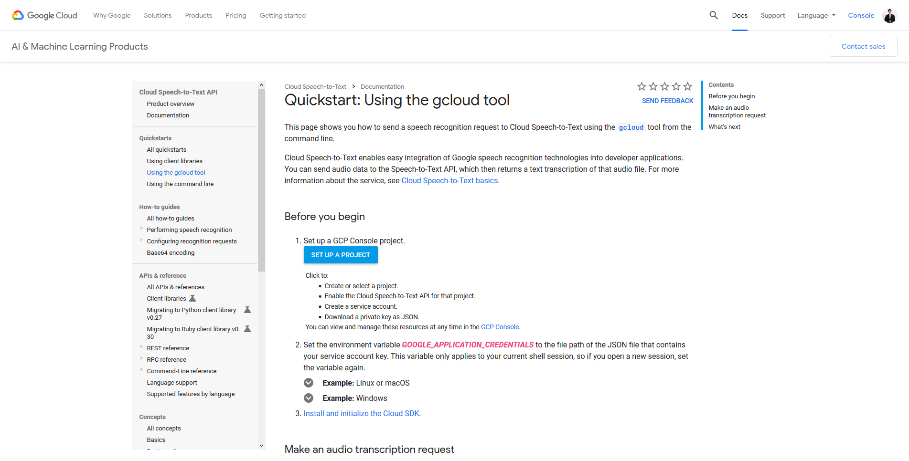
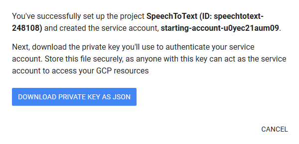

# 🧤 Speech to Text with Google API


หลายคนคงเคยใช้งาน Speech to Text กันมาบ้างแล้ว ในการแปลงเสียงเป็นข้อความ เช่น Google Translate ซึ่งทาง Google เองก็มี API ให้ใช้งาน มีทั้งแบบฟรีและไม่ฟรีให้ได้ลองเล่นกัน ถ้าไม่เกิน 60 นาที สามารถใช้งานได้ฟรี แต่ถ้าเกินก็จะเสียตัง [Cloud Speech to Text Pricing](https://cloud.google.com/speech-to-text/pricing)


## **Requirement**

* [Google Cloud SDK](https://cloud.google.com/sdk/docs/)
* [FFmpeg](https://ffmpeg.org/)

## **Get Started**

* เข้าไปที่หน้าเว็บ [https://cloud.google.com/speech-to-text/docs/quickstart-gcloud](https://cloud.google.com/speech-to-text/docs/quickstart-gcloud) แล้วคลิก Set up a project



* ทำการ Create project คลิก Next แล้วคลิก Download private key a JSON



* ทำการติดตั้ง Google Cloud SDK แล้วกำหนดค่า Environment Variable


```
set GOOGLE_APPLICATION_CREDENTIALS="path"
```


* ทำการรัน Google Speech to Text API โดยขึ้นอยู่กับ [Audio Encoding](https://cloud.google.com/speech-to-text/docs/encoding) ที่ Support


```
gcloud ml speech recognize gs://cloud-samples-tests/speech/brooklyn.flac --language-code="en-US"
```


```
{
  "results": [
    {
      "alternatives": [
        {
          "confidence": 0.9835046,
          "transcript": "how old is the Brooklyn Bridge"
        }
      ]
    }
  ]
}
```

* ทำการรัน Google Speech to Text API โดยทำการ Upload ไฟล์ไปไว้ใน [Google Cloud Storage](https://cloud.google.com/storage/) ของตัวเอง เมื่อรันคำสั่งจะ Return ค่า Operation ID กรณีที่ไฟล์มีความยาวเกิน 1 นาทีให้ใช้คำสั่ง _**recognize-long-running**_


```
gcloud ml speech recognize-long-running gs://natthasath/input.flac --language-code="th-TH" --async
```


```
Check operation [operations/1267314263370035202] for status.
{
  "name": "1267314263370035202"
}
```

* &#x20;ทำการแสดง Metadata ของ Operation ID


```
gcloud ml speech operations describe OPERATION_ID
```


```
{
  "metadata": {
    "@type": "type.googleapis.com/google.cloud.speech.v1.LongRunningRecognizeMetadata",
    "lastUpdateTime": "2019-07-28T09:14:02.127561Z",
    "progressPercent": 7,
    "startTime": "2019-07-28T09:12:58.526378Z"
  },
  "name": "1267314263370035202"
}
```

* &#x20;ทำการแสดง Result ของ Operation ID


```
gcloud ml speech operations wait OPERATION_ID
```


```
Waiting for operation [operations/1267314263370035202] to complete...
```

**อ่านเพิ่มเติม** : [https://bit.ly/312fabR](https://bit.ly/312fabR)
