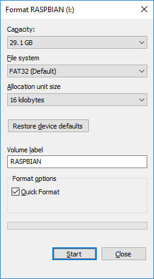
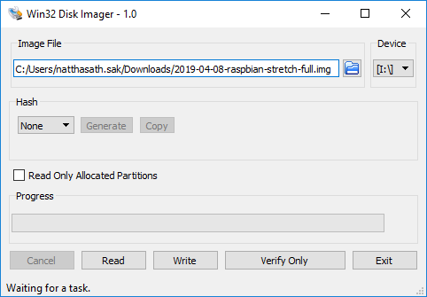
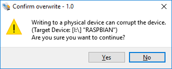
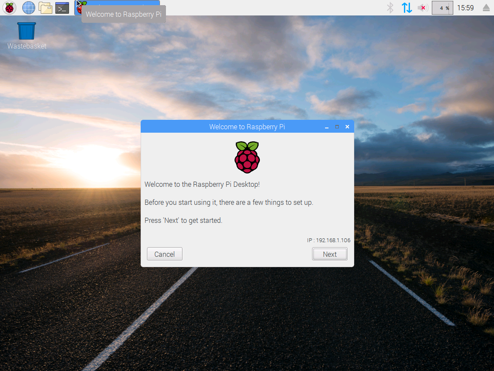

# 🍓 Install NOOBS on Rasberry Pi


[NOOBS](https://www.raspberrypi.org/documentation/installation/noobs.md) ( New Out Of Box Software ) เป็นระบบปฏิบัติการบน Raspberry Pi ที่มีขนาดเล็ก สามารถติดตั้งบน Micro SD Card ได้ ซึ่งจะประกอบได้วย Operating System ต่าง ๆ รวมถึง Raspbian ที่เราจะใช้ในการติดตั้ง


## **✅ Requirement**

* [NOOBS Image](https://www.raspberrypi.org/downloads/noobs/)
* [Win32DiskImager](https://win32diskimager.download/)
* Micro SD Card 8 GB + ( 16 GB )
* Monitor
* HDMI Cable
* Keyboard
* Mouse

## **🏆Install**

* ทำการ Format Micro SD Card โดยเลือก File System เป็น FAT32



* เปิดโปรแกรม Win32DiskImager แล้วทำการ Mount ไฟล์ NOOBS Image เลือก Device แล้วคลิก Write



* คลิก Yes



* นำ Micro SD Card ไปใส่ใน Raspberry Pi แล้วทำการกรอก Username และ Password

```
Username: pi
Password: raspberry
```

* จะแสดง Raspbian OS GUI



**อ่านเพิ่มเติม** : [https://bit.ly/36Ffa7c](https://bit.ly/36Ffa7c)
