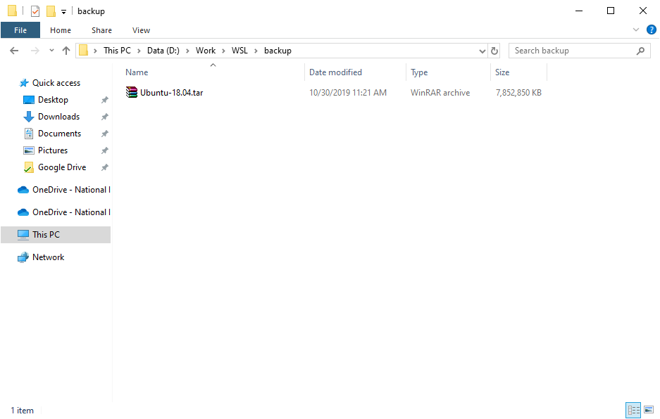

# 🧿 Export and Import Distro on Windows Subsystem for Linux


หลังจากที่ได้ลองติดตั้ง Docker บน Windows Subsystem for Linux ( WSL ) กันไปแล้ว เราจะมาลอง Export and Import Distro บน WSL กันบ้าง


## **Requirement**

* Enable Window Subsystem for Linux ( WSL )
* Install Ubuntu 18.04 LTS from Microsoft Store
* Upgrade Windows 10 Version 1903+

## **Get Started**

* ทำการตรวจสอบ Linux Distro บน Windows Subsystem for Linux


```
wsl --list --all
```


```
Windows Subsystem for Linux Distributions:
Ubuntu-18.04
```

* ทำการ Export Distro


```
wsl --export Ubuntu-18.04 D:\Work\WSL\backup\Ubuntu-18.04.tar
```


* ลองทำการเปิดโฟลเดอร์ backup ขึ้นมา



* ทำการ Import Distro


```
wsl --import Ubuntu-18.04 D:\Work\WSL\backup\Ubuntu-18.04.tar
```


**อ่านเพิ่มเติม** : [https://bit.ly/2qXDoHJ](https://bit.ly/2qXDoHJ)
