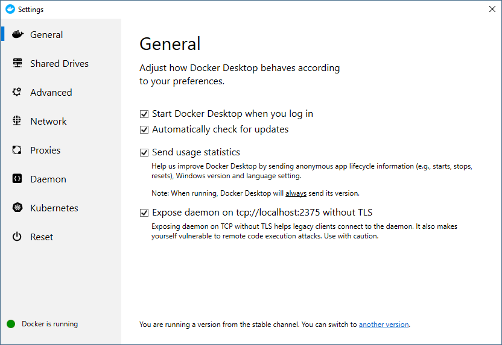

# 🧿 Install Docker on Windows Subsystem for Linux


หลังจากที่ได้ลองติดตั้ง Web Server บน Windows Subsystem for Linux ( WSL ) กันไปแล้ว เราจะมาลองติดตั้ง Docker บน WSL เพื่อทำการสร้าง Container กันบ้าง


## **Requirement**

* Enable Window Subsystem for Linux ( WSL )
* Install Ubuntu 18.04 LTS from Microsoft Store
* Install Docker Desktop for Windows

## **Install**

* ทำการ Update และ Upgrade


```
apt-get update && apt-get upgrade -y
```


* ทำการติดตั้ง Package


```
apt-get install apt-transport-https ca-certificates curl software-properties-common -y
```


* ทำการเพิ่ม Docker Public Key


```
curl -fsSL https://download.docker.com/linux/ubuntu/gpg | sudo apt-key add -
```


* ทำการตรวจสอบ Fingerprint จาก 8 ตัวสุดท้าย


```
apt-key fingerprint 0EBFCD88
```


```
pub   rsa4096 2017-02-22 [SCEA]
      9DC8 5822 9FC7 DD38 854A  E2D8 8D81 803C 0EBF CD88
uid           [ unknown] Docker Release (CE deb) <docker@docker.com>
sub   rsa4096 2017-02-22 [S]
```

* ทำการเพิ่ม Stable Repository


```
add-apt-repository "deb [arch=amd64] https://download.docker.com/linux/ubuntu $(lsb_release -cs) stable"
```


* ทำการติดตั้ง Docker CE


```
apt-get install docker-ce -y
```


* ทำการระบุ Docker Host เพื่อทำการ Connect ผ่าน Daemon Socket


```
docker -H localhost:2375 images
```


* ทำการกำหนด Environment Variable


```
export DOCKER_HOST=localhost:2375
```



```
echo "export DOCKER_HOST=localhost:2375" >> ~/.bash_profile
```


* เปิดโปรแกรม Docker Desktop เลือก General แล้วคลิก Expose daemon



**อ่านเพิ่มเติม** : [https://dockr.ly/2rgbOBK](https://dockr.ly/2rgbOBK), [https://bit.ly/2oT6kPV](https://bit.ly/2oT6kPV)
