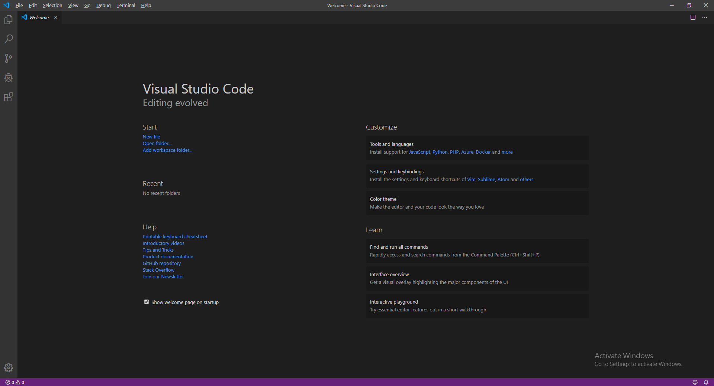
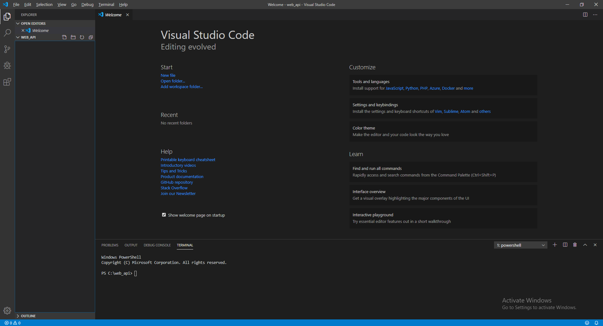
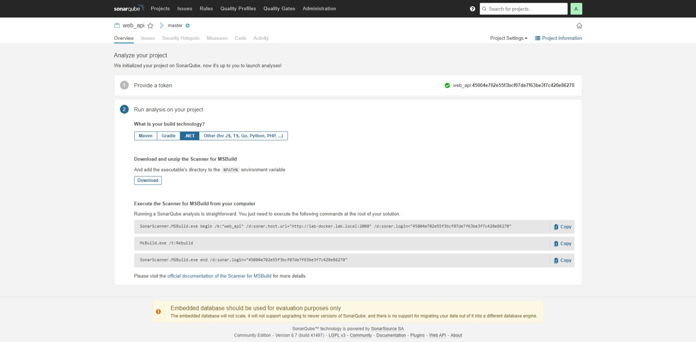
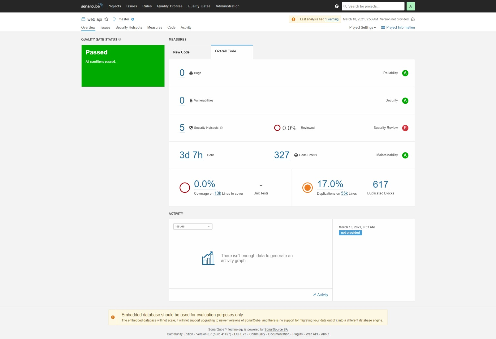

# 🐹 .NET Core Automatic Code Review with SonarQube


หลังจากที่เราได้ลองติดตั้ง .NET Core Web API กันไปแล้ว ในการใช้งาน เราจะต้องมานั่งตรวจสอบข้อผิดพลาดในการเขียนโปรแกรม รวมถึงช่องโหว่ต่าง ๆ ซึ่งจะเสียเวลาในการตรวจสอบ ซึ่งเราจะใช้ SonarQube ในการทำ Automatic Code Review กัน


## **Requirement**

* Install .NET Core SDK 2.0+
* Install .NET Framework 4.6+
* Install Java Development Kit ( JDK ) 11

## **Get Started**

* ทำการเปิดโปรแกรม Visual Studio Code แล้วคลิก Open Folder Project ขึ้นมา



* คลิก Terminal แล้วเลือก New Terminal



* ทำการตรวจสอบ .NET Core Version


```
dotnet --version
```


```
3.0.101
```

* ทำการติดตั้ง SonarScanner


```
dotnet tool install --global dotnet-sonarscanner --version 5.1.0
```


* ทำการตรวจสอบ Package ที่ติดตั้ง


```
dotnet tool list --global
```


```
Package Id               Version      Commands
---------------------------------------------------------
dotnet-ef                3.0.0        dotnet-ef
dotnet-sonarscanner      5.1.0        dotnet-sonarscanner
```

* ทำการสร้าง Project ใน SonarQube



* ทำการกำหนดค่า Sonar Project


```
dotnet-sonarscanner begin /k:"project-key" /d:sonar.login="Token"
```



```
dotnet build
```



```
dotnet-sonarscanner end /d:sonar.login="Token"
```


* จะแสดงข้อมูล Overview ของ Code



**อ่านเพิ่มเติม** : [http://bit.ly/3brpuT0](http://bit.ly/3brpuT0)
