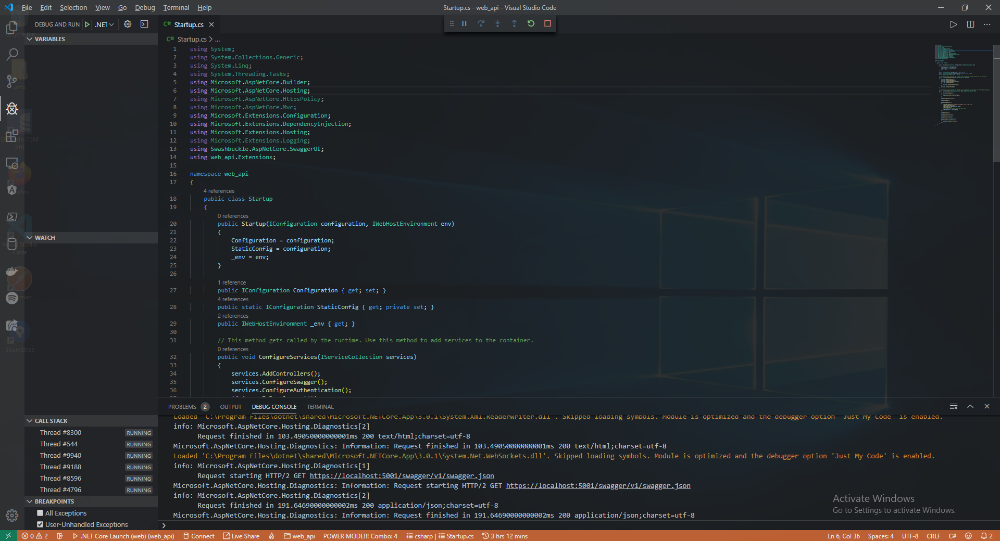

# 🐹 .NET Core Disable Authentication in Development Environment


หลังจากที่เราได้ลองสร้าง Web API ด้วย .NET Core และทำ Authentication ด้วย JWT กันไปแล้ว จะเห็นว่าในกรณีที่อยู่ใน Development Mode จะต้องทำการ Authentication ก่อนทุกครั้ง ทำให้เสียเวลา ซึ่งเราอาจเขียนให้ไม่ต้อง Authentication เมื่ออยู่ใน Development Mode


## **Get Started**

* ทำการสร้างไฟล์ DisableAuthorizationHandler.cs ในโฟลเดอร์ Services


```
using System.Threading.Tasks;
using Microsoft.AspNetCore.Authorization;

namespace web_api.Services
{
    public class DisableAuthorizationHandler : AuthorizationHandler
    where TRequirement : IAuthorizationRequirement
    {
        protected override Task HandleRequirementAsync(AuthorizationHandlerContext context, TRequirement requirement)
        {
            context.Succeed(requirement);

            return Task.CompletedTask;
        }
    }
}
```


* ทำการสร้างไฟล์ TransientExtension.cs ในโฟลเดอร์ Services


```
using Microsoft.AspNetCore.Authorization;
using Microsoft.Extensions.DependencyInjection;
using web_api.Services;

namespace web_api.Extensions
{
    public static class TransientExtension
    {
        public static void ConfigureTransient(this IServiceCollection services)
        {
            services.AddTransient<IAuthorizationHandler, DisableAuthorizationHandler>();
        }
    }
}
```


* ทำการเรียกใช้คลาส ConfigureTransient ที่อยู่ในไฟล์ TransientExtension.cs เข้ามาในคลาส ConfigureServices ที่อยู่ในไฟล์ Startup.cs


```
public Startup(IConfiguration configuration, IWebHostEnvironment env)
{
    Configuration = configuration;
    StaticConfig = configuration;
    _env = env;
}

public IConfiguration Configuration { get; set; }
public static IConfiguration StaticConfig { get; private set; }
public IWebHostEnvironment _env { get; }
public void ConfigureServices(IServiceCollection services)
{
    services.AddControllers();
    services.ConfigureSwagger();
    services.ConfigureAuthentication();
    if (_env.IsDevelopment())
    {
        services.ConfigureTransient();
    }
    services.ConfigureScoped();
}
```


* คลิก Debug แล้วเลือก Start Debugging



* ลองเข้าไปที่ [https://localhost:5001/index.html](https://localhost:5001/index.html) จะสามารถเรียกใช้ API โดยไม่ต้องทำการ Authentication ในโหมด Development


**อ่านเพิ่มเติม** : [https://bit.ly/37WnKNl](https://bit.ly/37WnKNl)
