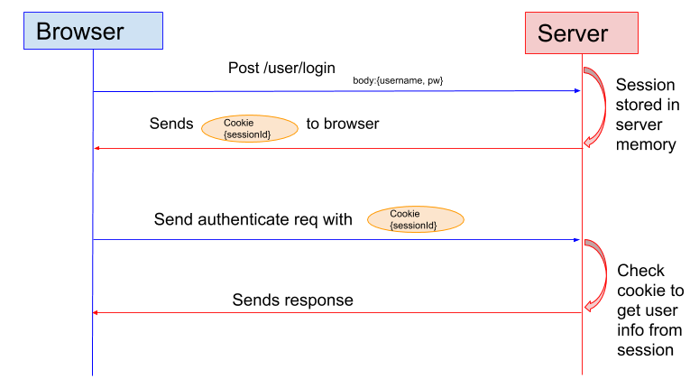
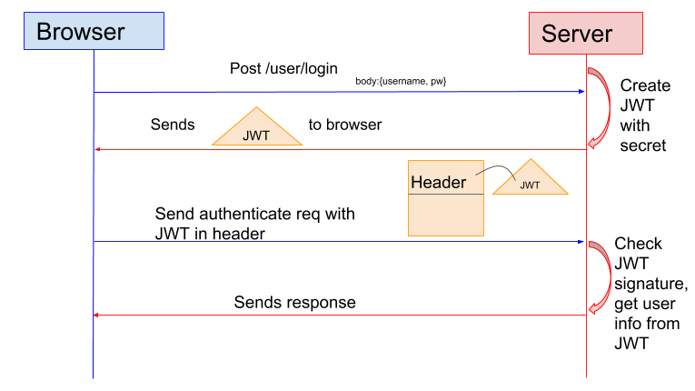
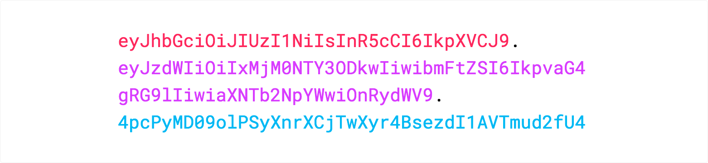
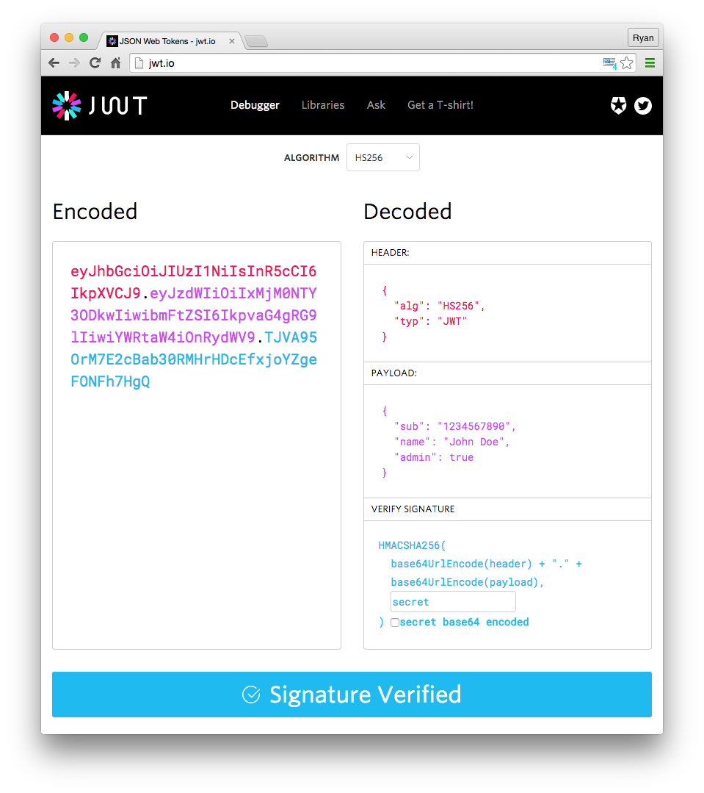

# ⚪ JSON Web Token


หลายคนคงเคยใช้งาน Session หลังจากทำการ Login ด้วย Username และ Password จะทำการสร้าง Session เพื่อใช้ในการยืนยันการ Authentication ทำให้ไม่ต้องทำการ Login ด้วย Username และ Password ทุกครั้งที่มีการเชื่อมต่อกับ Server แล้ว JSON Web Token นั้นมีดีอย่างไร ทำไมคนถึงนิยมใช้ในปัจจุบัน


## **Authentication**


โดยปกติเวลาผู้ใชงาน User จะเข้าใช้งานระบบ Login จะมีการรักษาความปลอดภัย ว่าผู้ใช้งานนั้นมีสิทธิ์ในการเข้าถึงระบบจริง ซึ่งจะใช้การ Authentication จะอาศัย Parameter แบบ Post 2 ตัว ซึ่งก็คือ Username และ Password หรือจะใช้ Email กับ Password ก็ได้ เมื่อ Client ส่งค่า Parameter ไป ทาง Server ก็จะตอบ Response กลับมา


## **Session**




หลังจากที่เราทำการ Authentication ครั้งแรก จะมีการสร้าง Session ของแต่ละ User ขึ้นมา เพื่อให้ผู้ใช้งานไม่ต้องทำการ Authentication อีก โดย Session จะเก็บอยู่บน Memory ของ Server ส่วน Cookie  จะเก็บอยู่บน Browser ของ Client จนกว่าผู้ใช้งานจะทำการ Logout จึงจะทำลาย Session นั้นทิ้งไป หรือจนกว่า Session Expire ตามระยะเวลาที่ได้กำหนด


## **Token**



## **JSON Web Token**




JWT เป็นมาตรฐานในการส่งข้อมูลระหว่าง Parties ต่าง ๆ โดยจะมีขนาดกะทัดรัด Compact และก็บข้อมูลในตัว Self-Contained ซึ่งจะใช้ HMAC Algotithm ในการเข้ารหัส หรือจะใช้ Key Pair อย่าง RSA หรือ ECDSA ที่เป็น Public Key / Private Key ก็ได้ โดยจะประกอบไปด้วย 3 ส่วน คือ


<details>

<summary>Header</summary>

เป็นส่วนที่บอกประเภทของ Token และ Algorithm ที่ใช้ เช่น HMAC, SHA256 หรือ RSA

```
{
  "alg": "HS256",
  "typ": "JWT"
}
```

</details>

<details>

<summary>Payload</summary>

เป็นส่วนของ Data ที่เรียกกันว่า [JWT Claim](https://tools.ietf.org/html/rfc7519#section-4.1) โดยจะเป็นการอ้างสิทธิ์ของผู้ใช้งาน User ที่ร้องขอ ซึ่งจะแบ่งเป็น 3 ประเภท Registered Claim, Public Claim และ Private Claim

* Registered Claim : เป็นส่วนที่ใช้บอกรายละเอียด เช่น Issuer ( iss ), Subject ( sub ), Audience ( aud ), Expire Time ( exp ) และอื่น ๆ
* Public Claim : เป็นส่วนที่สามารถสร้างได้เอง แต่ควรมีการกำหนด [IANA JSON Web Token Registry](https://www.iana.org/assignments/jwt/jwt.xhtml) เพื่อป้องกัน Collision Resistant การชนกัน หรือใช้ URL นำหน้าในการสร้าง Namespace
* Private Claim : เป็นส่วนที่สามารถสร้าง เพื่อ Share ข้อมูลระหว่าง Parties ที่มีการตกลงกัน ซึ่งจะไม่ใช่ทั้ง Registered Claim และ Public Claim หมายความว่าไม่ต้องสนใจ Collision Resistant

```
{
  "sub": "1234567890",
  "name": "John Doe",
  "iat": 1516239022
}
```

</details>

<details>

<summary>Signature</summary>

เป็นส่วนของ Digital Signature โดยจะใช้ Secret ที่ได้จากการ Generate JWT ของแต่ละ Web Service มาทำการยืนยันตัวตน

```
HMACSHA256(
  base64UrlEncode(header) + "." +
  base64UrlEncode(payload),
  secret)
```

</details>

เมื่อทำการ Encode แต่ะละส่วนด้วย Base64Url แล้วรวมทั้ง 3 ส่วนเข้าด้วยกัน จะได้รหัสขึ้นมาชุดหนึ่ง

```
xxxxx.yyyyy.zzzzz
```

## **JWT Debugger**



## **Comparison**


นอกจากการใช้ JWT แล้ว ยังมี Service ที่คล้ายกันได้แก่ Simple web Token ( SWT ) และ Security Assertion Markup Language Tokens ( SAML )

เราสามารถใช้ [JWT Debugger](https://jwt.io/#debugger) ในการ Encode หรือ Decode ข้อมูล Header กับ Payload ได้ และยังสามารถใช้ในการตรวจสอบ Signature Verified ได้อีกด้วย


**อ่านเพิ่มเติม** : [https://bit.ly/20I8XQq](https://bit.ly/20I8XQq), [https://bit.ly/2Zguf8J](https://bit.ly/2Zguf8J), [https://bit.ly/31MyJ8A](https://bit.ly/31MyJ8A), [https://bit.ly/31P0PjE](https://bit.ly/31P0PjE), [https://bit.ly/31LwDWp](https://bit.ly/31LwDWp)
