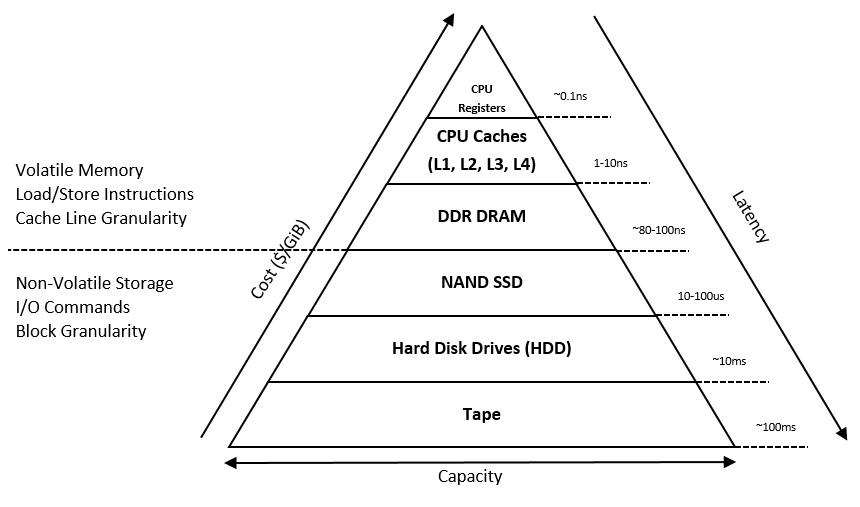
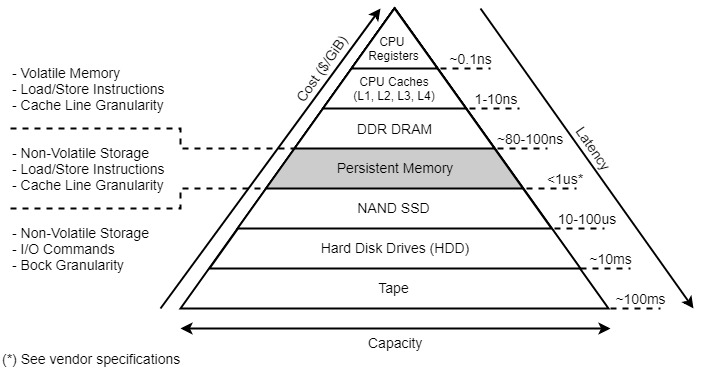
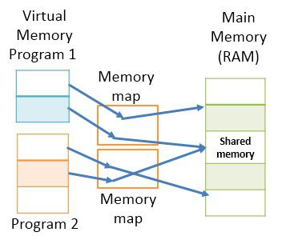

# 🟦 Memory Architecture


หลายคนคงคุ้นเคยกับ Memory ที่เราใช้กันอยู่ทุกวัน ซึ่งเป็นส่วนประกอบหนึ่งของคอมพิวเตอร์ ประกอบไปด้วย หน่วยความจำหลัก ( Primary Memory ) ได้แก่ RAM, ROM และหน่วยความจำสำรอง ( Secondary Memory ) ซึ่งใช้ไฟฟ้าในการบันทึกข้อมูล


## **Memory Hierarchy**

โดยปกติระบบต้องการ Memory ที่มีขนาดใหญ่ มีความเร็วสูง และมีราคาถูก แต่ปัญหาอยู่ที่ Memory ที่มีความเร็วสูงนั้นย่อมมีราคาแพงตามไปด้วย จึงได้มีการแบ่ง Memory Hierarchy ออกเป็น 6 Level โดยจะเรียงตั้งแต่ Base ซึ่งมีราคาถูก มีขนาดใหญ่ และมีความเร็วต่ำ ไปจนถึงความเร็วสูงอย่าง Register และนอกจากนี้ยังแบ่งโดยใช้เกณฑ์กระแสไฟฟ้า Volatile Memory เข้าถึงข้อมูลได้อย่างรวดเร็ว แต่ข้อมูลจะหายไปเมื่อปิดเครื่อง และ Non-Volatile Memory เข้าถึงข้อมูลได้ช้ากว่า แต่ข้อมูลจะไม่หายไปหลังปิดเครื่อง

## Persistent Memory

ทั้ง Volatile Memory และ Non-Volatile Memory ต่างก็มีข้อดีข้อเสียกันคนละอย่าง จึงมีการนำข้อดีของทั้งสองมารวมไว้ด้วยกันเป็น Persistent Memory ที่มีคุณสมบัติเป็น Non-Volatile Memory ข้อมูลไม่หายไปหลังปิดเครื่อง แต่ก็ยังสามารถเข้าถึงข้อมูลได้อย่างรวดเร็ว เหมาะกับงานที่มีการอ่านเขียนข้อมูลบนฐานข้อมูลอย่าง Oracle Database จะต่างกับ Cache Memory ที่ข้อมูลจะหายไปเมื่อดับเครื่อง

<figure><figcaption></figcaption></figure>

## **RAM vs ROM**

ทั้ง Read Access Memory ( RAM ) และ Read Only Memory ( ROM ) ต่างก็เป็น Memory ที่อยู่ภายในคอมพิวเตอร์ ต่างกันตรงที่ RAM เป็นหน่วยความจำชั่วคราว สามารถ Read / Write ได้ อีกทั้งยังต้องใช้ไฟฟ้าตลอดเวลาเพื่อไม่ให้ข้อมูลหาย ( Volatile ) และมีขนาดได้ตั้งแต่ 64 MB ถึง 4 GB ส่วน ROM เป็นหน่วยความจำถาวร สามารถ Read ได้อย่างเดียว อีกทั้งยังไม่จำเป็นต้องใช้ไฟฟ้าตลอดเวลา ( Non-Volatile ) จึงใช้เก็บข้อมูลพวก Bios และมีขนาดเล็กว่า RAM ทำให้ราคา ROM จึงถูกกว่า RAM

## **32 Bit vs 64 Bit**

Processor ถูกออกแบบมาให้สามารถจัดการกับข้อมูล แต่ละระบบก็มีความแตกต่างกัน ขนาดของ Word แตกต่างกัน หากเป็น Processor รุ่นแรก ๆ 1 Word จะใช้ 16 Bit สามารถเข้าถึงหน่วยความจำได้ไม่เกิน 64 KB ถัดมาในยุค 90 จะใช้ 32 Bit สามารถเข้าถึงหน่วยความจำได้ไม่เกิน 4 GB ปัจจุบันจะใช้ 64 Bit สามารถเข้าถึงหน่วยความจำได้มากกว่า 4 GB สูงสุดถึง 18.4 EB ทำให้สามารถจัดการกับปริมาณข้อมูลที่มากขึ้น การประมวลผลข้อมูลขนาดใหญ่ ซึ่ง Memory ก็ต้องออกแบบมาให้ทำงานร่วมกับ Processor ด้วยเช่นเดียวกัน

## **Memory Process**

เมื่อ CPU มีการเรียกข้อมูลที่อยู่บน Memory จะตรวจสอบว่ามี Word อยู่ใน Cache หรือไม่ ถ้ามีจะเรียกว่า ( Hit ) ถ้าไม่มีจะเรียกว่า ( Miss ) ก็จะไปหาใน Block บน Memory โดย Block จะมีขนาดเป็นจำนวนเท่าของ Word หลังจากนั้น Memory จะ Transfer Data Block กลับไปให้ CPU พร้อมทั้งเก็บไว้ใน Cache ระหว่าง Disk กับ Memory ก็ถือเป็นการทำ Cache อย่างหนึ่งเรียกว่า Virtual Memory

## **Cache Memory vs Virtual Memory**

ทั้งสองตัวต่างเป็น Memory เหมือนกัน ถูกสร้างมาเพื่อถลายข้อจำกัดของ Memory โดย Cache Memory ช่วยลดระยะเวลาในการเข้าถึงข้อมูล ( Access Time ) โดยทำการ Copy Data ที่ถูกใช้ไปเมื่อไม่นาน ทำให้สามารถเข้าถึงข้อมูลได้อย่างรวดเร็วโดยไม่ต้อง Access Disk ส่วน Virtual Memory ช่วยให้สามารถรันโปรแกรมที่มีขนาดใหญ่กว่า Main Memory ได้ หรือโปรแกรมที่ใช้ Address มากกว่า 4 GB ใน Processor แบบ 32 Bit โดยอาศัยการ Mapping ระหว่าง Virtual Address กับ Physical Address

