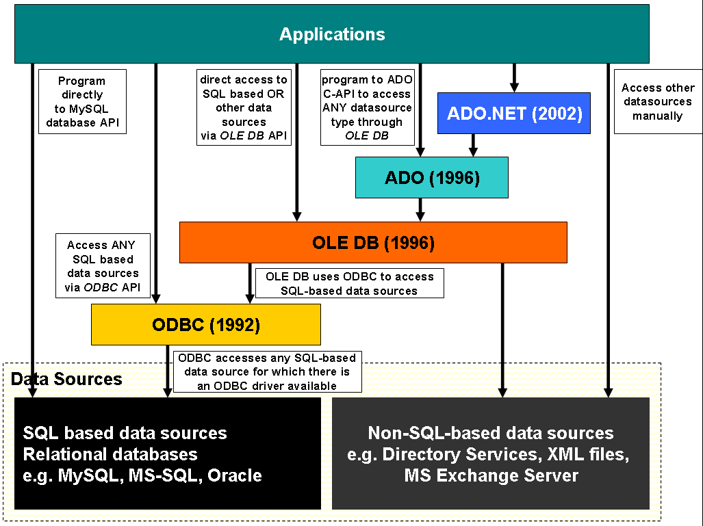

# 🟣 Microsoft Universal Data Access


ในการเชื่อมต่อกับฐานข้อมูลในภาษา .NET Programming ของทาง Microsoft จะใช้ Universal Data Access ในการเข้าถึงฐานข้อมูล ไม่ว่าจะเป็น ODBC, OLEDB และ ADO จะมีลักษณะการใช้งานที่แตกต่างกัน รวมถึง ODP.NET ของทาง Oracle ที่ใช้ในการเข้าถึงฐานข้อมูล Oracle Database โดยเฉพาะ


## [**ODBC**](https://en.wikipedia.org/wiki/Open\_Database\_Connectivity)


Open Database Connectivity ( ODBC ) เป็น API มาตรฐานของทาง Microsoft ที่ใช้ในการเชื่อมต่อ Data Source ต่าง โดยถูกออกแบบมาให้สามารถเข้าถึงข้อมูลประเภท SQL เช่น MSSQL, MySQL, Oracle หรือข้อมูลประเภท Relational Database


## [**OLEDB**](https://en.wikipedia.org/wiki/OLE\_DB)


Object Linking and Embedding Database ( OLEDB ) เป็น API ซึ่งถูกพัฒนาต่อจาก ODBC ที่ใช้ในการเชื่อมต่อ Data Source ต่าง ๆ โดยถูกออกแบบมาให้สามารถเข้าถึงข้อมูลประเภท Non-SQL เช่น MS Access, MS Excel, Exchange ส่วนข้อมูลประเภท SQL ก็ยังเรียกใช้ ODBC ในการเข้าถึง Relational Database เช่น MSSQL, MySQL, Oracle


## [**ADO**](https://en.wikipedia.org/wiki/ActiveX\_Data\_Objects)


ActiveX Data Objects ( ADO ) เป็น API ซึ่งถูกพัฒนาต่อจาก OLEDB ที่ใช้ในการเชื่อมต่อ Data Source ต่าง ๆ โดยถูกออกแบบมาให้สามารถเขียนโปรแกรมในการเชื่อมต่อไม่ว่าข้อมูลจะถูกเก็บอยู่ในรูปแบบใดก็ตาม เป็นส่วนหนึ่งของ Component Object Model ( COM ) ซึ่งจะอยู่ใน Layer ของ Programming Language


## [**ODP.NET**](https://www.oracle.com/database/technologies/appdev/dotnet/odp.html)


Oracle Data Provider for .NET ( ODP.NET ) เป็น Feature ซึ่งถูก Optimize จาก ADO.NET ให้สามารถเข้าถึง Advance Feature ของ Oracle Database ประกอบไปด้วย Real Application Cluster ( RAC ), Self-Tuning Statement Cache และ Fast Connection Failover ซึ่งสามารถใช้งานบน .NET Core ได้ด้วย ODP.NET Core


**อ่านเพิ่มเติม** : [https://bit.ly/370lp3m](https://bit.ly/370lp3m), [https://bit.ly/2QYZdBc](https://bit.ly/2QYZdBc)
