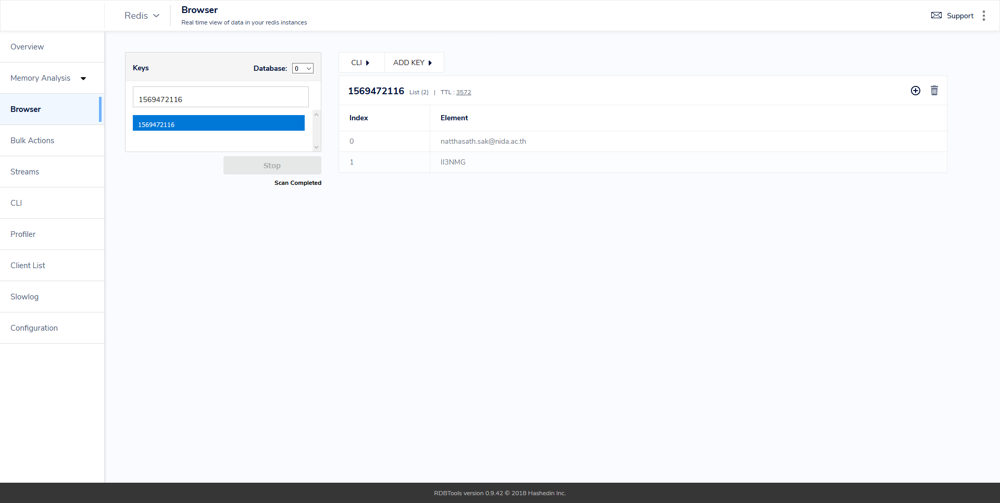

# 🍂 Laravel Redis Key-Value Store


หลังจากที่เราลองได้ติดตั้ง Redis และ Redis GUI กันไปแล้ว เราจะมาใช้งาน Redis บน Laravel ในการเก็บข้อมูล OTP กัน ซึ่งถ้าหากไม่คิดอะไรมากเราอาจจะเก็บมันแบบ Session แต่ถ้าหากอยากใช้ Redis เพื่อการเก็บข้อมูลจากการ Query Database เราก็จะมาลองเก็บข้อมูล OTP กันก่อน


## **Get Started**

* ทำการติดตั้ง Laravel Package ผ่าน Composer


```
composer require predis/predis
```


* ทำการแก้ไขไฟล์ config/app.php


```
'redis' => [

    'client' => 'predis',

    'default' => [
        'host' => env('REDIS_HOST', '127.0.0.1'),
        'password' => env('REDIS_PASSWORD', null),
        'port' => env('REDIS_PORT', 6379),
        'database' => env('REDIS_DB', 0),
        'read_write_timeout' => 60,
    ],

    'cache' => [
        'host' => env('REDIS_HOST', '127.0.0.1'),
        'password' => env('REDIS_PASSWORD', null),
        'port' => env('REDIS_PORT', 6379),
        'database' => env('REDIS_CACHE_DB', 1),
    ],

],
```


* ทำการ Create Route ในไฟล์ routes/web.php


```
<?php

Route::post('otp/generate','OtpController@index');
Route::post('otp/verified','OtpController@verified');
Route::get('otp/session','OtpController@session');
```


* ทำการแก้ไขไฟล์ app/Http/Controller/OtpController.php


```
use Illuminate\Http\Request;
use Illuminate\Support\Str;
use Illuminate\Support\Facades\Redis;

class OtpController extends Controller
{
    public function index(Request $request)
    {
        $email = $request->email;
        $ldap = app("App\Http\Controllers\LdapController")->find($email);
        if ($ldap == 'Successfull') {
            $otp = $this->generate();
            $session = now()->timestamp;
            Redis::rpush($session, $email, $otp);
            Redis::expire($session, 300); // 5 minutes
	    $subject = 'One Time Passcode (OTP)';
	    $body = 'Your One Time Passcode (OTP) is: ' . $otp . '';
            $mail = app("App\Http\Controllers\MailController")->sendmail($email, $subject, $body);
            if ($mail == 'Successful') {
                $node = response()->json(['status' => 'Successful', 'session' => $session]);
            } else {
                $node = response()->json(['status' => 'Failed', 'message' => 'Can not sendmail']);
            }            
	} else {
	    $node = response()->json(['status' => 'Failed', 'message' => 'Not found user on active directory']);
        }       

        return $node;

    }

    public function generate()
    {
        $otp = Str::random(6);
        return $otp;
    }

    public function verified(Request $request)
    {
        $session = $request->session;
        $otp = $request->otp;

        if (Redis::lrange($session, 0, 0) != NULL) {
            $session_otp = Redis::lrange($session, 1, 1);
            if ($session_otp[0] == $otp) {
                Redis::del($session);
                $node = response()->json(['status' => 'Successful']);
            } else {
                $node = response()->json(['status' => 'Failed', 'message' => 'Invalid otp']);
            }
        } else {
            $node = response()->json(['status' => 'Failed', 'message' => 'Not found session']);
        }

        return $node;
    }

    public function session(Request $request)
    {
        $session = $request->session;

        if (Redis::lrange($session, 0, 0) != NULL) {
            $session_email = Redis::lrange($session, 0, 0);
            $session_otp = Redis::lrange($session, 1, 1);
            $node = response()->json(['email' => $session_email[0], 'otp' => $session_otp[0]]);
        } else {
            $node = response()->json(['status' => 'Failed', 'message' => 'Not found session']);
        }

        return $node;
    }

    public function flush()
    {
        Redis::flushDB();
        return response()->json(['status' => 'Successful']);
    }
    
}
```


* ทำการตรวจสอบผ่าน Redis GUI



**อ่านเพิ่มเติม** : [https://bit.ly/2kv4xPn](https://bit.ly/2kv4xPn)
