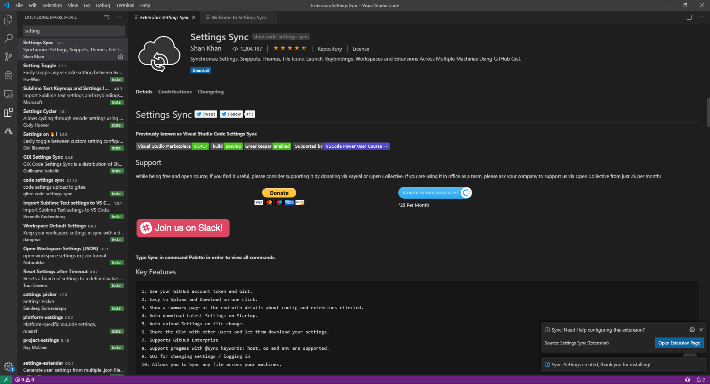
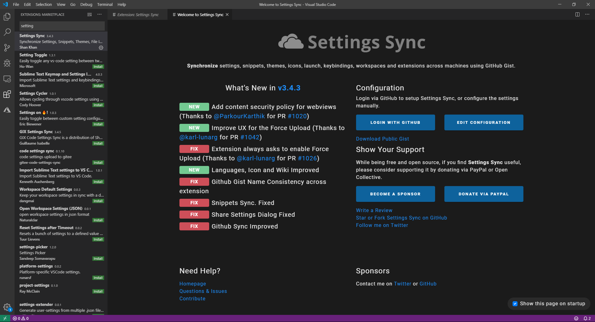
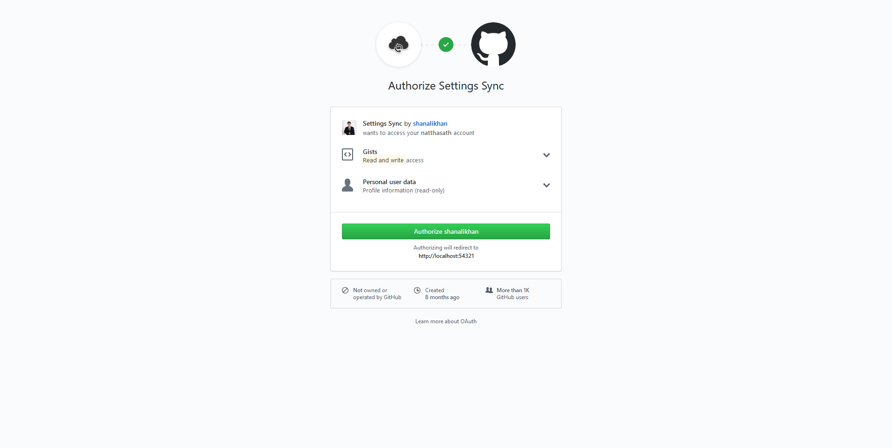
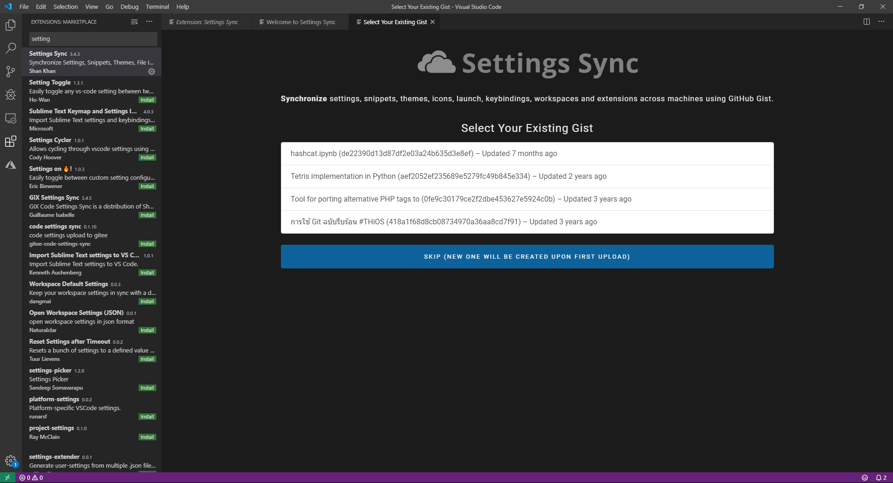
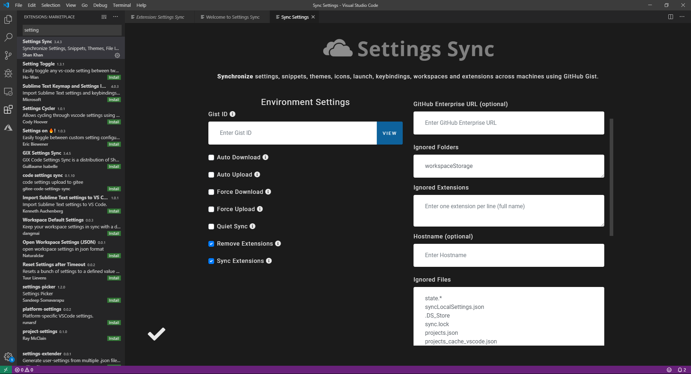
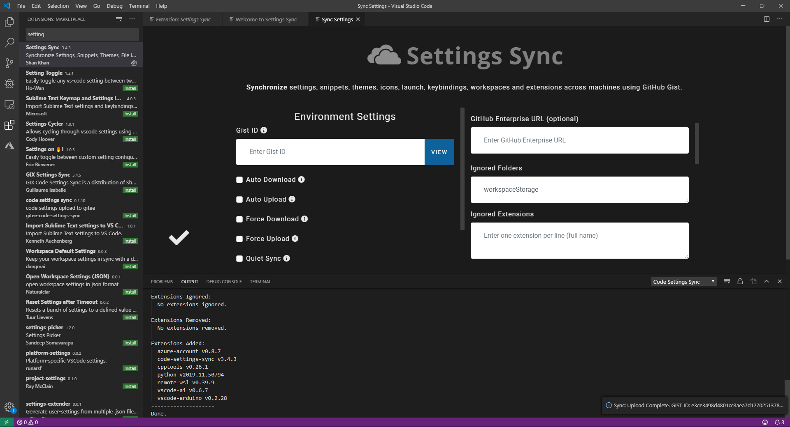
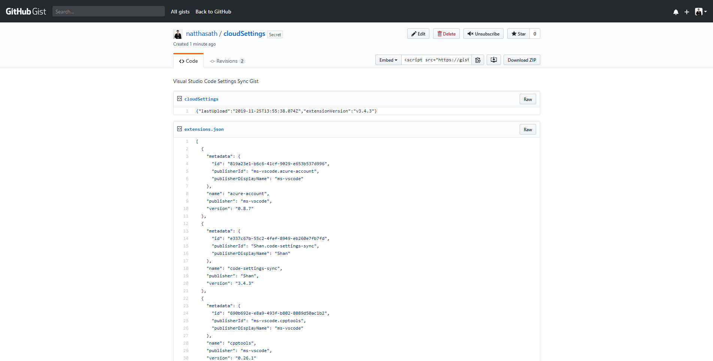
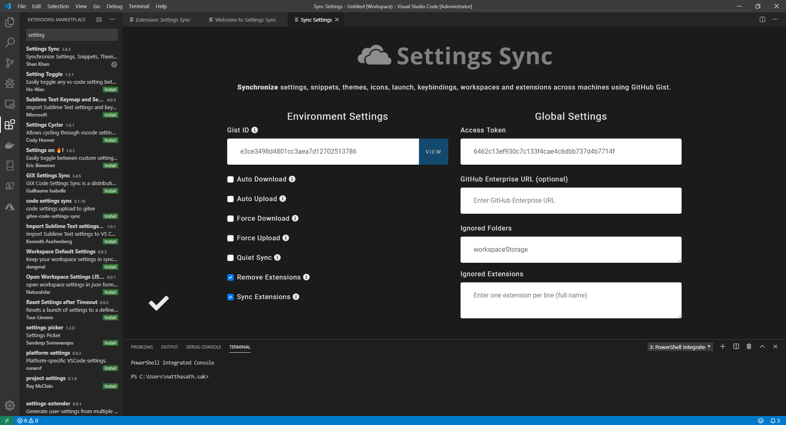
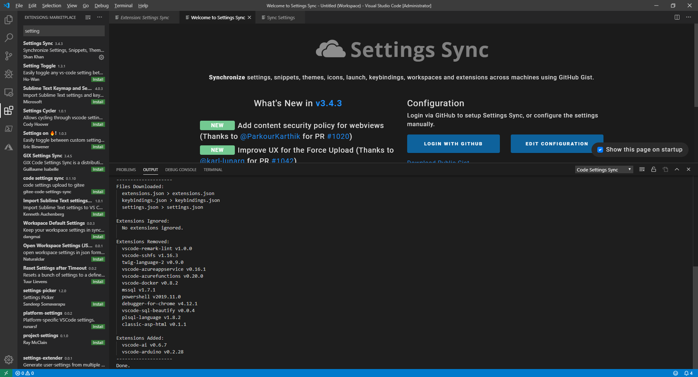

# 🌑 Backup Extension for Visual Studio Code


หลายคนคงเคยใช้ Visual Studio Code ในการเขียนโปรแกรม ซึ่งสามารถทำการติดตั้ง Extension เพื่อช่วยในการเขียนโปรแกรม จึงเกิดคำถามที่ว่า หากเราไปทำการ Develop เครื่องอื่น หรือต้องการให้ทีมทำการติดตั้ง Extension เหมือน ๆ กัน จะต้องทำยังไง รวมถึงการ Backup & Restore ซึ่งเราจะใช้ Extension Setting Sync มันจะทำการ Sync Extension ทั้งหมดใน Preferences -> Setting JSON


## **Get Started**

* ทำการติดตั้ง Extension ที่ชื่อ Settings Sync

* คลิก Login with Github

* คลิก Authorize shanalikhan

* คลิก Close Tab

* คลิก Skip

* คลิก Edit Configuration

* ลองทำการ Upload Extension คลิก Shift + Alt + U

* ลองเข้าไปที่ [https://gist.github.com](https://gist.github.com/) จะเห็น cloudSettings ที่ได้จาก Visual Studio Code Settings Sync Gist

* คลิก Edit Configuration แล้วทำการใส่ Gist ID

* ลองทำการ Download Extension คลิก Shift + Alt + D คำเตือนเมื่อทำการ Download หากมี Extension ที่ติดตั้งเพิ่มแต่ยังไม่ได้ Upload มันจะถูก Remove

**อ่านเพิ่มเติม** : [https://bit.ly/2qIlLvF](https://bit.ly/2qIlLvF)
