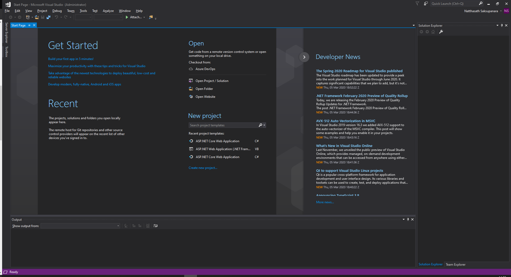
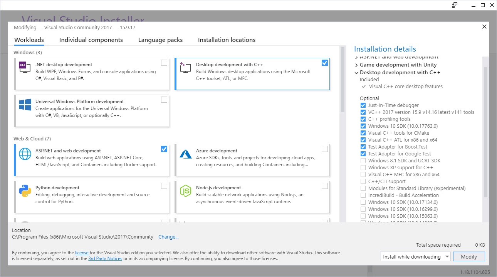

# 🌑 Fix CMake not Found Visual Studio


ในกรณีที่เราทำการ Build System Generate ของ Binaries File ด้วย CMake แล้วไม่สามารถ Build ได้ เนื่องจาก Version ของ Visual Studio ซึ่งต้องเป็น Version 2017 ขึ้นไปแล้ว ยังต้องทำการติดตั้ง VC++ เพื่อให้สามารถทำการ Build โปรแกรมที่เป็น Windows Portable Execution ( PE ) ได้


```
The system is: Windows - 10.0.18363 - AMD64
```


**Cause** : สาเหตุเนื่องมาจาก CMake มองหา Visual Studio 2017 ที่ใช้ในการ Build System Generate ไม่พบ ซึ่งต้องทำการติดตั้ง Visual C++ สำหรับ Desktop Development บน Visual Studio 2017 ก่อน ถึงจะสามารทำการ Build ได้


## **Configuration**

* ทำการเปิดโปรแกรม Visual Studio 2017 แล้วคลิก Tools -> Get Tools and Features



* เลือก Workloads -> Desktop development with C++ แล้วคลิก Modify



**อ่านเพิ่มเติม** : [http://bit.ly/2Tuh7Nr](http://bit.ly/2Tuh7Nr)
